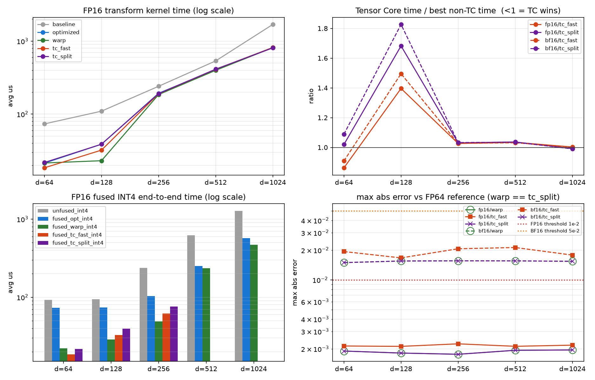

# CUDA Hadamard 变换加速

入口：[总结报告](docs/final_report.md) · [最新补测](docs/gap_closure.md) ·
[实验数据索引](tensor_core/results/README.md) · [Slurm 脚本说明](tensor_core/slurm/README.md) ·
[目录整理与归档](docs/repository_cleanup.md)

本目录实现输入形状 `[batch_size, seq_len, num_heads, head_dim]` 最后一维上的
快速 Walsh-Hadamard Transform。实现支持 FP16、BF16，核心维度为 64/128/256，
保留 shared-memory 教学 baseline，并提供 warp-shuffle/向量化优化版本、
warp-per-token 全寄存器版本，以及逐 token 对称 INT4 融合量化。所有 FHT 路径均在
FP32 中完成蝶形，并支持归一化 `Hx/sqrt(head_dim)`。

Tensor Core 分支见 [`tensor_core/`](tensor_core/README.md)：用
`H_d = H_{d/16} ⊗ H_16` 把 FHT 改写成两次 16x16x16 WMMA（而不是退化成稠密
GEMM），并与做到位的非 Tensor Core 实现做同环境 A/B。

2026-09-08 验收修订：TC 已改为全张量、低精度外部参考的**严格绝对误差**检查；
历史 `PASS(rel)` 和 token-peak ULP 不能证明 PDF 合规。`tc_split` 不保证普遍逐位
等价。TC 融合现已补齐 d=64/128 尾部 warp 回退，新增测试与调优记录见
[`docs/audit_optimization.md`](docs/audit_optimization.md)。历史 GPU 数字不代表新变体的性能。

2026-09-09 第二轮完成：H200 三次扫描中位数下，选中组合使 d=64 warp
**1.54×**、其融合 INT4 **1.12×**；FP16 d=128 TC fast/split **1.29×/1.43×**，
d=256 split **1.47×**（均相对同后端原参数，不是对 warp 的加速）。
五组参数各 132 配置的真实参考库验收已完成：baseline/optimized/warp 均 132/132、
误差 0；TC fast/split 为 96/132、121/132，不能宣称普遍满足 PDF。
75 项 sanitizer 无错误，H100 上 40 次 NCU 采集成功，并补齐实测 DRAM Roofline。
[最终表格与可视化](tensor_core/results/verify_17251073/final_library/summary.md)。
通用默认保持不变；可选组合构建：`make -C tensor_core h200-tuned`。

后续四阶段实验已完成，见 [参考库基线与下一轮优化](docs/next_optimization.md)：
H200 上 80 配置的 Dao v1.1.0 同边界性能对照；七组 warp/INT4 参数的 1848 行
验证全部通过；11 个 TC split 失败用例完成逐阶段定位；独立 PTX 重排在 L40S
d=64 上相对向量化 WMMA fast/split 再快约 1.30×/1.41×（FP16）。
PTX 与 WMMA 测试输出逐位一致，也保留原有精度失败，未接入默认分发。
本轮使用 CUDA Graph 摊销设备时间，不与上面的普通 CUDA Event 数字混算。

Hopper 补测：新 PTX 已在 H200 完成 **30 项 NCU**（三维度、五后端、两种缓存策略）。
D=128 下 PTX fast/split 动态 shared 均为 0，short-scoreboard 相对 WMMA 显著降低；
不再把新 PTX 的计数器统一标成“DCGM 阻塞”。恢复记录、精度实验和 PTX 解释见
[缺口补测报告](docs/gap_closure.md)。
量化宽写回经过三个独立进程复测后，新增 `QUANT_VECTOR=2`，只优化 D=1024：
最终 H200 FP16/BF16 分别再快 **6.2% / 5.7%**，D=512 基本不变；528 行输出
检查全过。构建：`make CUDA_ARCH=90 WARPS=0 QUANT_VECTOR=2 OUT=build/h200-selective`。

TC 精度实验 p2 从 101/108 提高到 107/108；加保护与 warp 回退的 p3 达到
108/108，并通过 192/192 幅度/相消压力测试及三类 sanitizer。但 p3 比严格 warp
更慢，仍是非默认实验，不能称为“纯 TC 已同时解决精度和性能”。
[最终检查与性能成本](tensor_core/results/guard_quant_17294196/summary.md)。

## 构建与运行

```bash
make -j2

./build/hadamard_bench \
  --batch 4 --seq 1024 --heads 32 --head_dim 128 \
  --dtype fp16 --normalize true --warmup 5 --iters 20 --check true

# baseline / optimized / unfused INT4 / fused INT4 的正确性与 A/B 计时
./build/hadamard_advanced_bench \
  --batch 4 --seq 1024 --heads 32 --head_dim 128 \
  --dtype fp16 --normalize true --warmup 20 --iters 100

# baseline / optimized / warp / tc_fast / tc_split + 五条融合路径的对照
# （BF16 WMMA 需要 SM >= 80）
make -C tensor_core CUDA_ARCH=89 -j4
./tensor_core/build/hadamard_tc_bench \
  --batch 4 --seq 1024 --heads 32 --head_dim 256 \
  --dtype fp16 --normalize true --warmup 20 --iters 100
```

也可使用 CMake：

```bash
cmake -S . -B build -DCMAKE_CUDA_ARCHITECTURES=86
cmake --build build -j
```

## 验证

```bash
# 小规模 CUDA/CPU 冒烟
make smoke

# FP16/BF16、64/128/256、多档规模的正确性与性能扫描
bash scripts/run_tests.sh

# 9.1/9.2：优化 FHT 与融合 INT4 的完整矩阵、CSV 和可视化
bash scripts/run_advanced.sh

# 只运行官方 fast_hadamard_transform 对照
~/hadamard_env/bin/python tests/test_vs_library.py

# warp / Tensor Core 路径：全矩阵扫描（FP16/BF16 × d=64..1024 + normalize=false
# + 尾部回落配置）；这是回归扫描，不替代外部参考验收
make -C tensor_core sweep

# 严格参考库验收（使用安装了 CUDA PyTorch 和 fast_hadamard_transform 的 Python）
python tensor_core/scripts/validate_tc.py --bin tensor_core/build/hadamard_tc_bench \
  --output-dir tensor_core/results/library_audit --reference library
```

原 baseline 的参考库验收结果：36/36 配置通过，GPU 输出与参考库 100% bit-exact。
这不是所有新后端的统一验收结论。原始记录位于：

- [`results/library_check.csv`](results/library_check.csv)：官方库正确性对照；
- [`results/results.csv`](results/results.csv)：内置 FP32 自检与 CUDA Event 时间。

## Profiler

```bash
bash scripts/profile.sh nsys
bash scripts/profile.sh ncu
```

ncu 需要 GPU performance-counter 权限。脚本不会修改系统权限，无法采集时会输出
`ERR_NVGPUCTRPERM` 提示。

集群上可直接提交完整矩阵（FP16/BF16 × 64/128/256）：

```bash
mkdir -p /scratch/gz2522/gz2522/tmp/hadamard/runs/slurm
sbatch slurm/profile_hadamard.slurm
```

任务会在 `results/profile_<job-id>/` 保存无 profiler 的 CUDA Event 重复计时、
Nsight Systems 时间线/统计、Nsight Compute 原始报告和整理后的
`ncu_metrics.csv`；若 performance counter 被 DCGM/其他工具占用，则保留错误日志并
生成明确标为 `minimum_io_fallback` 的 `profile_metrics.csv`。两种情况下都会生成：

- `figures/roofline.png`：优先用 NCU 实际 DRAM 字节；不可用时明确采用逻辑最小 I/O；
- `figures/profiler_metrics.png`：有计数器时展示 occupancy/DRAM/stall；否则展示
  timing、有效逻辑带宽、算法吞吐和 Roofline 比例；
- `figures/nsys_timeline.png`：kernel 稳定性、分布与 CUDA Runtime API 开销。

Roofline 的 FP32/HBM 上界由同一节点的 CUDA device properties 推导并标为
theoretical；散点的 FLOP 数采用 FHT 的 `tokens*d*log2(d)` 标量加减，避免把
Tensor Core 峰值错误用于当前 FP32 butterfly kernel。

已完成的 L40S 实测、CSV 与图表见
[`results/profile_16967596/`](results/profile_16967596/README.md)。

## 9.1/9.2 优化与融合量化

优化 kernel 使用 `half2`/`__nv_bfloat162` 向量化 I/O，将 stride 1 放在寄存器内、
stride 2–32 放在 warp shuffle 中，仅跨 warp 阶段使用 shared memory；d=64/128 每个
block 分别处理 4/2 个 token。原 baseline API 保留，便于严格 A/B 回归。

融合量化采用逐 token 对称 INT4：

```text
scale = max(abs(x)) / 7
q = clamp(round_to_nearest_even(x / scale), -7, 7)
```

相邻两个有符号 INT4 以 two's-complement nibble 打包到一个 byte，另输出每 token 一个
FP32 scale。fused kernel 在寄存器内模拟一次 FP16/BF16 中间舍入，因此与
`optimized Hadamard -> 独立 quantize` 的语义严格相同，同时省去中间张量的 global
write/read。

2026-09-04 L40S（131072 tokens，20 warmup + 100 runs）结果：

| dtype | d | baseline us | optimized us | FHT speedup | unfused INT4 us | fused INT4 us | fusion speedup |
|---|---:|---:|---:|---:|---:|---:|---:|
| FP16 | 64 | 73.43 | 21.50 | 3.42x | 92.68 | 73.34 | 1.26x |
| FP16 | 128 | 109.37 | 38.62 | 2.83x | 110.50 | 73.41 | 1.51x |
| FP16 | 256 | 240.75 | 193.64 | 1.24x | 240.77 | 104.47 | 2.30x |
| BF16 | 64 | 73.55 | 21.51 | 3.42x | 92.79 | 73.43 | 1.26x |
| BF16 | 128 | 109.53 | 38.91 | 2.82x | 110.56 | 73.54 | 1.50x |
| BF16 | 256 | 240.99 | 192.82 | 1.25x | 240.69 | 103.40 | 2.33x |

六个配置中，optimized-vs-baseline、fused-vs-unfused、GPU-vs-CPU quantizer 三组
packed bytes 和 scales 检查均为 bit-exact。INT4 含 scale 的输出压缩率为
3.56x–3.88x，MAE 为 0.0912–0.1084。另对 FP16/BF16、normalize true/false 和
d=32/64/128/256/512/1024 跑了 24 个小规模配置，全部通过三项 bit-exact 检查。
完整 CSV、环境、Nsight 汇总和四联图见
[`results/optimization_16970010/`](results/optimization_16970010/README.md)：


代表性 FP16/d=128 Nsight Systems trace 显示：baseline 平均 14.86 us、optimized
5.83 us、独立 quantize 9.91 us、fused 10.27 us（16384 tokens；该 trace 用于结构分析，
正式性能采用上表无 profiler CUDA Event 数据）。优化 kernel 的 grid 从 16384 降为
8192，block 为 128 threads，静态 shared memory 为 1024 B；资源上限推导 occupancy
为 100%，不是硬件计数器实测 achieved occupancy。NCU 对 optimized/fused 的两次尝试
仍因节点 DCGM 占用 performance counter 失败，原始日志已经保留。

跨节点重试后，H200 job `16975372` 已成功取得 optimized/fused 的真实 NCU 硬件指标：
SM throughput 34.73%/34.12%、DRAM throughput 11.63%/6.79%、achieved occupancy
58.39%/46.69%，并已导出 cache 与 warp-stall 数据。L40S/A100 仍被 DCGM 占用，但
**NCU 加分检查现已在 H200 上完成**。完整结果和可视化见
[`results/ncu_retry_16975372/`](results/ncu_retry_16975372/README.md)。

原 baseline 的 L40S Roofline 仍见下图；横轴使用一次 16-bit 读写的逻辑最小 I/O，
因为 NCU 没能提供实际 DRAM bytes：


## warp-per-token 与 Tensor Core

`src/hadamard_warp.cu` 把每线程负责的元素数从 2 提升到 `head_dim/32`，于是一个
warp 恰好处理一个 token：低阶蝶形在寄存器数组内完成，高 5 级全部
`__shfl_xor_sync`，**shared memory 与 `__syncthreads()` 用量为 0**，global 访问
宽度升到 128-bit（d=256）。融合 INT4 版本的 per-token max 也随之变成纯 warp
归约，去掉了 9.2 版本的 shared 归约和两次 barrier。

`tensor_core/` 用 Sylvester 矩阵的 Kronecker 递归 `H_d = H_{d/16} ⊗ H_16`，把每
256 个连续元素看成一个 16x16 tile，于是整段变换归约成 `Y = A · X · H_16` 两次
`m16n16k16` WMMA（`A = I_k ⊗ H_m` 是块对角常量矩阵）。`tc_split` 额外把中间结果
拆成 hi/lo 两份、用三次 mma 累加到同一 FP32 accumulator，从而与 FP32 FHT 正确
舍入一致。

2026-09-06 L40S（131072 tokens、normalize=true、20 warmup + 100 runs、
job `17083405`）：

| dtype | d | baseline | optimized (9.1) | warp | tc_fast | tc_split | fused_opt (9.2) | fused_warp | fused_tc_fast |
|---|---:|---:|---:|---:|---:|---:|---:|---:|---:|
| FP16 | 64 | 73.43 | 21.31 | 21.41 | **18.38** | 21.73 | 73.38 | 22.09 | **18.58** |
| FP16 | 128 | 109.80 | 38.73 | **23.01** | 32.13 | 38.71 | 73.55 | **28.82** | 32.85 |
| FP16 | 256 | 240.66 | 193.00 | **185.31** | 190.17 | 190.98 | 103.85 | **48.82** | 62.01 |
| BF16 | 64 | 73.36 | 21.38 | 21.40 | **19.44** | 23.27 | 73.41 | 21.99 | **19.88** |
| BF16 | 128 | 109.55 | 38.72 | **23.02** | 34.42 | 42.05 | 73.66 | **28.68** | 35.16 |
| BF16 | 256 | 240.89 | 192.91 | **185.18** | 190.17 | 191.23 | 103.45 | **48.32** | 66.58 |

单位 us，粗体为该行最快。要点：

- warp-per-token 在 9.1 之上把 d=128 的变换再加速 **1.68x**，融合 INT4 在
  d=64/128/256 上相对已验收的 9.2 融合 kernel 加速 **2.13x–3.34x**
  （d=512/1024 为 1.07x–1.22x，此时已访存受限），输出与 9.1 **100% 逐位一致**；
- Tensor Core 在 **d=64** 上最快：变换 1.10x–1.16x、融合 INT4 1.11x–1.19x
  （相对最好的非 TC 实现，不是相对教学 baseline）；
- `tc_split` 在这组 FP16 d<=256 样本中 100% 逐位一致，但 BF16 和较大维度存在差异；
  历史 token-peak `max_ulp` 不能证明逐元素正确舍入或 PDF 验收通过；
- d>=256 时五条路径收敛到 1%–3% 以内 —— 该维度的最小逻辑 I/O 按 864 GB/s
  理论上限约需 155 us，实测 185 us，提示访存压力；这不是不可优化的严格下界，
  需要结合实际 DRAM/L2 流量及缓存控制验证；
- TC 在 d>=128 落后的原因由 nsys launch 结构和 H200 硬件计数器两条独立证据
  确认：WMMA 的 accumulator 与 matrix_b fragment 布局不同，必须经 shared memory
  中转，9.7–12.8 KB/block 的 scratch 把 resource-limit occupancy 从 100% 压到
  83.3%/66.7%；NCU 上 warp FHT 的 `stall barrier` 精确为 0、主导 stall 是
  global memory 延迟（访存受限的正常形态），而两条 TC kernel 的主导 stall 换成了
  `short scoreboard`（12.9/11.1）与 `mio throttle`（10.5/12.8）—— 它们在等
  shared memory，不是在等显存。

历史 CSV 实际含 14 个唯一配置，旧 TC 融合尾部用例被跳过，不能作为已验证证据；
本轮已补齐尾部实现与严格检查。历史 CSV、摘要表、四联图与 nsys 产物见
[`tensor_core/results/tc_17083405/`](tensor_core/results/tc_17083405/README.md)；
H200 上采到的真实硬件计数器见
[`tensor_core/results/tc_ncu_17083350/`](tensor_core/results/tc_ncu_17083350/README.md)；
算法推导与逐项分析见 [`tensor_core/README.md`](tensor_core/README.md)。



## 目录结构

```text
FastHadamard-CUDA/
├── CMakeLists.txt
├── Makefile
├── include/                 # 公共接口与 CUDA 错误检查
├── src/                     # CUDA kernel、benchmark、CPU 开发参考
│   ├── hadamard.cu          # baseline + 9.1 optimized + 9.2 fused INT4
│   └── hadamard_warp.cu     # warp-per-token FHT（零 shared / 零 barrier）
├── tensor_core/             # Tensor Core (WMMA) 实验分支与对照基准
├── tests/                   # 官方库对照与 dump 检查
├── scripts/                 # 一键测试和 profiler 入口
├── slurm/                   # 集群工具探测与完整 profiler 任务
├── results/                 # 小型 CSV 验收证据
└── docs/final_report.md     # 唯一项目总结报告
```

## 当前范围

Week1/Week2 baseline、9.1 kernel 优化、9.2 对称 INT4 融合量化、warp-per-token
再优化和 Tensor Core 对比均已实现和实测。FP8 输出与国产平台适配仍未实现；
Tensor Core 分支要求 SM >= 80（BF16 WMMA），且其融合 INT4 仅支持
`head_dim <= 256`（`head_dim > 256` 时显式回落到非 TC 融合 kernel）。
边界、实验解释和后续路线见 [`docs/final_report.md`](docs/final_report.md)。
