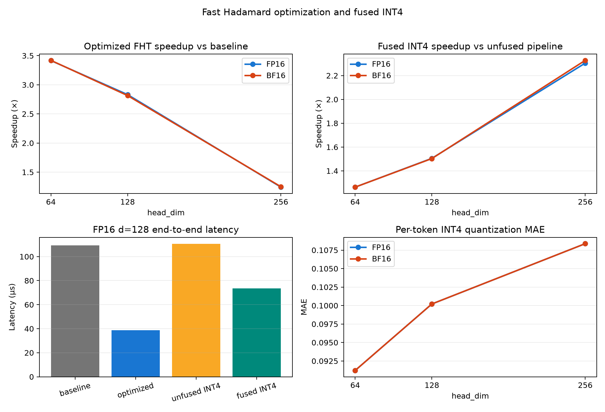
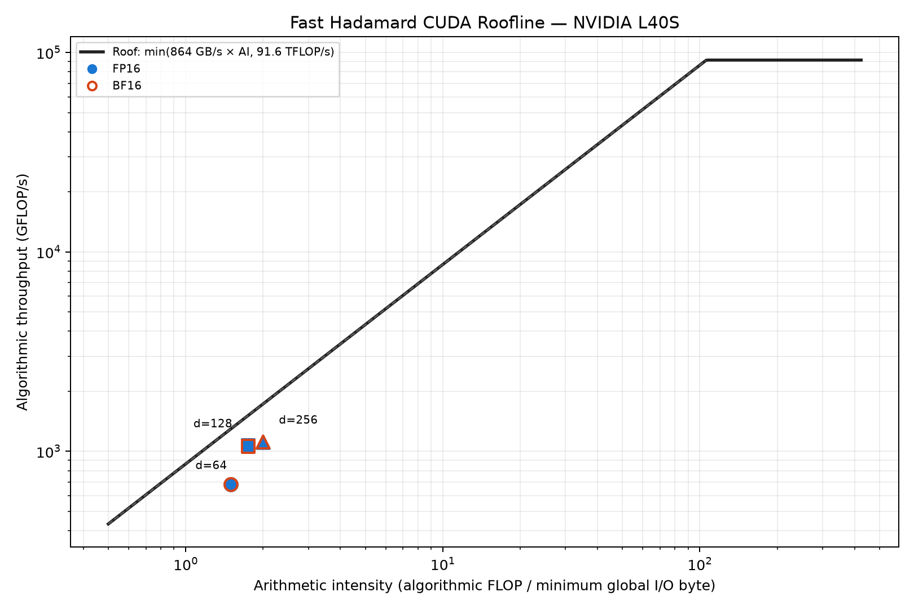

# CUDA Hadamard 变换加速

本目录实现输入形状 `[batch_size, seq_len, num_heads, head_dim]` 最后一维上的
快速 Walsh-Hadamard Transform。实现支持 FP16、BF16，核心维度为 64/128/256，
保留 shared-memory 教学 baseline，并提供 warp-shuffle/向量化优化版本与逐 token
对称 INT4 融合量化。两条 FHT 路径均在 FP32 中完成蝶形，并支持归一化
`Hx/sqrt(head_dim)`。

## 构建与运行

```bash
make -j2

./build/hadamard_bench \
  --batch 4 --seq 1024 --heads 32 --head_dim 128 \
  --dtype fp16 --normalize true --warmup 5 --iters 20 --check true

# baseline / optimized / unfused INT4 / fused INT4 的正确性与 A/B 计时
./build/hadamard_advanced_bench \
  --batch 4 --seq 1024 --heads 32 --head_dim 128 \
  --dtype fp16 --normalize true --warmup 20 --iters 100
```

也可使用 CMake：

```bash
cmake -S . -B build -DCMAKE_CUDA_ARCHITECTURES=86
cmake --build build -j
```

## 验证

```bash
# 小规模 CUDA/CPU 冒烟
make smoke

# FP16/BF16、64/128/256、多档规模的正确性与性能扫描
bash scripts/run_tests.sh

# 9.1/9.2：优化 FHT 与融合 INT4 的完整矩阵、CSV 和可视化
bash scripts/run_advanced.sh

# 只运行官方 fast_hadamard_transform 对照
~/hadamard_env/bin/python tests/test_vs_library.py
```

正式验收结果：36/36 配置通过，GPU 输出与官方库 100% bit-exact。原始记录位于：

- [`results/library_check.csv`](results/library_check.csv)：官方库正确性对照；
- [`results/results.csv`](results/results.csv)：内置 FP32 自检与 CUDA Event 时间。

## Profiler

```bash
bash scripts/profile.sh nsys
bash scripts/profile.sh ncu
```

ncu 需要 GPU performance-counter 权限。脚本不会修改系统权限，无法采集时会输出
`ERR_NVGPUCTRPERM` 提示。

集群上可直接提交完整矩阵（FP16/BF16 × 64/128/256）：

```bash
mkdir -p /scratch/gz2522/gz2522/tmp/hadamard/runs/slurm
sbatch slurm/profile_hadamard.slurm
```

任务会在 `results/profile_<job-id>/` 保存无 profiler 的 CUDA Event 重复计时、
Nsight Systems 时间线/统计、Nsight Compute 原始报告和整理后的
`ncu_metrics.csv`；若 performance counter 被 DCGM/其他工具占用，则保留错误日志并
生成明确标为 `minimum_io_fallback` 的 `profile_metrics.csv`。两种情况下都会生成：

- `figures/roofline.png`：优先用 NCU 实际 DRAM 字节；不可用时明确采用逻辑最小 I/O；
- `figures/profiler_metrics.png`：有计数器时展示 occupancy/DRAM/stall；否则展示
  timing、有效逻辑带宽、算法吞吐和 Roofline 比例；
- `figures/nsys_timeline.png`：kernel 稳定性、分布与 CUDA Runtime API 开销。

Roofline 的 FP32/HBM 上界由同一节点的 CUDA device properties 推导并标为
theoretical；散点的 FLOP 数采用 FHT 的 `tokens*d*log2(d)` 标量加减，避免把
Tensor Core 峰值错误用于当前 FP32 butterfly kernel。

已完成的 L40S 实测、CSV 与图表见
[`results/profile_16967596/`](results/profile_16967596/README.md)。

## 9.1/9.2 优化与融合量化

优化 kernel 使用 `half2`/`__nv_bfloat162` 向量化 I/O，将 stride 1 放在寄存器内、
stride 2–32 放在 warp shuffle 中，仅跨 warp 阶段使用 shared memory；d=64/128 每个
block 分别处理 4/2 个 token。原 baseline API 保留，便于严格 A/B 回归。

融合量化采用逐 token 对称 INT4：

```text
scale = max(abs(x)) / 7
q = clamp(round_to_nearest_even(x / scale), -7, 7)
```

相邻两个有符号 INT4 以 two's-complement nibble 打包到一个 byte，另输出每 token 一个
FP32 scale。fused kernel 在寄存器内模拟一次 FP16/BF16 中间舍入，因此与
`optimized Hadamard -> 独立 quantize` 的语义严格相同，同时省去中间张量的 global
write/read。

2026-09-04 L40S（131072 tokens，20 warmup + 100 runs）结果：

| dtype | d | baseline us | optimized us | FHT speedup | unfused INT4 us | fused INT4 us | fusion speedup |
|---|---:|---:|---:|---:|---:|---:|---:|
| FP16 | 64 | 73.43 | 21.50 | 3.42x | 92.68 | 73.34 | 1.26x |
| FP16 | 128 | 109.37 | 38.62 | 2.83x | 110.50 | 73.41 | 1.51x |
| FP16 | 256 | 240.75 | 193.64 | 1.24x | 240.77 | 104.47 | 2.30x |
| BF16 | 64 | 73.55 | 21.51 | 3.42x | 92.79 | 73.43 | 1.26x |
| BF16 | 128 | 109.53 | 38.91 | 2.82x | 110.56 | 73.54 | 1.50x |
| BF16 | 256 | 240.99 | 192.82 | 1.25x | 240.69 | 103.40 | 2.33x |

六个配置中，optimized-vs-baseline、fused-vs-unfused、GPU-vs-CPU quantizer 三组
packed bytes 和 scales 检查均为 bit-exact。INT4 含 scale 的输出压缩率为
3.56x–3.88x，MAE 为 0.0912–0.1084。另对 FP16/BF16、normalize true/false 和
d=32/64/128/256/512/1024 跑了 24 个小规模配置，全部通过三项 bit-exact 检查。
完整 CSV、环境、Nsight 汇总和四联图见
[`results/optimization_16970010/`](results/optimization_16970010/README.md)：



代表性 FP16/d=128 Nsight Systems trace 显示：baseline 平均 14.86 us、optimized
5.83 us、独立 quantize 9.91 us、fused 10.27 us（16384 tokens；该 trace 用于结构分析，
正式性能采用上表无 profiler CUDA Event 数据）。优化 kernel 的 grid 从 16384 降为
8192，block 为 128 threads，静态 shared memory 为 1024 B；资源上限推导 occupancy
为 100%，不是硬件计数器实测 achieved occupancy。NCU 对 optimized/fused 的两次尝试
仍因节点 DCGM 占用 performance counter 失败，原始日志已经保留。

跨节点重试后，H200 job `16975372` 已成功取得 optimized/fused 的真实 NCU 硬件指标：
SM throughput 34.73%/34.12%、DRAM throughput 11.63%/6.79%、achieved occupancy
58.39%/46.69%，并已导出 cache 与 warp-stall 数据。L40S/A100 仍被 DCGM 占用，但
**NCU 加分检查现已在 H200 上完成**。完整结果和可视化见
[`results/ncu_retry_16975372/`](results/ncu_retry_16975372/README.md)。

原 baseline 的 L40S Roofline 仍见下图；横轴使用一次 16-bit 读写的逻辑最小 I/O，
因为 NCU 没能提供实际 DRAM bytes：



## 目录结构

```text
FastHadamard-CUDA/
├── CMakeLists.txt
├── Makefile
├── include/                 # 公共接口与 CUDA 错误检查
├── src/                     # CUDA kernel、benchmark、CPU 开发参考
├── tests/                   # 官方库对照与 dump 检查
├── scripts/                 # 一键测试和 profiler 入口
├── slurm/                   # 集群工具探测与完整 profiler 任务
├── results/                 # 小型 CSV 验收证据
└── docs/final_report.md     # 唯一项目总结报告
```

## 当前范围

Week1/Week2 baseline、9.1 kernel 优化和 9.2 对称 INT4 融合量化均已实现和实测。
FP8、Tensor Core 探索与国产平台适配仍未实现，边界、实验解释和后续路线见
[`docs/final_report.md`](docs/final_report.md)。
