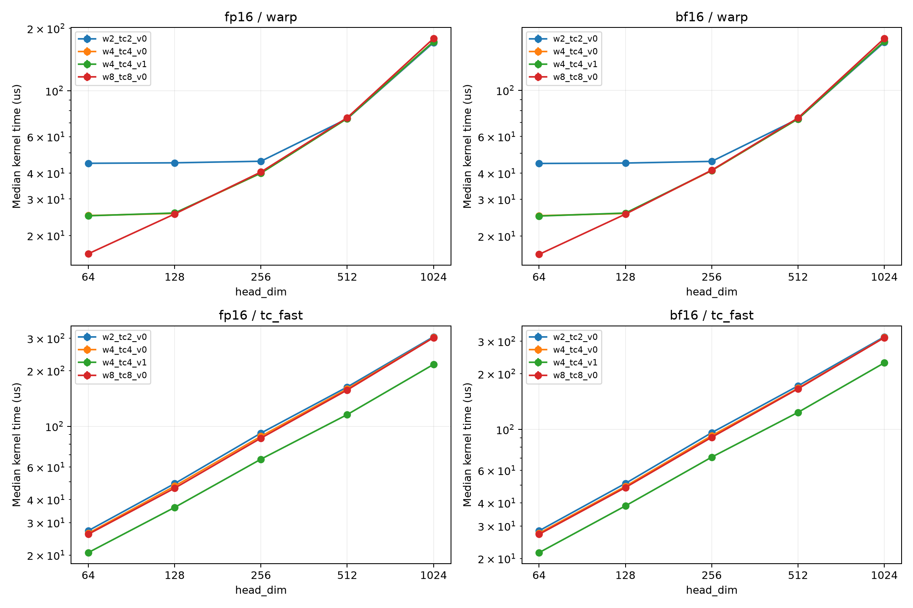

# 2026-09-08—09：PDF 验收修正与两轮 kernel 调优

本记录区分“已实现”“已测试”和“已确认收益”。历史 L40S / H200 数据保留，
不把旧代码的性能当作新变体的成绩，也不把相对误差通过当作 PDF 验收。

## 1. 输入输出与验收口径

PDF 选题三要求四维 FP16/BF16 输入、沿 head_dim 变换、输出 kernel 毫秒性能日志。
没有规定张量二进制容器或量化文件头；INT4 是当前选择的融合量化格式。
核心维度 64/128/256 支持，不能宣称支持任意 2 的幂。

修正内容：

- `tc_bench` 支持 `--input_bin`、`--reference_bin`、`--dump_dir`。外部参考必须来自
  相同输入、dtype 和归一化 scale；文件长度必须恰好为元素数乘 2 字节。
- 输入／参考／各后端输出及形状元数据可以导出；原 baseline 的读取入口也拒绝
  多余尾部字节。
- 对**全张量低精度参考输出**计算绝对误差，FP16 严格 `<0.01`，BF16 严格 `<0.05`。
  NaN/Inf 不会因 `std::max` 忽略异常而通过。未提供外部参考时仅作 optimized 回归，
  CSV 的 `pdf_verified=0`。
- FP64 采样误差、相对误差和 token-peak ULP 保留为诊断，不参与 PDF 通过判定。
  token-peak ULP 不是逐元素 ULP，因此 `0.5` 不能证明正确舍入。
- `tc_split` 降低舍入误差，但不保证与 FP32 FHT 普遍逐位一致。
- 每条融合后端与自己的未融合输出配对，分别检查 packed INT4 字节和 FP32 scale。
  optimized 融合不再假设其参考可无条件复用 warp 输出。

`validate_tc.py` 默认使用 Dao-AILab `fast_hadamard_transform`；`--reference cpu`
明确选择独立 PyTorch FP32 蝶形参考，不伪称跑过参考库。Python 再读回所有输出，
独立复核 C++ 的误差值、通过判据和校验元素数，并保存失败输入以便复现。

测试矩阵共 **132 个唯一配置**：

- FP16/BF16 × 64/128/256/512/1024 × normalize=true/false × tokens=1/5/2048：60 个；
- FP16/BF16 × 64/128/256 × 两种 normalize × 六种输入分布：72 个。
  分布为全零、常量、正负交替、单位脉冲、均匀随机和有限离群值。

历史 `tc_17083405` 实际为 10 个主配置＋3 个 FP16 非归一化配置＋1 个尾部配置。
旧尾部用例跳过 TC 融合；历史退出码为零不能推出严格 PDF 验收通过。

## 2. 尾部修复与优化实现

TC 融合 d=64/128 现在将完整 tile 交给 TC，尾部不足 tile 的 token 交给 warp
融合；输入、packed 输出和 scale 的偏移分别计算。全为尾部的 tokens=1 不启动
零大小 TC grid。纯变换使用同样分区，所以同算法融合比较覆盖混合执行路径。
d>256 的 TC 融合仍显式不支持，调用方应选择已有 warp 融合；没有冒充 TC 加速。

保留默认参数作为控制组，新增三个候选：

| 标记 | 非 TC warps/block | TC warps/block | TC 共享内存中转 |
|---|---:|---:|---|
| w4_tc4_v0 | 4 | 4 | 原标量代码 |
| w2_tc2_v0 | 2 | 2 | 原标量代码 |
| w8_tc8_v0 | 8 | 8 | 原标量代码 |
| w4_tc4_v1 | 4 | 4 | 向量化读写 |

向量化候选把每 lane 的 8 个 FP32 shared 读取改为两次 `float4`，低精度 shared
写入改为一次 `int4`；最终 accumulator 中转同样向量化。padded stride 保证 16B
对齐，局部向量数组显式 `alignas(16)`。数学运算和舍入次序不变，通过输出 SHA256
检查各变体同一后端是否保持逐位输出。

这是针对已有 NCU `short scoreboard`/`mio throttle` 的低风险候选；它不保证编译后
一定更快，需通过 A/B 决定。显式 PTX MMA 寄存器重排暂不混入这一轮，以免同时
改变数值算法、布局和调度，难以定位收益或回归。

```bash
make -C tensor_core CUDA_ARCH=90 OUT=build/w4_tc4_v1 WARPS=4 TC_WARPS=4 TC_VECTOR=1
python tensor_core/scripts/validate_tc.py --bin tensor_core/build/w4_tc4_v1/hadamard_tc_bench \
  --output-dir tensor_core/results/new_library_validation --reference library
sbatch tensor_core/slurm/tc_audit_tune.slurm
sbatch tensor_core/slurm/tc_verify_profile.slurm
```

输出目录必须按新运行区分。不要向已有 CSV 追加新 schema；`run_tc.sh` 会拒绝覆盖。
Make 的编译参数变化需要独立 `OUT`；CMake 提供等价的三个编译选项。

## 3. 测量与 NCU / Roofline

性能扫描固定 131072 tokens、归一化，每次 20 warmup、100 CUDA Event 计时，
独立重复三次。汇总报告中位数及 min/max，不以最快一次作为最终性能。
NCU 时间仅用于 profiler 内结构对比，不与无 profiler 时间混算。

缓存策略显式设置为 `--cache-control all` 和 `none`。前者 replay 前刷新，后者不
由 profiler 刷新；这不自动等于应用层“冷／热缓存”。历史 DRAM 流量较低不能简单
归因于前序 validation 预热，因为 NCU 默认会刷新缓存。
[NVIDIA 缓存控制说明](https://docs.nvidia.com/nsight-compute/ProfilingGuide/index.html)。

Roofline 横轴使用 NCU 实际 DRAM 字节，或明确标注为 rate×duration 的测量派生值；
纵轴统一按 `tokens × d × log2(d)` 有用加减次数计算，不把 TC 冗余稠密乘加当作收益。
FP32 compute roof 仅为非 TC 参考上限，不能表示 Tensor Core 峰值利用率。
H200 SXM 参考规格为 4.8 TB/s、FP32 67 TFLOPS；NVL 的 FP32 规格不同，需核对设备。
[NVIDIA H200 规格](https://www.nvidia.com/en-in/data-center/h200/)。

NCU 硬件计数器已经在历史 H200 作业 `17083350` 成功采集。历史 L40S 节点 DCGM
阻塞日志保留为环境记录，不能继续将全部 NCU 工作标成“未完成”。

## 4. 本轮执行记录

- `17249309`：H200 上编译四个变体、三次重复性能扫描及 sanitizer。
  初次严格校验因 venv 的 `/usr/bin/python` 在节点之间版本不同而无法导入 PyTorch，
  明确记录为环境失败；没有用计时结果替代验收。
- `17249426`：依赖上一作业结束后运行，改用显式 Python 3.12 的现有 CUDA PyTorch
  环境（只读使用），参考库安装到作业独立目录；补跑全矩阵及 all/none NCU。
- `17249309` 已结束：四个变体均编译成功；四个变体各三项 sanitizer 共 12 项
  memcheck/racecheck/synccheck 均为 0 errors，racecheck 同时 0 warnings。
  验证输入为 BF16、d=64、tokens=5，覆盖完整 tile 与尾部，不能扩大解释为所有形状
  已通过 sanitizer。
- `17249426` 原先等待调度，后来确认验收与 NCU 绑定缩小了可选 GPU 范围。
  单凭 `QOSGrpGRES` 不能断言账户组占满；该合并作业已取消并拆分。未测试完的候选
  不切换为默认实现。
- `17249673`：旧的依赖合并作业的 CPU 汇总，已取消，由 `17251082` 替代。新汇总读取严格验收 CSV 和
  NCU all/none 原始计数器，生成 `tensor_core/results/verify_17251073/final/summary.md`、
  `timing_summary.csv`、可用时的 `cache_ncu_summary.csv`、性能图和 `roofline_cache.png`。
  汇总保留失败行；作业退出不等于全部后端通过。若 NCU 没有产物，不生成虚构图点。

### 4.1 已完成的 H200 性能结果

以下为 **FP16、131072 tokens、normalize=true**，三次扫描中位数。每列比较同一
后端的控制组和对应候选；没有把 TC 对自身的加速说成对最优非 TC 的加速。

| 路径 | d | 控制组 μs | 候选 μs | 加速 |
|---|---:|---:|---:|---:|
| warp，8 warps/block | 64 | 24.967 | 16.328 | 1.529× |
| tc_fast，共享内存向量化 | 64 | 26.275 | 20.653 | 1.272× |
| tc_fast，共享内存向量化 | 128 | 47.307 | 36.289 | 1.304× |
| tc_fast，共享内存向量化 | 256 | 88.210 | 66.280 | 1.331× |
| tc_split，共享内存向量化 | 128 | 57.577 | 40.130 | 1.435× |
| tc_split，共享内存向量化 | 256 | 108.751 | 73.907 | 1.471× |
| fused_tc_fast INT4，共享内存向量化 | 128 | 47.389 | 36.457 | 1.300× |
| fused_tc_split INT4，共享内存向量化 | 256 | 109.293 | 76.639 | 1.426× |

这说明向量化中转是有效候选，但 H200 上 d=128/256 的 TC 仍慢于 warp。
2 warps/block 明显拖慢小维度 warp，不采用；其他不足约 1% 的差异不视作可靠收益。
H200 与历史 L40S 的最优选择不同，不能跨架构硬编码统一 TC 分发。

[完整重复扫描表和图](../tensor_core/results/audit_17249309/summary/summary.md)



### 4.2 本地检查

7 项 CPU 单元测试通过：既有 profiler 解析/峰值测试，以及新增配置去重与覆盖、
NCU 宽表单位换算、多 kernel 拒绝、缺失计数器不伪造、采集维度解析、严格验收回归保护。
Python 脚本编译检查、Slurm/bash 语法检查、`git diff --check` 通过。
新增真实 GPU 负向测试覆盖短/长输入、非法形状、溢出形状、零参考范围和伪造参考；
其执行结果由补验收作业的 `negative_tests.json` 记录；第二轮五组参数全部通过。

## 5. 第二轮：拆分调度、组合参数与裁剪末尾同步

验收脚本现在默认仅验收＋计时＋sanitizer，开放 L40S/A100/H100/H200；
`tc_profile_only.slurm` 独立请求 H100/H200，且不需要 PyTorch 或参考库安装。
两者的输出目录、GPU 环境和报告输入独立，不跨 GPU 混算 Roofline。

新增 `WARPS=0` 可选按形状配置：d=64 用 8 warps/block，其余维度用 4；
`TC_VECTOR=2` 在向量化基础上去掉最后一次私有 scratch 读取后的 `__syncwarp`，
只保留下一 tile 覆盖 scratch 前的同步。默认仍是 `WARPS=4, TC_VECTOR=0`。
`make -C tensor_core h200-tuned` 提供可选的 `WARPS=0, TC_VECTOR=1` 组合，不会
偷偷将 warp 后端替换为 TC，也不意味着所有 TC 数值模式通过验收。

作业记录：

- `17251073`：H200 上五组参数（4/4/0、8/8/0、4/4/1、0/4/1、0/4/2），每组
  132 配置独立 FP32 参考、三次核心性能扫描，以及 5 个维度的三种 sanitizer，已完成。
- `17251063`：H100 `gh006` 独立 NCU all/none 对照，40/40 采集成功；
  `17251082` 汇总已完成。随后依据实际 H100 SXM 规格补充 roof 并更新图例。
- `17251189`：参考库 CPU 构建失败，原因是 PyPI 1.1.0 源码包缺少 `csrc`；
  依赖它的 `17251207` 已取消。此前 CUDA 13/PyTorch CUDA 12.1 的不匹配也已记录。
- `17251238`：改用 CUDA 12.8 容器，在 CPU 上编译完整上游 v1.1.0 源码，commit
  `1cc807efbd6cc001df359822d60bf6052dd66859`，不修改共享 Python 环境。
  构建及导入均成功；`17251286` 已在 H100 `gh008`、同一容器 ABI 下完成参考库验收。

五组参数独立 FP32 参考的严格结果：baseline/optimized/warp 均 132/132，最大绝对误差 0；
TC fast 96/132，最大绝对误差 1；TC split 121/132，最大绝对误差 0.5。
失败主要为非归一化输入，证明旧 `PASS(rel)` 掩盖了真实的绝对误差不达标。
已执行融合检查均与同算法 unfused 逐位一致，但不能替代变换精度验收。

### 5.1 选择的配置与拒绝的候选

采用可选 `w0_tc4_v1` 组合：按形状选择 warp block 大小，TC shared 中转向量化；
不采用 `TC_VECTOR=2`。下表为第二轮 H200、FP16、131072 tokens、归一化、
三次扫描中位数，比较同一后端，单位为 μs：

| 路径 | d | 控制组 | 组合配置 | 加速 |
|---|---:|---:|---:|---:|
| warp | 64 | 24.8502 | 16.1386 | 1.540× |
| fused_warp INT4 | 64 | 25.2122 | 22.5171 | 1.120× |
| tc_fast | 128 | 46.9066 | 36.2342 | 1.295× |
| tc_split | 128 | 57.1277 | 39.9834 | 1.429× |
| tc_fast | 256 | 87.9098 | 66.0173 | 1.332× |
| tc_split | 256 | 108.3900 | 73.7037 | 1.471× |
| fused_tc_fast INT4 | 128 | 46.9997 | 36.2819 | 1.295× |
| fused_tc_split INT4 | 256 | 108.9050 | 76.3059 | 1.427× |

BF16 d=64 warp 同样约 1.54×。d=128/256 warp 基本不变；TC 变快仍不代表
比 warp 快，例如 d=128 的 warp 为 25.4867 μs，仍优于两条 TC 路径。
裁剪末尾同步的 TC 时间变化约在 ±0.55% 内，没有稳定收益，不选为推荐值。

五组参数共 660 个配置运行；同用例/后端的输出 SHA256 差异组数为 0，
Python/C++ 判据不一致行数为 0。75 项 sanitizer（五参数 × 五维度 × 三工具）
均 0 errors，racecheck 同时 0 warnings；覆盖 BF16、tokens=5 的完整 tile 和尾部。
这些检查不等于已证明所有输入数值范围都正确。

[完整计时、独立 FP32 校验、NCU 表与图](../tensor_core/results/verify_17251073/final/summary.md)


### 5.2 新增 NCU 检查报告与 Roofline

`17251063` 在 H100 80GB HBM3、700W SXM 上采集，CUDA 13.0.88，未锁 GPU 时钟。
五组参数 × 两种缓存策略 × 四个目标（warp d=64/128、TC fast/split d=128），
共 40 份原始 CSV 和本地 `.ncu-rep`。无 DCGM/权限失败，不再标为环境阻塞。
固定 FP16、16384 tokens、normalize=true，每个目标为一次 kernel replay；
只用于结构诊断，不与 H200 无 profiler 中位数混算。

| d=128，cache-control=all | fast 原配置 | fast 向量化 | split 原配置 | split 向量化 |
|---|---:|---:|---:|---:|
| NCU μs | 8.096 | 6.784 | 9.600 | 7.360 |
| short scoreboard / issue | 12.922 | 5.994 | 10.957 | 5.568 |
| MIO throttle / issue | 10.305 | 9.561 | 12.478 | 9.724 |
| tensor active % | 2.574 | 3.053 | 3.271 | 4.267 |

short scoreboard 分别减少约 54%/49%，支持共享中转优化确实减少依赖等待；
MIO 压力仍高，TC 管线活跃度仍低，说明只提高峰值 MMA 算力不是目前的解决点。
stall 使用 NCU `per_issue_active.ratio`，不是百分比。单次计数器变化不作置信区间结论。

Roofline 采用本次 **H100 SXM 3.35 TB/s、FP32 67 TFLOPS** 参考规格，
不是 H200 4.8 TB/s。来源：[NVIDIA H100 规格](https://www.nvidia.com/en-sg/data-center/h100/)。
横轴来自测得 DRAM rate×duration，包含缓存/写回时序影响，不是输入＋输出逻辑字节；
`all` 与 `none` 的横向差异不能简单说成算法算术强度变了。
图例置于图外，展示控制组与选中组合，其余候选保留于 CSV。


### 5.3 下一步值得优化的位置

1. 优先保持严格验收的 warp/fused_warp 路径；为更多 tokens 档位和 GPU 架构做交错
   A/B，之后才决定是否推广按形状配置。本轮未据 H200 结果切换全局默认。
2. TC 可尝试显式 PTX MMA 的寄存器布局转换，减少 shared 往返；这会改变底层布局，
   需独立数值/尾部/sanitizer 验证，不能假设 WMMA fragment 内部映射可移植。
3. TC split 的剩余绝对误差是正确性问题，需先研究残差表示、累加次序和输入范围，
   而不是继续放宽阈值或在未归一化模式自动分发 TC。
4. 为真实激活分布扩大融合量化验证，再比较与后续 GEMM 融合的端到端收益。

### 5.4 真实参考库最终验收（已完成）

`17251286` 用时 7 分 17 秒；五组参数分别完成 132 个配置，参考为上游
`fast_hadamard_transform` v1.1.0，不再是 CPU fallback。CUDA 12.8 容器内编译并
执行对照；H200 计时仍使用原 CUDA 13 编译产物，不混淆这两个环境。

| 每组参数的路径 | 严格通过/总数 | 最大绝对误差 |
|---|---:|---:|
| baseline / optimized / warp（各自） | 132/132 | 0 |
| tc_fast | 96/132 | 1 |
| tc_split | 121/132 | 0.5 |
| unfused / fused_opt / fused_warp INT4（各自） | 132/132 | packed bytes 与 scale 逐位一致 |
| fused_tc_fast / fused_tc_split INT4（各自） | 108/108 | 与各自未融合算法逐位一致 |

TC 融合只计支持的 d=64/128/256；纯变换覆盖 d=64..1024。五组的失败配置和
误差一致，输出哈希跨参数无差异，Python 与 C++ 判据无分歧；30 项负向测试均通过。
控制组与选中组合在 CUDA 13 独立 FP32 参考运行和 CUDA 12.8 库参考运行之间，
对应输出哈希差异也为 0。

失败例：非归一化、2048 tokens、FP16 d=128 的 split 绝对误差为 0.015625，
超过 0.01；BF16 d=64 为 0.0625，超过 0.05。所有 split 的 11 个失败均为
非归一化配置，但这不构成对任意归一化输入正确性的证明。

结论是“默认非 TC 路径在本矩阵通过，TC 实现有性能收益但严格数值覆盖不足”，
不是“全部 kernel 合格”。作业 `COMPLETED` 表示检查流程跑完，记录中的
`all_pass=false` 和 `validation_rc=1` 正是保留的 TC 失败，未被抹掉。

[最终参考库验收＋计时＋NCU/Roofline 汇总](../tensor_core/results/verify_17251073/final_library/summary.md)
和[原始参考库验证目录](../tensor_core/results/verify_17251286/)包含完整证据。
