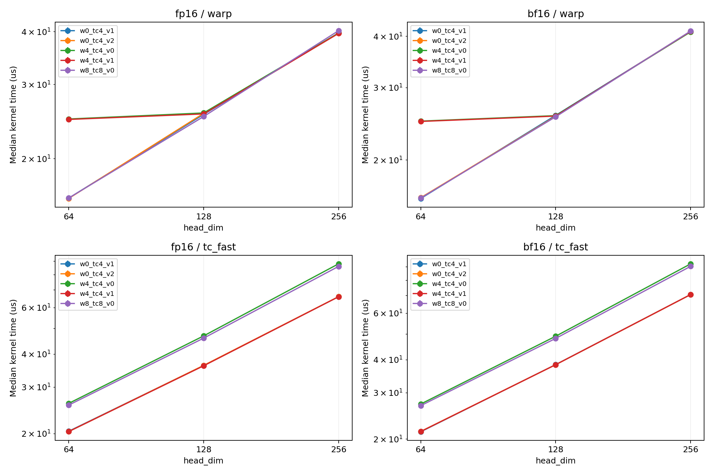
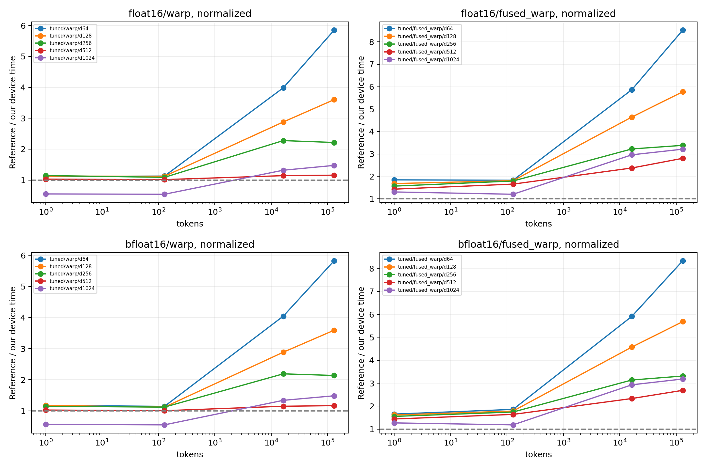
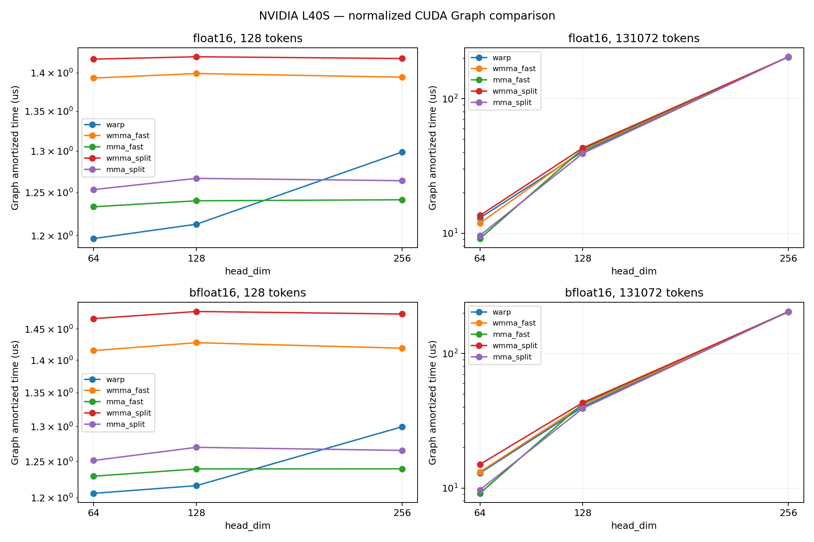
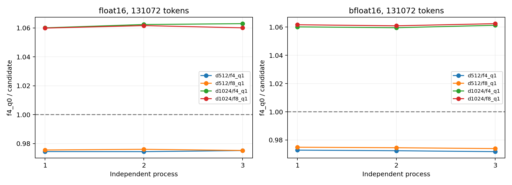
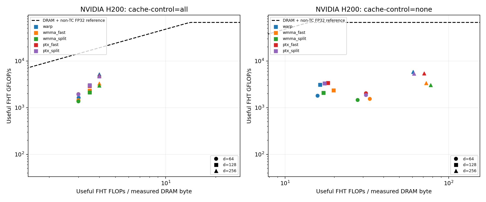
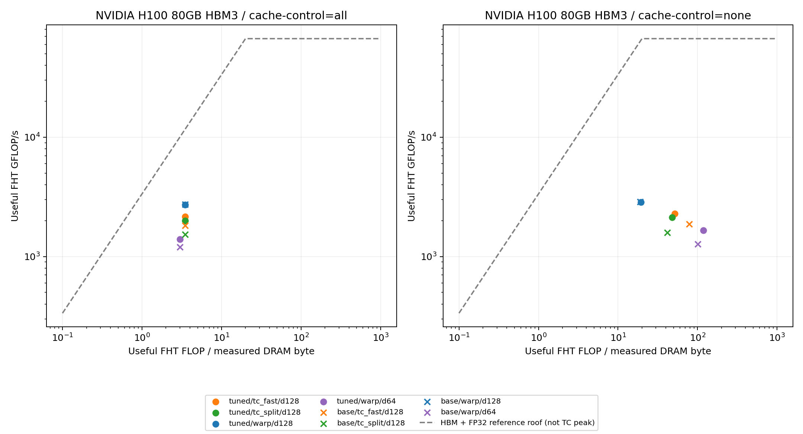

# Hadamard 变换加速项目总结报告

> 项目：2026 夏季训练营 CUDA 方向项目·选题三


## 1. 摘要

本项目实现了面向 `[batch_size, seq_len, num_heads, head_dim]` 激活张量最后一维的
CUDA 快速 Walsh-Hadamard 变换（FHT），支持 FP16 / BF16，核心 `head_dim` 为
64/128/256，并额外实例化 32/512/1024。围绕同一个数学定义，项目给出了**五条变换
路径和五条融合量化路径**，并在同一进程、同一 stream、同一输入上互相对照：

| 路径 | 关键结构 | 状态 |
|---|---|---|
| `baseline` | 一 block 一 token，全程 shared memory 蝶形 | 严格验收通过，作为正确性锚点 |
| `optimized`（9.1） | packed I/O + warp shuffle + 多 token/block | 严格验收通过 |
| `warp`（warp-per-token） | 每线程 `d/32` 元素，0 shared memory、0 barrier | 严格验收通过，**默认推荐** |
| `tc_fast` / `tc_split`（WMMA） | Kronecker 分解 + 两/三次 `m16n16k16` mma | 已实现，严格验收有保留失败 |
| `ptx_fast` / `ptx_split`（`mma.sync`） | 显式 PTX + warp shuffle 重排，消除 shared 中转 | 实验路径，未接入默认分发 |

对应的融合 INT4 路径与各自的变换算法配对，协议为逐 token 对称 INT4。

### 1.1 主要结论

**1. 非 Tensor Core 路径已严格验收通过并取得确认收益。** 以 Dao-AILab
`fast_hadamard_transform` v1.1.0 为参考，在 132 个配置的严格矩阵上，
`baseline` / `optimized` / `warp` 均为 **132/132、最大绝对误差 0**。性能上，
L40S、131072 tokens 下 `optimized` 相对 `baseline` 加速 1.24×–3.42×；
`warp` 在此之上于 d=128 再快 **1.68×**，其融合 INT4 相对已验收的 9.2 融合 kernel
快 **2.13×–3.34×**（d=64/128/256），且与 9.1 输出 100% 逐位一致。

**2. Tensor Core 路径有性能收益，但严格数值覆盖不足，因此不作默认。**
用 `H_d = H_{d/16} ⊗ H_16` 把 FHT 改写成两次 16×16×16 WMMA（而非退化成稠密
GEMM）之后，`tc_fast` 在 L40S d=64 上确实最快（相对最好的非 TC 实现 1.16×）。
但同一严格矩阵下 `tc_fast` 为 **96/132**（最大绝对误差 1）、
`tc_split` 为 **121/132**（最大绝对误差 0.5），**不能宣称普遍满足题目判据**。
11 个 split 失败全部出现在非归一化配置，但这不构成对归一化输入正确性的证明。

**3. Tensor Core 在 d≥128 落后的原因有两条独立证据。** nsys 的 launch 结构显示
WMMA 的 accumulator 与 matrix_b fragment 布局不同，必须经 shared memory 中转，
9.7–12.8 KB/block 的 scratch 把 resource-limit occupancy 从 100% 压到 83.3%/66.7%；
H200 硬件计数器显示 `warp` 路径的 `stall barrier` **精确为 0**、主导 stall 是
global memory 延迟（访存受限算子的正常形态），而两条 TC kernel 的主导 stall 换成
`short scoreboard` 与 `mio throttle` —— 它们在等 shared memory，不是在等显存。

**4. 显式 PTX 证实了上述归因，但没有解决精度问题。** 用 `mma.sync` 配合 warp
shuffle 直接完成 accumulator → operand 重排后，H200 D=128 的 dynamic shared 从
9728 B/block 降到 **0**，`short scoreboard / active issue` 从 6.164 降到 0.976，
NCU 时间从 6.304 降到 4.992 μs。PTX 与对应 WMMA 的输出逐位一致 —— 这既说明重排
正确，也说明**它继承了原算法的全部精度失败**。

**5. 纯 Tensor Core 同时满足严格精度与速度，仍是未解决的研究项。** 加入误差包络
保护与 warp 回退后（`MMA_PRECISION=3`）可以做到 108/108，但 H200 FP16 d=64/128/256
分别为 20.927 / 39.334 / 72.718 μs，**均慢于同卡严格 warp 的 13.651 / 22.257 /
35.956 μs**。这条路径是"TC + warp 回退"，不能描述成纯 TC 的精度修复，更不能把
回退通过包装成 TC 的成功。

**6. 项目已在三个国产 GPU 平台完成适配**：Moore Threads MUSA（S4000）、
沐曦 MACA（MetaX C500）、天数智芯 CoreX（Iluvatar MR-V100）。三者均不改动 CUDA
主工程的默认构建，覆盖 baseline / optimized / warp / 融合 INT4 全部非 TC 路径。

### 1.2 交付状态总览

| 交付项 | 状态 | 主要证据 |
|---|---|---|
| FP16/BF16 baseline | 严格验收通过 | 参考库 132/132，绝对误差 0 |
| 9.1 optimized FHT | 严格验收通过 + 确认收益 | L40S 1.24×–3.42×；参考库 132/132 |
| 9.2 fused INT4 | 严格验收通过 + 确认收益 | L40S 1.26×–2.33×；三类一致性检查全过 |
| warp-per-token FHT | 严格验收通过 + 确认收益 | d=128 再快 1.68×；与 9.1 100% 逐位一致 |
| warp-per-token 融合 INT4 | 严格验收通过 + 确认收益 | 相对 9.2 快 2.13×–3.34×（d=64/128/256） |
| 扩展 shape / normalize | 严格验收通过 | 132 配置矩阵覆盖 d=64..1024、两种 normalize、六种分布 |
| Tensor Core 变换（WMMA） | 已实现，**严格验收有保留失败** | fast 96/132、split 121/132 |
| Tensor Core 融合 INT4 | 已实现（d≤256），尾部已修复 | 与同算法 unfused 逐位一致；d>256 显式回落 |
| Tensor Core vs 非 TC 对比 | 已完成 | 同进程/stream/输入的十条路径 A/B |
| 显式 PTX `mma.sync` | 已实现，**实验路径不作默认** | 与 WMMA 输出哈希一致；继承同样的精度失败 |
| 保护式 TC（`MMA_PRECISION=3`） | 已测试，**慢于 warp 故不采用** | 108/108 + 192/192 压力测试，但更慢 |
| Nsight Systems | 已完成 | kernel timeline、launch 形状、寄存器/shared、API 汇总 |
| Nsight Compute 硬件计数器 | 已完成（H200 / H100） | throughput、occupancy、L2、warp stall 齐全 |
| Roofline | 已完成（口径分列） | 历史 L40S 逻辑 I/O；H100/H200 实测 DRAM |
| 与外部参考库的性能对照 | 已完成 | H200 80 配置、2800 条 Graph 摊销计时 |
| 国产平台适配 | 已完成（三平台） | MUSA / MACA / CoreX 均实测通过 |
| FP8 输出 | **未实现** | 见 §10.4 |
| 模型端到端集成 | **未实现** | 当前为算子级合成输入，见 §10.4 |

## 2. 背景与目标

激活中的少量异常值会放大量化 scale，挤压大多数普通值的有效量化区间。正交旋转把
能量扩散到多个通道，可降低单通道动态范围，同时保持全精度网络的等价性。QuaRot
展示了旋转后端到端 4 bit 权重、激活和 KV cache 量化；SpinQuant 进一步学习旋转矩阵；
FlashAttention-3 则将 incoherent processing 与 FP8 block quantization 用于 Hopper
注意力计算。相关一手资料见附录 C。

项目目标不是只追求单次最快数字，而是建立可验证、可复现的优化闭环：

1. 支持题目要求的形状、FP16/BF16 和 64/128/256 维度；
2. 与官方 CUDA 参考库对齐变换次序、归一化和输出 dtype；
3. 建立可复现的正确性矩阵、CUDA Event 性能日志和 profiler 入口；
4. 用 profiler 数据驱动 shuffle / vectorized / multi-token 优化；
5. 固定量化协议并验证 fused 与 unfused bit-exact；
6. 在 Tensor Core 上**换算法**实现同一变换，并与做到位的非
   Tensor Core 实现在同环境下对比误差、单 kernel 时间和融合后的端到端时间。

## 3. 数学定义与算法

令 `d = head_dim`，且 `d` 为 2 的幂。Sylvester Hadamard 矩阵满足：

```text
H_1 = [1]
H_2d = [[H_d,  H_d],
        [H_d, -H_d]]
H_d H_d^T = d I
```

实现同时支持：

- 非归一化：`y = H_d x`；
- 归一化：`y = H_d x / sqrt(d)`，此时为正交变换，也是默认的量化旋转语义。

直接矩阵乘的复杂度为 `O(d^2)`。FHT 利用 Kronecker 结构进行蝶形分解，每轮执行：

```text
(a, b) -> (a + b, a - b)
stride = 1, 2, 4, ..., d/2
```

因此每个 token 的计算复杂度降为 `O(d log d)`，额外存储为 `O(d)`。

## 4. 基础实现

### 4.1 工程结构

| 路径 | 内容 |
|---|---|
| `include/hadamard.cuh` | 稳定的 host API、dtype 与返回码 |
| `include/cuda_check.cuh` | 统一的 CUDA Runtime 错误检查宏 |
| `src/hadamard.cu` | baseline、9.1 optimized、9.2 fused INT4 的模板 kernel 与静态分发 |
| `src/hadamard_warp.cu` | warp-per-token FHT 及其融合 INT4（独立编译单元） |
| `src/main.cu` | 输入生成、参数解析、CUDA Event 计时、dump 与 CSV |
| `src/advanced_bench.cu` | 9.1/9.2 A/B 计时、CPU INT4 reference 与 bit-exact 检查 |
| `src/reference_cpu.h` | 开发期 FP32 自检 |
| `tensor_core/` | WMMA / PTX / 精度诊断实验分支，详见 [`tensor_core/README.md`](../tensor_core/README.md) |
| `musa/`、`muxi/`、`tianshu/` | 三个国产平台的适配入口（§10.1） |
| `tests/` | CPU 工具测试与 GPU 参考库验收入口 |
| `scripts/`、`slurm/` | 一键测试、profiler 采集与集群作业模板 |

接口按**加法**方式演进：`launch_hadamard`（baseline）、
`launch_hadamard_optimized`、`launch_hadamard_warp`、
`launch_hadamard_fused_quant_int4`、`launch_hadamard_fused_quant_int4_warp`
各自独立，旧路径的数值语义从未改动。这既保证已验收结论持续有效，也使任意两条
路径可以在同一输入、同一 stream、同一 Event 边界下做严格逐位回归。

关键函数均注明张量语义、精度策略、同步原因和错误码。所有 CUDA Runtime 调用统一经
`CUDA_CHECK` 检查，kernel launch 后检查异步错误，不静默吞错。

### 4.2 数据布局与数值路径

前 3 个维度展平成 `total_tokens = batch × seq × heads`，变换沿最后一维进行。
所有路径共享同一条数值策略：

1. FP16/BF16 从 global memory 读入；
2. 精确转换为 FP32；
3. **全部蝶形在 FP32 中完成**；
4. 可选乘 `1/sqrt(d)`；
5. **只在最终写回时**舍入到 FP16/BF16。

FP32 中间计算是 BF16 达到误差要求的关键。若直接以 BF16 逐轮累加，误差会随蝶形
级数快速传播。这条策略也是本实现能与参考库 bit-exact 的直接原因：相同的累加
精度 + 相同的蝶形次序 + 末端一次舍入。

### 4.3 baseline

映射为"一 block 一 token、一线程一元素"：`gridDim.x = total_tokens`，
`blockDim.x = head_dim`，全部蝶形经 shared memory，每轮后一次 `__syncthreads()`。

这个结构直接、易于证明正确，**但它不是最优映射**，保留的目的是作为正确性锚点和
严格 A/B 的对照基线。后文所有"相对 baseline 的加速比"都应理解为相对教学实现，
而不是相对一个做到位的实现 —— 这也是本报告在比较 Tensor Core 时坚持与
warp-per-token（而不是 baseline）对照的原因。

## 5. 优化设计

本章沿着“减少同步、提高访存宽度、消除中间写回”三条主线，从optimized
逐步推进到 warp-per-token、融合 INT4 与 Tensor Core / PTX 实验路径。

### 5.1 optimized FHT

每个线程负责相邻两个元素，使用 `half2` / `__nv_bfloat162` 做 32-bit 合并
load/store。stride=1 的加减留在同一线程的两个 FP32 寄存器中；stride=2–32 通过
`__shfl_xor_sync` 交换，不再为每一轮访问 shared memory 和执行 block barrier；
只有 stride ≥ 64 的跨 warp 阶段才使用 shared memory。d=64 每 block 处理 4 tokens，
d=128 每 block 处理 2 tokens，减少 block 数并提高每个 block 的有效工作量。

### 5.2 fused INT4

量化协议固定为逐 token 对称 INT4：

```text
scale = max(abs(x)) / 7                     # 全零 token 使用 scale=1
q = clamp(round_to_nearest_even(x / scale), -7, 7)
```

相邻两个 `q` 按 two's-complement 分别放入一个 byte 的低/高 nibble；每 token 另存
一个 FP32 scale。unfused 路径为 `optimized FHT → 低精度中间张量 → quantize`；
fused 路径在 FHT 寄存器结果上**先模拟一次输入 dtype 的舍入**，再直接求
max/scale/INT4，避免中间张量的写回和重读。

这个显式舍入是 fused 与 unfused 能够严格 bit-exact 的关键：不做这一步，fused 会
在 FP32 精度上量化，与 unfused 走过低精度中间张量的结果系统性不同。

量化 kernel 中每个线程处理相邻两个元素：先求本地 `max(abs(x0), abs(x1))`，再用
`__shfl_down_sync` 做 warp max；每个 warp 仅写一个 shared-memory 最大值，thread 0
完成最终 token max 和 scale，最后所有线程并行舍入、饱和并打包。fused kernel 采用
每 block 一个 token，因为 scale 依赖整个 token。

### 5.3 warp-per-token FHT

结构性瓶颈来自"每线程只持 2 个元素"：一个 token 需要 `d/2` 个线程，
所以 d=128/256 时 token 跨多个 warp，stride ≥ 64 的蝶形必须走 shared memory +
`__syncthreads()`，而且那些阶段用 `if (partner > local_pair)` 只让一半线程干活。
d=256 因此只拿到约 1.25× 加速。

把每线程负责的元素数提升到 `ELEMS = head_dim / 32`，于是**一个 warp 恰好处理一个
token**：

- 全局下标 = `lane * ELEMS + i`；
- `stride < ELEMS` 的低阶蝶形完全在同一线程的寄存器数组内完成；
- `stride >= ELEMS` 的阶段配对元素落在 `lane ^ (stride/ELEMS)` 上，`i` 不变，
  因此恒定是 **5 次** `__shfl_xor_sync`（因为 `d/ELEMS = 32`），**与 d 无关**；
- 全程 **0 shared memory、0 `__syncthreads()`**，所有线程每一级都在干活；
- global 访问宽度提升到 `ELEMS × 2` 字节：d=64 为 32-bit、d=128 为 64-bit、
  d=256 及以上为 128-bit（多个 `int4` chunk）。

融合 INT4 版本受益更大。融合 kernel 是 block-per-token，per-token max 需要
一次 warp shuffle + shared memory 跨 warp 归约 + 两次 `__syncthreads()`；
warp-per-token 之下一个 warp 就是一个 token，per-token max 退化成纯 warp
`__shfl_xor_sync` 归约，**shared memory 和 barrier 全部消失**，写回也从每线程
1 byte 提升到每 lane `ELEMS/2` 字节的一次 32-bit store。

限制是 `head_dim >= 64`（否则一个 warp 装不下 2 元素/线程），d=32 仍走 9.1 路径。

### 5.4 Tensor Core 路径（WMMA）

**分析**：把 Hadamard 写成稠密 `H_d @ x` 交给 Tensor Core 是错的。
FHT 是 `O(d log d)`，稠密 GEMM 是 `O(d^2)`；d=256 时每 token 的算术量从 2048 次
加减涨到 65536 次乘加，涨 32 倍，而 Tensor Core 相对 FP32 SIMT 的峰值优势只有
一个量级左右，且 FHT 本身访存受限（逻辑算术强度仅 1.5–2.0 FLOP/B）。所以
Tensor Core 版本必须**换算法**，而不是换后端。

本实现用 Sylvester 矩阵的 Kronecker 递归，取 `b = 16`（正好是 WMMA `m16n16k16`
的形状）：

```text
H_d = H_{d/16} (kron) H_16          (d >= 64)
```

把 token 内下标写成 `j = 16*rr + c`，则

```text
y[16*rr+c] = sum_{rr',c'} H_{d/16}[rr,rr'] * H_16[c,c'] * x[16*rr'+c']
         ==>  Y = H_{d/16} @ X @ H_16^T ,   H_16 对称
```

为了让每条 mma 都吃满 16×16×16，实现固定"**一个 warp 处理 256 个连续元素
（一个 16×16 tile）**"，而不是固定一个 warp 一个 token：

| head_dim | 一个 tile 的内容 | 左乘常量矩阵 `A` |
|---:|---|---|
| 64 | 4 个 token，每 4 行一个 | `I_4 (kron) H_4` |
| 128 | 2 个 token，每 8 行一个 | `I_2 (kron) H_8` |
| 256 | 1 个 token，16 行 | `H_16` |
| 512 / 1024 | 一个 token 跨 2 / 4 个 tile | `H_16` |

左乘因子统一是块对角常量矩阵 `A = I_k (kron) H_m`（`m = min(d,256)/16`、
`k = 16/m`），于是**任何 head_dim 都归约成同一个两步计算**：

```text
P = X @ H_16     第 1 次 mma；X 是原始低精度输入，FP32 累加
Y = A @ P        第 2 次 mma
```

`d > 256` 时一个 token 跨 `d/256` 个 tile，对应
`H_d = H_{d/256} (kron) H_256`：先在每个 tile 内做上面两步，再对 accumulator
**逐元素**做 `log2(d/256)` 级蝶形。同一 fragment 类型的第 `e` 个元素在各 tile 中
对应相同的 `(row, col)`，所以这一级完全在寄存器里完成。

每 token 的乘加次数为 `2d`（d=256 即 8192），是稠密 GEMM 的 1/8。

**精度是这条路径的真正难点。** WMMA 的 accumulator 是 FP32，但 operand 必须是
FP16/BF16。第 1 次 mma 直接使用原始输入，不保证任意动态范围下精确；中间结果 `P`
必须舍入回低精度才能喂给第 2 次 mma —— 这是 FHT 路径**没有**的额外舍入。
因此提供两种模式：

| 模式 | mma 次数 | 中间结果 | 效果 |
|---|---:|---|---|
| `tc_fast` | 2 | `P_hi = round(P)` | 最快，多一次低精度舍入 |
| `tc_split` | 3 | `P_hi = round(P)`，`P_lo = round(P - P_hi)` | 等效尾数 FP16 11→22 bit、BF16 8→16 bit |

`tc_split` 把 `A @ P` 拆成 `A @ P_hi + A @ P_lo` 累加到同一个 FP32 accumulator。
`A` 的元素只有 `0, ±1`，残差项能显著减小中间误差，**但这不保证与 FP32 FHT 逐位
一致**，严格验收结果见 §6.4。

**融合 INT4 侧**：每个 lane 固定负责 8 个连续元素，因此 `d <= 256` 时一个 token
恰好由连续的 `d/8` 个 lane 覆盖，per-token max 就是一次宽度为 `d/8` 的 sub-warp
`__shfl_xor_sync` 归约，无 shared memory、无 barrier。`d > 256` 时一个 token 跨
多个 tile，该归约不成立，接口**显式返回不支持**并由调用方回落到非 TC 融合
kernel —— 这是刻意的限制而不是未实现。

**尾部处理**：TC 融合 d=64/128 将完整 tile 交给 TC，尾部不足一个 tile 的 token
交给 warp 融合；输入、packed 输出和 scale 的偏移分别计算，全为尾部的
`tokens=1` 不启动零大小 TC grid。纯变换使用同样的分区，因此同算法融合比较覆盖
混合执行路径。

### 5.5 显式 PTX `mma.sync` 实验分支

§5.4 的实现瓶颈在于：WMMA 的 accumulator fragment 与 matrix_b fragment 内部布局
不同，第 1 次 mma 的结果**必须经 shared memory 中转**才能喂给第 2 次。绕开它需要直接控制 fragment 布局，这是 `tensor_core/src/hadamard_mma_experimental.cu`
的目的。

先澄清三个常被混淆的概念：**Tensor Core 是计算硬件，WMMA 是使用它的 CUDA 编程
接口，PTX 是 NVIDIA 的低层虚拟指令集**（介于 CUDA C++ 与机器码 SASS 之间，
编译关系为 CUDA C++ → PTX → SASS）。本分支用 `mma.sync` 指令调用**同一类**矩阵
乘加硬件，收益来自减少 shared memory 中转，**不是"写成汇编就更快"，也不会自动
修复原数值算法的精度问题**。

设计要点：

- 用两个 `m16n8k16` 覆盖一个 16×16 tile，生成原来的块对角 Hadamard 常量；
- 第 1 次 mma accumulator 到第 2 次 operand 的转换使用**显式 warp shuffle**，
  不经 shared memory；FP16/BF16、fast/split 仍分别实现原有的两种精度算法；
- 覆盖范围为 d=64/128/256，尾部继续用 warp；**不覆盖 d=512/1024，也没有 PTX 专用
  的融合量化**；
- 按**公开的** PTX fragment 布局设计，CPU 符号测试覆盖每个 lane 的 C→B 映射，
  不依赖不公开的 WMMA fragment 内部表示。

该分支是独立编译单元，**不接入生产 API 的默认分发**。它与对应 WMMA 路径在 108 个
核心配置上输出哈希差异为 0 —— 这既说明重排没有改变数值，也说明它**继承了原算法
的全部精度失败**（§6.4）。

### 5.6 编译期可选参数

所有优化候选都以编译参数形式提供，**默认值一律保持原有行为**，不因某次 A/B 的
最快结果而自动切换。Make 与 CMake 提供等价选项：

| Make 变量 | CMake 选项 | 取值 | 含义 |
|---|---|---|---|
| `WARPS` | `HADAMARD_WARPS_PER_BLOCK` | 0/2/4/8（默认 4） | 非 TC 变换的 warps/block；`0` = 按形状自适应（d=64 用 8，其余用 4） |
| `FUSED_WARPS` | `HADAMARD_FUSED_WARPS_PER_BLOCK` | 同上（默认继承 `WARPS`） | 融合 INT4 的 warps/block，与变换解耦 |
| `QUANT_VECTOR` | `HADAMARD_QUANT_VECTOR_STORE` | 0/1/2（默认 0） | INT4 宽写回：`1` = 全部支持维度，`2` = **仅 d=1024** |
| `TC_WARPS` | — | 默认 4 | TC 路径的 warps/block |
| `TC_VECTOR` | — | 0/1/2（默认 0） | TC shared 中转：`1` = 向量化读写，`2` = 再裁剪末尾 `__syncwarp` |
| `MMA_PRECISION` | — | 0/1/2/3（默认 0） | **仅作用于独立 PTX split**，见下 |
| `CUDA_ARCH` | `CMAKE_CUDA_ARCHITECTURES` | 默认 86 | 目标架构；BF16 WMMA 需要 SM ≥ 80 |
| `OUT` | — | 默认 `build` | 输出目录。**每组参数必须用独立 `OUT`**，否则 make 会复用旧编译参数 |

`TC_VECTOR=1` 把每 lane 的 8 个 FP32 shared 读取改为两次 `float4`，低精度 shared
写入改为一次 `int4`，padded stride 保证 16 B 对齐，局部向量数组显式 `alignas(16)`。
**数学运算和舍入次序不变**，通过输出 SHA256 检查各变体同一后端是否保持逐位输出。

`MMA_PRECISION` 的四个取值：

- `0`：原来的高低部分顺序 MMA 累加，保持旧算法；
- `1`：高、低部分分别以 FP32 accumulator 计算，最后相加；
- `2`：再分解一层 native 残差，低、第三部分先相加，再与高部分相加；
- `3`：在 `2` 的基础上，以 tile 输入最大值、维度和 scale 构造保守误差包络，
  检查 native 舍入后的上下界是否仍满足绝对误差阈值；**无法安全判定时，整个 tile
  使用与参考一致顺序的 FP32 warp 蝶形重新计算**。

必须明确：`MMA_PRECISION=3` 是 **"TC + warp 回退"**，不是纯 TC 的精度修复。其
误差包络是需要压力测试验证的保守构造，不声称对任意有限位模式的形式化证明。

**采用与拒绝的候选**（依据见 §8.4、§8.7）：

| 候选 | 决定 | 理由 |
|---|---|---|
| `WARPS=0`（按形状自适应） | 作为**可选**组合提供 | H200 上 d=64 warp 快 1.54×，但跨架构最优不同，不改全局默认 |
| `TC_VECTOR=1` | 作为**可选**组合提供 | `short scoreboard` 降约 50%，TC 自身快 1.27×–1.47× |
| `TC_VECTOR=2`（裁剪末尾同步） | **拒绝** | 变化在 ±0.55% 内，无稳定收益 |
| `WARPS=2` | **拒绝** | 明显拖慢小维度 warp |
| `QUANT_VECTOR=1`（全维度宽写回） | **拒绝** | d=1024 快约 6%，但 d=512 回退约 2.5% |
| `QUANT_VECTOR=2`（仅 d=1024） | 作为**可选**组合提供 | 三个独立进程复测确认 d=1024 收益，d=512 基本不变 |
| `MMA_PRECISION=3`（保护式 TC） | **保留为实验** | 108/108 通过，但比严格 warp 慢 1.5×–2.0× |

可选组合的构建入口：

```bash
# TC 调优组合（不会把 warp 后端偷偷替换为数值不同的 TC）
make -C tensor_core h200-tuned

# 仅 d=1024 开启宽写回
make CUDA_ARCH=90 WARPS=0 QUANT_VECTOR=2 OUT=build/h200-selective
```

## 6. 正确性验证

判据与口径见 §7.3、§7.4，本节只给方法与结果。

### 6.1 验收流程

每个配置由 C++ bench 生成目标低精度输入，运行本项目 kernel 并 dump 原始
输入/输出；Python 将输入严格 reshape 为 `[-1, head_dim]`，再调用参考库。双方使用
相同 scale，并在 FP32 域比较低精度输出。

`tc_bench` 支持 `--input_bin`、`--reference_bin`、`--dump_dir`。外部参考必须来自
相同输入、dtype 和归一化 scale；**文件长度必须恰好为元素数乘 2 字节**，读取入口
拒绝多余尾部字节。`validate_tc.py` 默认使用 Dao-AILab `fast_hadamard_transform`；
`--reference cpu` 明确选择独立 PyTorch FP32 蝶形参考，**不伪称跑过参考库**。
Python 再读回所有输出，独立复核 C++ 的误差值、通过判据和校验元素数，并保存失败
输入以便复现。

### 6.2 测试矩阵

项目先后使用过三个规模不同的矩阵，报告中引用时均注明分母，**不同分母不能混用**：

| 矩阵 | 规模 | 构成 | 用途 |
|---|---:|---|---|
| 历史 baseline 验收 | 36 | FP16/BF16 × d=64/128/256 × tokens=1024/16384/131072 × normalize 开关 | 原 baseline 的参考库验收 |
| **严格全矩阵** | **132** | FP16/BF16 × d=64/128/256/512/1024 × normalize 开关 × tokens=1/5/2048（60 个）+ FP16/BF16 × d=64/128/256 × normalize 开关 × 六种输入分布（72 个） | **当前正式验收** |
| 核心维度子矩阵 | 108 | 仅 d=64/128/256 | PTX 实验与精度实验 |

六种输入分布为：全零、常量、正负交替、单位脉冲、均匀随机、有限离群值。

TC 融合只统计其支持的 d=64/128/256，分母为 108；纯变换覆盖 d=64..1024，分母 132。

历史 `tc_17083405` 的 CSV 实际只含 **14 个唯一配置**（10 个主配置 + 3 个 FP16
非归一化配置 + 1 个尾部配置），且旧尾部用例**跳过了** TC 融合。该次
`sweep_exit_code=0` 包含相对误差放宽，**不能**作为严格验收通过的证据。

### 6.3 非 Tensor Core 路径：全部通过

严格 132 配置矩阵，两套参考独立执行且结论一致：

| 参考 | 环境 | 结果 |
|---|---|---|
| 独立 FP32 蝶形（PyTorch） | CUDA 13.0.88，作业 `17251073` | baseline/optimized/warp 各 132/132，最大绝对误差 **0** |
| Dao v1.1.0 参考库 | CUDA 12.8 容器，H100 `gh008`，作业 `17251286` | 同上，132/132，最大绝对误差 **0** |

参考库为上游完整源码 commit `1cc807efbd6cc001df359822d60bf6052dd66859`，在 CUDA
12.8 容器内编译，不修改共享 Python 环境。五组编译参数分别完成上述矩阵，**同用例/
同后端的输出 SHA256 跨参数差异为 0**，Python 与 C++ 判据不一致行数为 0。

原 baseline 在历史 36 配置矩阵上同样 36/36 通过，`max_abs_error=0`、逐位一致率
100%，逐配置记录见 [`results/library_check.csv`](../results/library_check.csv)。

### 6.4 Tensor Core 路径：保留的失败

同一严格矩阵、同样两套参考下：

| 路径 | 严格通过/总数 | 最大绝对误差 |
|---|---:|---:|
| `tc_fast` | **96/132** | 1 |
| `tc_split` | **121/132** | 0.5 |

失败**主要集中在非归一化输入**。典型失败例：非归一化、2048 tokens、
FP16 d=128 的 split 绝对误差为 0.015625（阈值 0.01）；BF16 d=64 为 0.0625
（阈值 0.05）。split 的 11 个失败**全部**为非归一化配置 —— 但这只是观察到的分布，
**不构成对任意归一化输入正确性的证明**。

这组结果同时说明历史上的 `PASS(rel)` 掩盖了真实的绝对误差不达标：失败正是在
相对误差口径下曾被判为通过的那些配置。作业记录中保留的 `all_pass=false` 和
`validation_rc=1` 就是这些失败，未被抹掉。

核心维度 108 子矩阵上，WMMA 与 PTX 均为 fast 84/108、split 101/108；
`validation_rc=1` 是保留的精度失败，实验未因此冒充全通过。

**结论是"默认非 TC 路径在本矩阵通过，TC 实现有性能收益但严格数值覆盖不足"，
不是"全部 kernel 合格"。**

### 6.5 融合与非融合的一致性

`hadamard_advanced_bench` 与 `tc_bench` 对每条融合路径执行三类逐位验证（口径见
§7.4）：

1. optimized FHT 与保留的 baseline 低精度输出完全一致；
2. fused INT4 的 packed bytes 和 FP32 scales 与**同算法** unfused pipeline 完全一致；
3. GPU unfused quantizer 与独立 CPU reference 的 packed bytes 和 scales 完全一致。

严格矩阵结果：

| 路径 | 通过/总数 | 说明 |
|---|---:|---|
| unfused / `fused_opt` / `fused_warp` INT4（各自） | 132/132 | packed bytes 与 scale 逐位一致 |
| `fused_tc_fast` / `fused_tc_split` INT4（各自） | 108/108 | 与各自未融合算法逐位一致 |

L40S 上 6 个核心性能配置全部 PASS；进一步覆盖 FP16/BF16、normalize 开关与
d=32/64/128/256/512/1024 的 24 个小规模配置也全部通过三项检查。CPU reference 另外
计算反量化误差：normal 输入下 MAE 为 0.0912–0.1084，RMSE 为 0.1075–0.1263。

注意 §6.4 的 TC 变换精度失败与本节的融合一致性通过**不矛盾**：融合检查回答的是
"融合是否改变了该算法自己的结果"，它不能替代变换本身的精度验收。

### 6.6 `tc_split` 精度的逐阶段定位

作业 `17290602`（H200 `gh119`，23 秒）读取旧严格验收中 split 的 11 个失败输入，
新增**仅诊断用**编译单元，记录真实 GPU 第一次 MMA 输出 `P` 和最终 native 转换前的
FP32 值。先验证探针输出舍入后与生产 `tc_split` **逐位一致**（11/11 全部一致），
再分四步分解误差：第 1 次 MMA 与 FP64 第一阶段的差异；`P_hi + P_lo` 对 `P` 的
表示误差及其传播；后续 GPU 累加相对精确 hi/lo 第二阶段的差异；最后舍入相对参考库的
绝对误差。

FP64 在这里**仅用于定位误差，不代替验收**。原尾部 warp 回退的 token 不混入完整
TC tile 的错误归因。

| 失败元素 | FP16 d=128 | BF16 d=64 |
|---|---:|---:|
| 库输出 | 21.234375 | 13.0625 |
| TC 输出 | 21.21875 | 13.0 |
| FP64 精确蝶形值 | 21.2265639305 | 13.0312957764 |
| 从 GPU `P` 精确完成后续变换 | 21.2265639305 | 13.0312957764 |
| 从 `hi+lo` 精确完成后续变换 | 21.2265639305 | 13.0312347412 |
| GPU 最终舍入前值 | 21.2265625 | 13.0312347412 |
| native 绝对误差 | 0.015625 | 0.0625 |

两类典型问题：

- **FP16 例**：高低分解没有改变该输出的精确值，是后续 GPU 累加使其落在 native
  舍入中点上，ties-to-even 选了另一侧；
- **BF16 例**：`hi+lo` 的有限表示已经把值推过中点，后续累加不是该元素的主要误差源。

此外，FP16 输入的第 1 次 MMA 也并非普遍精确：本矩阵第 1 次 MMA 相对 FP64 的最大
差异约 `4.77e-7`–`3.81e-6`。

**更重要的发现：参考库本身也不总是"FP64 精确值再舍入"。** FP16 d=1024 的该用例中，
两者最大差异为 0.0625。因此不能简单把 TC 换成"更精确"的算法就声称满足与参考库的
固定绝对误差要求，更不能反过来用 FP64 作为宽松的验收依据（§7.3）。

本轮**没有**宣布 11 个失败已修复。

### 6.7 提高精度的三次尝试与其代价

`MMA_PRECISION` 的四个取值（定义见 §5.6）在核心 108 配置矩阵上的结果，
H200、严格判据、warp 作为对照：

| PTX split 参数 | 严格通过 | 最大误差 | 相对 p0 新修复 / 新回归 |
|---|---:|---:|---:|
| `0` 原算法 | 101/108 | 0.25 | — |
| `1` 独立累加 | 103/108 | 0.25 | 2 / 0 |
| `2` 三段残差 | 107/108 | 0.015625 | 6 / 0 |
| `3` 保护 + warp 回退 | **108/108** | 0.00048828125 | 7 / 0 |
| warp（对照） | **108/108** | **0** | — |

`2` 的剩余失败为 FP16 d=64、5 tokens、normalize=false、outlier 模式（case 71）；
**不能用"107/108"掩盖这项失败**。

更多残差项减少表示损失，但**不保证**恢复参考库的蝶形累加次序，因此必须以实测验收
为准，不能仅凭构造宣称严格合规。

精度改进的性能代价（H200、FP16、μs）：

| 配置 | d=64 | d=128 | d=256 |
|---|---:|---:|---:|
| `0` 原算法 | 10.707 | 20.286 | 37.742 |
| `2` 三段残差 | 12.294 | 21.243 | 40.286 |
| `3` 保护 + 回退 | 20.927 | 39.334 | 72.718 |
| **严格 warp** | **13.651** | **22.257** | **35.956** |

`3` 虽然通过全部严格检查，但比严格 warp 慢 1.53×/1.77×/2.02×。保护分支增加了
转换、判定、shuffle 与必要的重算，**没有带来可用的加速**。因此默认继续使用严格
warp，既不替换为保护式 TC，也不悄悄使用仍有精度失败的原 TC。

**纯 TC 同时保持严格精度与速度，仍是未解决的研究项。**

### 6.8 压力测试、sanitizer 与负向测试

| 检查 | 规模 | 结果 |
|---|---|---|
| 幅度/相消压力测试 | 192 配置 × 512 tokens，FP16 输入缩放 2⁻¹⁶–2⁷、BF16 2⁻¹²⁰–2¹⁰⁰ 的选定档位 | 192/192 通过（**非连续全域穷举**） |
| sanitizer（五参数 × 五维度 × 三工具） | 75 项 memcheck/racecheck/synccheck | 全部 0 errors，racecheck 同时 0 warnings |
| sanitizer（PTX 候选） | 9 项，覆盖 d=64/512/1024、BF16、tokens=5 | 全部 0 errors，racecheck 0 warnings |
| sanitizer（保护式 TC） | memcheck/racecheck/synccheck | 全部 0 errors，racecheck 0 warnings |
| GPU 负向测试 | 30 项：短/长输入、非法形状、溢出形状、零参考范围、伪造参考 | 全部通过 |
| CPU 单元测试 | 13–14 项：配置去重与覆盖、NCU 宽表单位换算、多 kernel 拒绝、缺失计数器不伪造、采集维度解析、严格验收回归保护 | 全部通过 |

sanitizer 的验证输入为 BF16、d=64、tokens=5，覆盖完整 tile 与尾部；
**不能扩大解释为所有形状已通过 sanitizer**。同理，压力测试覆盖的是选定档位，
不是连续全域。

### 6.9 一条需要单独说明的历史误差

开发期曾对 CPU FP32 未舍入真值运行 22 个配置，唯一
`BF16 + head_dim=128 + outlier(scale=20)` 的最大绝对误差为 `6.248e-2`，看似超标。
该项与官方 BF16 输出仍然 bit-exact，原因是输出落入 `[16,32)` 后 BF16 的 half-ULP
已达 `0.0625`，大于题目的固定绝对阈值。

**这是输出格式的舍入边界，不是 CUDA 计算错误** —— 也正是 §7.3 拒绝用 FP64/未舍入
参考做验收的原因。正式验收以同 dtype 参考库结果为准。

### 6.10 历史 FP64 采样诊断（保留，不用于验收）

以下为早期对前 4096 个 token 与 FP64 CPU 参考（同 stage 顺序、全程 double）的
比较。`max_ulp` 以"该 token 峰值处输出 dtype 的 ULP"为单位，**不是**每个元素
自己的 ULP，因此 `<= 0.5` 不能证明正确舍入（§7.3）。此表仅作诊断，
验收结论以 §6.3、§6.4 为准。

| dtype | d | 实现 | max_abs_error | max_ulp | 与 optimized 逐位一致率 |
|---|---:|---|---:|---:|---:|
| FP16 | 64 | warp | 1.901e-03 | 0.500 | 100.00% |
| FP16 | 64 | tc_fast | 2.138e-03 | 1.244 | 59.80% |
| FP16 | 64 | tc_split | 1.901e-03 | 0.500 | 100.00% |
| FP16 | 128 | warp | 1.813e-03 | 0.500 | 100.00% |
| FP16 | 128 | tc_fast | 2.119e-03 | 0.995 | 58.68% |
| FP16 | 128 | tc_split | 1.813e-03 | 0.500 | 100.00% |
| FP16 | 256 | warp | 1.762e-03 | 0.500 | 100.00% |
| FP16 | 256 | tc_fast | 2.249e-03 | 0.924 | 57.99% |
| FP16 | 256 | tc_split | 1.762e-03 | 0.500 | 100.00% |
| FP16 | 1024 | tc_split | 1.949e-03 | 0.500 | 99.99% |
| BF16 | 64 | warp | 1.495e-02 | 0.500 | 100.00% |
| BF16 | 64 | tc_fast | 1.935e-02 | 1.051 | 59.76% |
| BF16 | 64 | tc_split | 1.495e-02 | 0.500 | 99.97% |
| BF16 | 128 | tc_fast | 1.669e-02 | 1.013 | 58.67% |
| BF16 | 128 | tc_split | 1.553e-02 | 0.500 | 99.97% |
| BF16 | 256 | tc_fast | 2.066e-02 | 0.962 | 57.97% |
| BF16 | 256 | tc_split | 1.559e-02 | 0.500 | 99.94% |

`tc_split` 在 FP16 d=64/128/256 的这组样本中 100% 逐位一致，BF16 和更大维度存在
不一致；结合 §6.4 的严格结果，**不能宣称普遍等价**。

## 7. 实验设置

本项目横跨五种 GPU、三套计时方法和两类数值参考。为避免把不同口径的数字混在
一起，正确性、性能和 profiler 数据均遵守以下统一约定。

### 7.1 状态词与结论强度

| 状态 | 含义 |
|---|---|
| 已实现 | 代码存在并能编译 |
| 已测试 | 在目标硬件上跑通并产出记录 |
| 严格验收通过 | 在 §7.3 判据下逐配置通过，失败数为 0 |
| 已确认收益 | 同后端、同硬件、多次重复测量的中位数显示稳定加速 |

编译通过不等于测试通过，测试跑完不等于验收通过，单次变快不等于确认收益。
Slurm 作业标记 `COMPLETED` 只表示流程执行完毕，不表示其中各项检查都通过。

### 7.2 计时边界、预热与重复测量

| 口径 | 含义 | 用途 |
|---|---|---|
| **CUDA Event（无 profiler）** | 同一 stream 上包围 kernel 的 Event 计时，预热后重复测量 | 正式性能数字 |
| **CUDA Graph 回放摊销** | 捕获 16 次调用为 Graph，回放 10 次后按节点摊销 | 与外部参考库的同边界对照 |
| **NCU duration** | Nsight Compute 单 kernel replay 报告的时间 | 仅用于 profiler 内部结构对比 |

基础扫描使用 5 次预热、20 次测量；主 A/B 使用 20 次预热、100 次测量；涉及候选
参数选择时使用独立进程重复测量并比较中位数。NCU 会串行化 kernel 并引入采集
开销，其绝对值不能替代无 profiler 计时；Graph 摊销消除了 Python/ctypes 的调用
开销差异，也不等于端到端 API 延迟。三种口径不跨口径计算加速比。

### 7.3 数值验收判据

题目规定固定绝对误差：FP16 `< 0.01`，BF16 `< 0.05`。正式参考为 Dao-AILab
`fast_hadamard_transform` v1.1.0 的全张量低精度输出，输入、dtype、归一化 scale
与被测实现完全相同；比较在 FP32 域覆盖全部元素，不采样，并显式拒绝 `NaN`/`Inf`。

相对误差、FP64 未舍入参考和 token-peak ULP 仅用于诊断，不参与通过判定。尤其
token-peak ULP 以 token 峰值处输出 dtype 的 ULP 为单位，不是逐元素 ULP，
`max_ulp <= 0.5` 不能证明正确舍入。未提供外部参考时，运行仅作 optimized 回归，
CSV 中 `pdf_verified=0`。

### 7.4 三类互补的一致性检查

1. 对外部参考库的绝对误差，判断是否满足题目精度要求；
2. 与已验收路径的逐位一致率，判断新实现是否严格等价；
3. 融合与非融合的逐位比较，判断融合是否改变结果。

第 3 条必须按算法配对，例如 `fused_tc_fast` 只能与 `tc_fast` 比较。`bit-exact`
用于验证实现语义，`MAE` / `RMSE` 用于描述 INT4 有损误差，二者不能互相替代。

### 7.5 硬件、软件与输入规模

| 用途 | 硬件 |
|---|---|
| 历史 baseline | RTX 3060 Laptop（SM 8.6） |
| 端到端 A/B 主表 | L40S（SM 8.9） |
| 参数调优、参考库对照、PTX 计时 | H200（SM 9.0） |
| 缓存策略 NCU 与 Roofline | H100 SXM（SM 9.0） |
| 国产平台 | Moore Threads S4000、MetaX C500、Iluvatar MR-V100 |

软件版本随实验批次记录而非事后统一：L40S 主 A/B 与 H200 NCU 使用驱动
580.82.07、CUDA Toolkit 13.0；H200 参考库对照及后续 PTX 补测使用同版驱动、
CUDA Toolkit 12.8；外部参考库固定为 Dao-AILab `fast_hadamard_transform` v1.1.0。
逐作业的完整环境快照见附录 B，避免用一套软件版本错误覆盖全部历史结果。

核心输入矩阵覆盖 FP16/BF16、`head_dim=64/128/256` 和 small/medium/large 三档规模；
严格扩展矩阵进一步覆盖 d=512/1024、normalize 开关和六种输入分布。跨 GPU 数字不
混算，每张表均标注硬件、规模、计时方式和作业号。Roofline 使用对应采集硬件的
规格：H200 SXM 4.8 TB/s，H100 SXM 3.35 TB/s，L40S 864 GB/s。

### 7.6 Roofline 与吞吐计算

- 纵轴按 FHT 有用加减次数 `tokens × d × log2(d)` 计算，不把 Tensor Core 冗余
  稠密乘加计入收益；
- 横轴优先使用 NCU 实测 DRAM 字节；不可用时明确标为“逻辑最小 I/O”；
- FP32 compute roof 是非 Tensor Core 参考上限，不代表 Tensor Core 峰值利用率；
- warm-cache 下按逻辑 I/O 计算的有效带宽可能超过 HBM 理论值，表示 L2 复用，
  不表示超越物理带宽。

## 8. 性能结果

计时口径见 §7.2，跨 GPU 规则见 §7.5。每张表都标注硬件、规模、计时方式和作业号。

### 8.1 RTX 3060 Laptop：baseline 的起点

CUDA Event，预热 5 次、正式测量 20 次，131072 tokens：

| dtype | head_dim | avg ms | min ms | max ms | 有效逻辑带宽 GB/s | 算法吞吐 GOP/s |
|---|---:|---:|---:|---:|---:|---:|
| FP16 | 64 | 0.3497 | 0.3461 | 0.3666 | 95.95 | 143.93 |
| FP16 | 128 | 0.7613 | 0.7444 | 0.7916 | 88.15 | 154.26 |
| FP16 | 256 | 1.6550 | 1.6333 | 1.7551 | 81.10 | 162.20 |
| BF16 | 64 | 0.3475 | 0.3451 | 0.3562 | 96.55 | 144.83 |
| BF16 | 128 | 0.7468 | 0.7432 | 0.7506 | 89.86 | 157.26 |
| BF16 | 256 | 1.6723 | 1.6320 | 1.7295 | 80.26 | 160.52 |

观察：FP16 与 BF16 时间基本一致，说明瓶颈不在二者的转换差异；`d` 翻倍时时间约增
2.17 倍，符合 `d log d` 工作量增长；有效带宽随维度从约 96 GB/s 降到 80 GB/s，
说明同步和 shared-memory 访问开始占更大比例。**d=256 需要 8 次 block barrier，
这是当时定位到的首要优化对象** —— 后续 9.1 和 warp-per-token 正是沿这条线做的。

### 8.2 L40S：9.1 / 9.2 的 A/B

131072 tokens、normal 分布、normalize=true，CUDA Event，预热 20 次、测量 100 次，
作业 `16970010`。`unfused` 含 optimized FHT 与独立 quantize 两个 kernel，
`fused` 为一个 kernel，因此这是**端到端**的融合收益：

| dtype | d | baseline μs | optimized μs | FHT 加速 | unfused INT4 μs | fused INT4 μs | 融合加速 |
|---|---:|---:|---:|---:|---:|---:|---:|
| FP16 | 64 | 73.43 | 21.50 | 3.42× | 92.68 | 73.34 | 1.26× |
| FP16 | 128 | 109.37 | 38.62 | 2.83× | 110.50 | 73.41 | 1.51× |
| FP16 | 256 | 240.75 | 193.64 | 1.24× | 240.77 | 104.47 | 2.30× |
| BF16 | 64 | 73.55 | 21.51 | 3.42× | 92.79 | 73.43 | 1.26× |
| BF16 | 128 | 109.53 | 38.91 | 2.82× | 110.56 | 73.54 | 1.50× |
| BF16 | 256 | 240.99 | 192.82 | 1.25× | 240.69 | 103.40 | 2.33× |

INT4 加上每 token 一个 FP32 scale 后，输出相对 FP16/BF16 中间张量压缩
3.56×/3.76×/3.88×（d=64/128/256）。

两条相反的趋势值得注意：**d 越小，变换优化收益越大**（吻合"减少 warp 内 barrier
+ 多 token/block"的设计目标）；**d 越大，融合收益越大**（中间张量 write/read 在
unfused pipeline 中占比更高）。d=256 的变换只有 1.25×，但融合达到 2.33×。

d=64/128 的输入+输出工作集分别约 32/64 MiB，小于 L40S 的 96 MiB L2；重复 warmup
后按逻辑最小 I/O 算出的"有效带宽"可超过 864 GB/s HBM 理论值。**这是 warm-cache /
L2 复用，不是超越显存物理上限**（§7.6）。


### 8.3 L40S：warp-per-token 与 Tensor Core 的同环境 A/B

作业 `17083405`。由 `tensor_core/src/tc_bench.cu` 在**同一进程、同一 stream、
同一份输入**上依次评测五条变换路径和五条融合路径，因此各行可以直接相减。
131072 tokens、normalize=true，CUDA Event，预热 20 次、测量 100 次。

变换 kernel（avg μs，**粗体为该行最快**）：

| dtype | d | baseline | optimized (9.1) | warp | tc_fast | tc_split | warp/optimized |
|---|---:|---:|---:|---:|---:|---:|---:|
| FP16 | 64 | 73.43 | 21.31 | 21.41 | **18.38** | 21.73 | 1.00× |
| FP16 | 128 | 109.80 | 38.73 | **23.01** | 32.13 | 38.71 | 1.68× |
| FP16 | 256 | 240.66 | 193.00 | **185.31** | 190.17 | 190.98 | 1.04× |
| FP16 | 512 | 535.94 | 408.04 | **398.28** | 411.84 | 412.89 | 1.02× |
| FP16 | 1024 | 1692.54 | 819.10 | 814.22 | 816.45 | **807.51** | 1.01× |
| BF16 | 64 | 73.36 | 21.38 | 21.40 | **19.44** | 23.27 | 1.00× |
| BF16 | 128 | 109.55 | 38.72 | **23.02** | 34.42 | 42.05 | 1.68× |
| BF16 | 256 | 240.89 | 192.91 | **185.18** | 190.17 | 191.23 | 1.04× |
| BF16 | 512 | 536.53 | 407.62 | **398.46** | 410.94 | 412.46 | 1.02× |
| BF16 | 1024 | 1699.60 | 817.35 | 813.50 | 814.51 | **805.48** | 1.00× |

融合 INT4 端到端（avg μs；`unfused` = warp FHT + 独立 quantize 两个 kernel）：

| dtype | d | unfused | fused_opt (9.2) | fused_warp | fused_tc_fast | fused_tc_split | fused_warp / 9.2 |
|---|---:|---:|---:|---:|---:|---:|---:|
| FP16 | 64 | 92.81 | 73.38 | 22.09 | **18.58** | 21.70 | 3.32× |
| FP16 | 128 | 94.37 | 73.55 | **28.82** | 32.85 | 39.39 | 2.55× |
| FP16 | 256 | 237.67 | 103.85 | **48.82** | 62.01 | 75.83 | 2.13× |
| FP16 | 512 | 621.32 | 251.85 | **235.50** | n/a | n/a | 1.07× |
| FP16 | 1024 | 1276.55 | 573.32 | **469.59** | n/a | n/a | 1.22× |
| BF16 | 64 | 92.99 | 73.41 | 21.99 | **19.88** | 23.61 | 3.34× |
| BF16 | 128 | 94.17 | 73.66 | **28.68** | 35.16 | 42.89 | 2.57× |
| BF16 | 256 | 237.65 | 103.45 | **48.32** | 66.58 | 86.24 | 2.14× |
| BF16 | 512 | 621.11 | 251.41 | **235.25** | n/a | n/a | 1.07× |
| BF16 | 1024 | 1277.13 | 556.81 | **468.59** | n/a | n/a | 1.19× |

（`n/a` = TC 融合不支持 d>256，显式回落，见 §5.4。）

**可比性锚点**：`fused_opt` 一列在本轮复现出 73.38 / 73.55 / 103.85 μs，与 §8.2
的 73.34 / 73.41 / 104.47 μs 相差 0.1%–0.6%。这说明本表与 §8.2 可比，差异不是
环境漂移。

三点结论：

1. **warp-per-token 兑现了 §8.1 指出的同步瓶颈。** d=128 去掉 1 轮 shared 交换和
   2 次 barrier，直接换来 1.68×；d=64 本来就没有 barrier 所以持平；d=256 只有
   1.04×，因为该维度已撞到访存上限（见第 3 点）。
2. **融合路径的收益远大于变换路径。** 9.2 的融合 kernel 是 block-per-token +
   shared 归约 + 2 次 barrier，warp-per-token 把它全部去掉，于是 d=64/128/256
   分别快 3.32× / 2.55× / 2.13×。这说明 9.2 时期"fused 只比 unfused 快
   1.26×–2.33×"的瓶颈**不在融合思路，而在 per-token 归约的实现方式**。
3. **d ≥ 256 已访存受限，计算侧优化改变不了时间。** d=256 的最小逻辑 I/O 是
   `131072 × 256 × 2 B × 2 = 134 MB`，按同节点 864 GB/s 理论上限也需 155 μs，
   实测 185 μs（达 roof 的 84%）。所以 d=256/512/1024 上五条路径全部收敛到 1%–3%
   以内，`tc_split` 在 d=1024 上那 1% 的领先属于噪声量级。


### 8.4 H200：编译参数调优的 A/B

作业 `17249309`、`17251073`。FP16、131072 tokens、normalize=true，CUDA Event，
**独立重复三次取中位数**并报告 min/max，不以最快一次作为成绩。
每行比较**同一后端**的控制组与候选，**不是对 warp 的加速**：

| 路径 | d | 控制组 μs | 组合配置 μs | 加速 |
|---|---:|---:|---:|---:|
| warp | 64 | 24.8502 | 16.1386 | **1.540×** |
| `fused_warp` INT4 | 64 | 25.2122 | 22.5171 | 1.120× |
| `tc_fast` | 128 | 46.9066 | 36.2342 | 1.295× |
| `tc_split` | 128 | 57.1277 | 39.9834 | 1.429× |
| `tc_fast` | 256 | 87.9098 | 66.0173 | 1.332× |
| `tc_split` | 256 | 108.3900 | 73.7037 | **1.471×** |
| `fused_tc_fast` INT4 | 128 | 46.9997 | 36.2819 | 1.295× |
| `fused_tc_split` INT4 | 256 | 108.9050 | 76.3059 | 1.427× |

组合配置为 `WARPS=0, TC_WARPS=4, TC_VECTOR=1`。BF16 d=64 warp 同样约 1.54×。

**关键限定**：TC 变快**不代表**比 warp 快。例如 d=128 的 warp 为 25.4867 μs，
仍优于两条 TC 路径调优后的 36.2 / 40.0 μs。H200 与历史 L40S 的最优选择不同，
因此**不能跨架构硬编码统一 TC 分发**，该组合只作为可选构建提供（§5.6）。



### 8.5 H200：与 Dao 参考库的同边界对照

作业 `17289704`，H200 `gh112`，CUDA 12.8 容器，未修改的 Dao v1.1.0
（commit `1cc807ef`）。矩阵为 FP16/BF16 × d=64/128/256/512/1024 ×
tokens=1/128/16384/131072 × normalize 开关，共 80 个配置、七条路径、五轮交错顺序，
合计 2800 条计时行，**全部输出检查通过**。

**公平比较的边界必须先说清**：

- 两侧同一 GPU、同一输入地址、dtype、scale、stream；输入预先驻留 GPU；
- C ABI 桥接避免另装 PyTorch C++ 扩展，但 Python/ctypes 与参考库的调用开销不同，
  因此两侧均捕获 16 个调用为 CUDA Graph，测量 10 次回放并按 160 个节点摊销；
- 预热、Graph 构建、输出分配不计时。结果叫 **Graph 回放摊销设备时间**，
  既不是 Python 端到端 API 延迟，也不是 NCU 单 kernel 时间（§7.2）；
- 五轮旋转/反转后端顺序，保留中位数与 min/max；
- 融合对照是"Dao 变换 + 本项目 standalone INT4 量化器"，**Dao 本身不提供融合
  量化**。INT4 协议、packed bytes 与 FP32 scale 一致；该对照也不是最优二 kernel
  pipeline 的证明。

FP16、131072 tokens、normalize=true，中位数 μs：

| d | Dao | warp | Dao/warp | Dao+量化 | fused_warp | pipeline/fused |
|---:|---:|---:|---:|---:|---:|---:|
| 64 | 80.568 | 13.770 | **5.85×** | 160.710 | 18.858 | **8.52×** |
| 128 | 80.626 | 22.380 | 3.60× | 160.957 | 27.882 | 5.77× |
| 256 | 80.710 | 36.421 | 2.22× | 161.736 | 47.818 | 3.38× |
| 512 | 81.630 | 70.481 | 1.16× | 219.084 | 78.128 | 2.80× |
| 1024 | 249.396 | 169.180 | 1.47× | 544.036 | 169.388 | 3.21× |

**小规模收益要小得多**，不能把大规模的 3.60× 推广给所有规模：FP16 d=128 在
tokens=1 时为 1.546→1.371 μs，tokens=128 时为 1.694→1.510 μs。

结构性解释：上游该版本按输入行启动 block，本项目在小 d 时一个 block 处理多个
token。这是大规模小维度差异的一个合理解释，**具体占比仍需同条件 profiler 验证**。



### 8.6 PTX 实验路径的计时

**L40S**（作业 `17290837`，五轮中位数、Graph 摊销、131072 tokens、
normalize=true，μs）：

| dtype / d | warp | 向量化 WMMA fast → PTX fast | 向量化 WMMA split → PTX split |
|---|---:|---:|---:|
| FP16 / 64 | 13.007 | 11.906 → 9.133（1.304×） | 13.573 → 9.634（1.409×） |
| BF16 / 64 | 12.929 | 13.171 → 9.145（1.440×） | 15.025 → 9.696（1.550×） |
| FP16 / 128 | 40.429 | 41.451 → 42.356（0.979×） | 43.091 → 39.261（1.098×） |
| FP16 / 256 | 205.245 | 204.442 → 204.162（基本不变） | 204.722 → 204.793（基本不变） |

**H200**（作业 `17292654`，五轮中位数、Graph 摊销，FP16，μs）：

| d | warp | WMMA fast → PTX fast | WMMA split → PTX split |
|---|---:|---:|---:|
| 64 | 13.671 | 17.485 → 9.841（1.777×） | 19.484 → 10.746（1.813×） |
| 128 | 22.316 | 32.906 → 20.187（1.630×） | 36.691 → 20.254（1.811×） |
| 256 | 35.959 | 62.748 → 36.690（1.710×） | 70.454 → 37.670（1.870×） |

读法：

- PTX 相对**对应 WMMA** 有稳定收益（L40S d=64 约 1.30×–1.55×，H200 全维度
  1.63×–1.87×），这与 §9.6 的 shared memory 计数器证据一致；
- 相对 **warp** 则分维度：H200 的 d=64/128 快于 warp，d=256 没有超过；
  L40S 只在 d=64 有明显收益，d=128 fast 反而变慢，d=256 无改善；
- **这些是未经保护的 fast/split 实验路径，§6.4 的严格正确性失败仍然存在，
  因此不能作为合规提交的加速数字**；
- 结果不能跨 GPU 套用。

编译资源佐证：PTX d=64 fast/split FP16 分别 33/36 registers，stack/local/static
shared 均 0，launch 的 dynamic shared 也为 0。注意 WMMA 的 shared 主要是**动态**
分配，**不能**把其 `cuobjdump` 中 static SHARED=0 误读成 WMMA 不用 shared。



### 8.7 融合 INT4 宽写回（`QUANT_VECTOR`）

这是一个"单次最快不等于确认收益"的典型例子，因此记录完整的判断过程。

**首轮观察**（作业 `17290172`，H200 `gh119`，七组参数、四档规模、五维度、
两 dtype、五轮交错，131072 tokens 的 fused INT4 中位数，括号内 min—max，μs）：

| dtype / d | 原 `w0_f0_q0` | q1 候选 | 候选时间 | 原/候选 |
|---|---:|---|---:|---:|
| FP16 / 1024 | 171.282 (169.786—175.991) | `w0_f8_q1` | 162.568 (160.198—211.195) | 1.054× |
| BF16 / 1024 | 172.631 | `w0_f8_q1` | 162.908 | 1.060× |
| FP16 / 512 | 81.022 (78.185—83.364) | `w0_f4_q1` | 84.844 (80.906—86.068) | **0.955×** |

SASS 确认写回确实变宽：d=1024 从 16 条 `STG.E.U8` 变为 1 条 `STG.E.128`
（不计 scale 写回）。但 **d=512 是负收益**，且 d=1024 候选存在较大离群点
（min—max 跨度 160–211 μs）。因此首轮结论是"需要独立重复确认，不全局启用"。

**独立复测**（作业 `17292654`）：三个独立 Python 进程，每进程九轮交错，覆盖
FP16/BF16、D=512/1024、16384/131072 tokens。固定 `f4_q0` 对照，`f4_q1` 只改变
写回宽度，`f8_q1` 另改变融合 block 大小。三个进程结果高度一致：

| 配置 | 进程 1 | 进程 2 | 进程 3 |
|---|---:|---:|---:|
| D=1024 FP16 | 1.060× | 1.062× | 1.063× |
| D=1024 BF16 | 1.060× | 1.060× | 1.061× |
| D=512 FP16 | 0.974× | 0.974× | 0.975× |
| D=512 BF16 | 0.973× | 0.972× | 0.972× |

**结论**：新增 `QUANT_VECTOR=2`，**只对 D=1024 开启**宽写回，其他维度保留原写回。
最终 H200 实测 D=1024 FP16 从 170.600 降至 160.623 μs（1.062×），BF16 从 172.215
降至 162.919 μs（1.057×）；D=512 为 1.002× / 0.999×，**没有重现全局宽写回造成的
约 2.5% 回退**。

选择性版本与原配置各 132 配置 × warp / fused_warp，共 **528 行输出检查全过**，
相同配置/后端的输出哈希差异为 0。该版本作为**显式选项**提供，通用默认不变。



## 9. 性能分析

本章用 Nsight Systems、Nsight Compute 和 Roofline 回答“为什么变快或变慢”，并将
结论与第 5 章的代码结构对应起来，而不是只罗列 profiler 指标。

### 9.1 Profiler 入口

```bash
bash scripts/profile.sh nsys
bash scripts/profile.sh ncu
```

代表配置为 FP16、`head_dim=128`、16384 tokens。ncu 需要 GPU performance-counter
权限；脚本**不会修改系统权限**，无法采集时输出 `ERR_NVGPUCTRPERM` 提示并保留
原始日志。

### 9.2 硬件计数器的可用性

本项目在多个节点上尝试过 NCU，结果差异很大，因此有必要说明哪些是环境问题、
哪些不是：

| 环境 | 结果 | 性质 |
|---|---|---|
| RTX 3060 本机（ncu 2022.4.1） | `ERR_NVGPUCTRPERM` | 系统策略禁止非管理员访问计数器 |
| L40S `gl021`/`gl049`、A100 `ga024` | `driver resource was unavailable` | DCGM/其他采集器占用 counter |
| **H200 `gh112`、`gh115`、`gh108`** | **成功** | 18 passes replay 完成 |
| **H100 `gh006`** | **成功（40/40）** | all/none 缓存策略对照 |

`driver resource was unavailable` 与代码编译、权限位或 kernel 正确性**无关，
不能通过修改 kernel"修复"**。原始失败日志全部保留，但**不能因此把全部 NCU 工作
标成"未完成"** —— 计数器已在 Hopper 节点闭环。

一次本可归因错误的故障值得单独记录：H200 采集中途 `wmma_split_d128_none` 导出
失败、NCU 进程未退出，真实原因是 **home 配额耗尽**，不是 DCGM。将项目内约
158 MiB 未提交失败样本迁至 scratch 并以符号链接保留访问后，在同一 Slurm 分配的
同一 GPU 上单独重采成功。原失败日志和 `_retry.log` 均保留。

另有一次操作失误需要如实记录：维护时修改了正在执行的 shell 文件，导致作业
`17291971` 后半阶段退出（`ho: command not found`），因此其 Slurm 状态为
**FAILED**，不能称为整项成功。计时与精度实验由独立作业 `17292654` 补跑，
不覆盖原始失败记录。后续采集脚本已把二进制 NCU 报告改存 scratch，并添加每次
90 秒超时。

### 9.3 Nsight Systems：launch 与同步结构

**旧版本的局限**：本机 Nsight Systems 2022.4.2 在 592 驱动上没有导出 GPU kernel
明细，`gpukernsum` 明确报告 `does not contain CUDA kernel data`。因此本报告不据此
虚构 SM 利用率或 occupancy。`.qdstrm` 转 `.nsys-rep` 必须使用相同版本 importer。

**L40S / 2025.3 已成功记录 kernel 明细。** 代表配置 FP16/d=128 的 trace 含 56 次
`hadamard_kernel`，严格对应 1 次分发校验、5 次 warmup 和 50 次计时迭代；kernel
平均 108.05 μs，中位数 108.06 μs，范围 107.62–108.96 μs。CUDA Runtime 侧 56 次
`cudaLaunchKernel`，中位调用开销 4.31 μs（首次 JIT/module 路径把平均抬到
8.87 μs），50 次 `cudaEventSynchronize` 平均 110.15 μs，与 kernel timeline 和
无 profiler 计时互相吻合。

**十条路径的 launch 结构**（作业 `17083405`，FP16、d=128、16384 tokens，
同一条 trace）：

| kernel | calls | avg μs | grid | block | registers/thread | shared/block | resource-limit occupancy |
|---|---:|---:|---:|---:|---:|---:|---:|
| baseline FHT | 26 | 14.831 | 16384 | 128 | 18 | 512 B static | 100% |
| optimized FHT (9.1) | 26 | 5.827 | 8192 | 128 | 20 | 1024 B static | 100% |
| **warp FHT** | 52 | **3.743** | 4096 | 128 | 21 | **0** | 100% |
| tc_fast | 26 | 4.931 | 2048 | 128 | 34 | 9728 B dynamic | 83.3% |
| tc_split | 26 | 5.834 | 2048 | 128 | 31 | 12800 B dynamic | 66.7% |
| standalone INT4 quant | 29 | 9.906 | 16384 | 64 | 18 | 12 B static | 100% |
| fused INT4 (9.2) | 26 | 10.225 | 16384 | 64 | 18 | 524 B static | 100% |
| tc_fast + INT4 | 26 | 5.191 | 2048 | 128 | 30 | 9728 B dynamic | 83.3% |
| tc_split + INT4 | 26 | 6.210 | 2048 | 128 | 30 | 12800 B dynamic | 66.7% |
| **warp FHT + INT4** | 26 | **4.762** | 4096 | 128 | 19 | **0** | 100% |

warp FHT 是 52 次，因为独立测试和 unfused pipeline 都会调用它。
**`resource-limit occupancy` 由 block/寄存器/shared-memory 上限推导，不是硬件
计数器实测的 achieved occupancy** —— 二者在 §9.4 的表里可以直接对照。

**这张表给出了 Tensor Core 为什么只在 d=64 赢的第一条证据。** WMMA 的代价不在 mma
本身，而在 accumulator 与 matrix_b 的 fragment 布局不同，第 1 次 mma 的结果必须经
shared memory 中转。这块 scratch 让每个 block 占用 9.7–12.8 KB shared memory，
把 resource-limit occupancy 从 100% 压到 83.3%/66.7%，同时多出一次 shared 写、
一次 shared 读和两次 `__syncwarp()`；寄存器也从 20–21 涨到 30–34。而 warp FHT 的
蝶形全在寄存器和 shuffle 里，shared memory 用量是 **0**。

收益窗口因此很清楚：d=64 的 FHT 需要 6 级蝶形，两条 mma 一次替掉全部 6 级，
并且一个 warp 顺带处理 4 个 token，TC 净赚；d=128/256 时 FHT 只增加到 7/8 级
（仍是 5 级 shuffle + 2/3 级寄存器），mma 能省下的绝对时间几乎不变，但 shared
中转成本不变甚至更高。

### 9.4 H200：optimized / fused 硬件计数器

作业 `16975372`，H200 `gh112`，FP16/d=128、16384 tokens，采集 SpeedOfLight、
MemoryWorkloadAnalysis、Occupancy、WarpStateStats：

| kernel | NCU duration μs | SM throughput | DRAM throughput | DRAM GB/s | achieved occupancy | L2 hit | registers/thread | static shared |
|---|---:|---:|---:|---:|---:|---:|---:|---:|
| optimized FHT | 7.552 | 34.73% | 11.63% | 555.90 | 58.39% | 53.99% | 19 | 1024 B |
| fused FHT+INT4 | 12.896 | 34.12% | 6.79% | 325.82 | 46.69% | 34.83% | 20 | 524 B |

optimized 的 SM throughput 明显高于 DRAM throughput，selected stall 中 long
scoreboard 最高（7.73），barrier 为 1.55；说明 warp shuffle 已降低 barrier 影响，
剩余主要问题是数据依赖/内存等待而非 HBM 带宽饱和。fused 的 long scoreboard 降至
4.99，但 token-wide max/scale/packing 增加依赖，使 achieved occupancy 从 58.39%
降为 46.69%。

以 NCU bandwidth × duration 积分，两次 capture 的实际 DRAM 流量均约 4.20 MB，
低于逻辑张量流量；**不能据此归因于 validation 预热，因为 NCU kernel replay 默认
刷新缓存**。


### 9.5 H200：warp vs Tensor Core 的直接证据

作业 `17083350`，H200 `gh115`，FP16、d=128、16384 tokens，全部采集成功
（`ncu_exit_status=0`）：

| 指标 | warp | tc_fast | tc_split |
|---|---:|---:|---:|
| NCU duration μs | 4.992 | 7.712 | 9.248 |
| SM throughput % | 33.88 | 21.65 | 21.99 |
| DRAM throughput % | 17.58 | 11.36 | 9.47 |
| DRAM GB/s | 841.1 | 544.5 | 454.2 |
| achieved occupancy % | 65.25 | 72.01 | 65.67 |
| L2 hit % | 53.44 | 53.46 | 53.73 |
| registers/thread | 21 | 30 | 32 |
| dynamic shared KB/block | 0.000 | 9.728 | 12.800 |
| stall long scoreboard | 10.64 | 4.10 | 2.97 |
| stall short scoreboard | 1.90 | **12.94** | **11.07** |
| stall mio throttle | 1.34 | **10.52** | **12.82** |
| stall barrier | **0.00** | 1.06 | 1.32 |

**stall 构成是 §9.3 那个解释的直接硬件证据**：

1. **warp FHT 的 `stall barrier` 精确为 0**，与"零 shared memory、零
   `__syncthreads()`"的设计一一对应；它的主导 stall 是 `long scoreboard`（10.64，
   global memory 延迟），也就是说这个 kernel 已经在等显存 —— **这正是一个访存受限
   算子该有的样子**。它把 DRAM 推到 841 GB/s。
2. **两条 TC kernel 的主导 stall 完全换了一批**：`short scoreboard`（12.94/11.07）
   和 `mio throttle`（10.52/12.82）都是 shared memory / MIO 通路的压力指标，而
   `long scoreboard` 反而降到 4.10/2.97。**TC 版本并没有在等显存，而是在等自己
   那次 accumulator → matrix_b 的 shared memory 中转。**
3. `tc_split` 多的那次 mma 让 shared 压力进一步上升（`mio throttle` 10.52→12.82，
   dynamic shared 9.7→12.8 KB），寄存器 30→32，duration 7.71→9.25 μs ——
   **精度换性能的代价在计数器上是可见的**。

**`achieved occupancy` 一列不能单独读**：`tc_fast` 的 72.01% 反而高于 warp 的
65.25%，但它的 block 数只有 warp 的一半（2048 vs 4096），单位工作量下的有效并行度
更低。真正解释时间差的是 stall 构成和 DRAM 吞吐，不是 occupancy 数字本身。

口径提醒：**计数器采自 H200，端到端时间采自 L40S，两组数字不混算**。NCU 的
warp : tc_fast : tc_split = 1 : 1.55 : 1.85，与 L40S nsys 的 1 : 1.32 : 1.56
排序一致但比例更陡 —— 这正是 NCU 串行化与采集开销的体现（§7.2）。

### 9.6 H200：PTX vs WMMA

作业 `17291971`，H200 `gh108`，GPU UUID `GPU-e09d6d3e-02ea-4da2-395a-b12b71dcdbdb`。
共 **30 项**单 kernel NCU：3 个维度（64/128/256）× 5 个后端（warp、WMMA fast/split、
PTX fast/split）× 2 种 cache-control（all/none）。输入固定为 FP16 随机数据、
16384 tokens、normalize=true，四次 launch 取第四次；**没有锁时钟**。

D=128、cache-control=all：

| 指标 | WMMA fast | PTX fast | WMMA split | PTX split |
|---|---:|---:|---:|---:|
| NCU duration μs | 6.304 | 4.992 | 6.880 | 4.832 |
| **dynamic shared B/block** | 9728 | **0** | 12800 | **0** |
| registers/thread | 32 | 32 | 32 | 32 |
| short scoreboard / active issue | 6.164 | 0.976 | 5.675 | 0.716 |
| MIO throttle / active issue | 9.675 | 2.112 | 9.630 | 1.455 |

这组数据**闭合了从 §9.3 的结构猜测到 §9.5 的 stall 归因再到 §5.5 的 PTX 修改**
这条推理链：去掉 shared 中转后，dynamic shared 归零，两项相关等待同步下降。

三点限定：stall 比值是 NCU `per_issue_active.ratio`，**不是百分比**；该次 PTX
split 比 fast 更快**不能**据此断言 split 普遍更快，需要多轮独立性能计时；
NCU 时间不与 Graph 时间混算（§7.2）。



### 9.7 H100：缓存策略与 `TC_VECTOR`

作业 `17251063`，H100 80GB HBM3 SXM `gh006`，CUDA 13.0.88，未锁时钟。
五组参数 × 两种缓存策略 × 四个目标（warp d=64/128、TC fast/split d=128），
共 **40 份**原始 CSV，无 DCGM/权限失败。FP16、16384 tokens、normalize=true。

| d=128，cache-control=all | fast 原配置 | fast 向量化 | split 原配置 | split 向量化 |
|---|---:|---:|---:|---:|
| NCU μs | 8.096 | 6.784 | 9.600 | 7.360 |
| short scoreboard / issue | 12.922 | 5.994 | 10.957 | 5.568 |
| MIO throttle / issue | 10.305 | 9.561 | 12.478 | 9.724 |
| tensor active % | 2.574 | 3.053 | 3.271 | 4.267 |

`short scoreboard` 分别减少约 **54% / 49%**，支持"向量化共享中转确实减少依赖
等待"这一解释（对应 §5.6 采纳 `TC_VECTOR=1`）。但 MIO 压力仍高、TC 管线活跃度
仍只有 2.6%–4.3%，说明**只提高峰值 MMA 算力不是目前的解决点**。

缓存策略显式设置为 `--cache-control all`（replay 前刷新）和 `none`（不由 profiler
刷新）。这**不自动等于**应用层的"冷/热缓存"，`all` 与 `none` 的横向差异也不能
简单说成算法算术强度变了。单次计数器变化不作置信区间结论。



### 9.8 Roofline 与瓶颈归纳

计算方式见 §7.6。L40S baseline 的逻辑算术强度为 `log2(d)/4`，即
1.5/1.75/2.0 FLOP/B，远低于约 106 FLOP/B 的 ridge point，因此三个维度在算法层面
均处于 memory-side；以逻辑最小 I/O 计，达到 roof 的 52.5%–70.6%。

该图横轴使用逻辑最小 I/O **而非实测 DRAM 流量**，因为该次 NCU 未能提供实际
DRAM bytes：


H100/H200 的图则使用实测 DRAM rate × duration，包含缓存/写回时序影响。汇总工具
`tensor_core/scripts/summarize_hopper.py` **拒绝混合 GPU**，要求完整的 30 项 NCU
与三个九轮量化复测，**缺失计数器不当成 0**。缓存命中时 DRAM 点越过斜线
不代表超越硬件带宽。

## 10. 局限与展望

项目的主要边界是 Tensor Core 严格精度尚未全面通过、当前仍是算子级而非模型级
验证，以及不同 GPU 软件栈之间仍存在维护成本。本章先用三类国产平台适配说明已有
可移植性，再总结工程经验、完成度、已知边界与后续研究方向。

### 10.1 跨平台适配与可移植性

三个适配都遵守同一条原则：**不改变 CUDA 主工程的默认构建，不把 NVIDIA 专有的
WMMA/Tensor Core 分支强行移植**，覆盖 baseline / optimized / warp / 融合 INT4
这四条非 TC 路径以及 FP16/BF16 × d=32..1024 的静态分发。三者的性能数字**不与
CUDA H200/L40S 的大规模结果混合比较**。

#### 10.1.1 Moore Threads MUSA（S4000）

目录 [`musa/`](../musa/README.md)，toolkit 为 MUSA 5.1.0，编译器 `mcc`，
用独立的 CMake language module 构建。`musa_compat.h` 负责 runtime 名称映射
（`cuda*` → `musa*`）与 `__nv_bfloat16` → `__mt_bfloat16` 类型别名，
Hadamard 数学、张量布局和 CPU 参考逻辑保持一致。

```bash
cd musa && source env.sh
make -j2
make smoke
./build/hadamard_advanced_bench --batch 1 --seq 16 --heads 2 --head_dim 128 \
   --dtype bf16 --normalize true --warmup 1 --iters 3 \
   --profile true --csv results/musa_validation.csv
```

S4000 实测：BF16 `head_dim=128` 的 `max_abs_error = 7.76e-3`，低于 `5e-2`；
FP16 同尺寸也通过 `1e-2`。BF16、d=128、32 tokens 的一次实测中 optimized 相对
baseline 为 `1.01×`，fused INT4 相对 unfused 为 `1.08×`，压缩率 `3.765×`；
更大规模的 FP16 d=64 与 BF16 d=256 中 fused 加速约 `1.10×`。

MUSA runtime 提供 `musaProfilerStart/Stop`，`--profile true` 已用该 API 包围
warmup 后的四组 CUDA Event 计时。**当前验证节点未安装独立的 MUSA 硬件计数器
命令行工具（如 `msprof`）**，因此本节只报告实际采集到的 kernel 时间和 CSV，
不虚构 SM occupancy、DRAM throughput 或 stall counter。

#### 10.1.2 沐曦 MACA（MetaX C500）

目录 [`muxi/`](../muxi/README.md)，MACA 3.5.3，编译器 `mxcc`。该适配保持 CUDA 风格
`.cu` 源码和 CUDA 兼容 API，通过 MACA 的 `tools/cu-bridge/include` 提供
`cuda_runtime.h`、`cuda_fp16.h`、`cuda_bf16.h`，链接阶段显式使用
`libruntime_cu.so`。

```bash
cd muxi && source env.sh
make -j2
make smoke
```

MetaX C500 小规模实测（FP16，batch=1、seq=8、heads=2、d=64）：

| 检查项 | 结果 |
|---|---|
| `hadamard_bench` 正确性 | `max_abs_error = 9.44e-4`，低于 `1e-2`，PASS |
| optimized / baseline | BIT-EXACT |
| fused / unfused | BIT-EXACT |
| GPU / CPU quantizer | BIT-EXACT |
| baseline → optimized | `0.030891 ms` → `0.023893 ms`（`1.29×`） |
| fused INT4 | `0.024661 ms`，压缩率 `3.556×` |

适配过程中修正了从 MUSA 模板带入的 `musa_runtime.h`，改为 MACA 提供的 CUDA 兼容
运行时头；随后补充 `libruntime_cu.so`，解决 `wcuda*` 运行时符号链接问题。
以上为**单个小规模配置**，用于确认平台兼容性和实现语义。

#### 10.1.3 天数智芯 CoreX（Iluvatar MR-V100）

目录 [`tianshu/`](../tianshu/README.md)，CoreX 4.4，使用定制 Clang 的 `ivcore`
编译模式。注意 `/usr/local/corex/bin/nvcc` 在该环境中只是版本探测脚本，不用于编译。

```bash
cd tianshu && source env.sh
make COREX_CXX=/path/to/corex/clang++
make smoke
```

**这个适配的结构值得单独说明：它没有复制源码，而是直接编译上级的
`../src/*.cu` 并 `-I../include`**，平台差异全部通过 `-DTIANSHU_COREX` 条件编译
表达。两处差异是：

1. **`PackedOps` 走标量路径** —— CoreX 的 ivcore 后端不支持 CUDA `__half2` /
   `__nv_bfloat162` 的地址空间转换，因此改为标量 load/store，**但保持相同的 FP32
   累加和低精度回写语义**；
2. **非归一化路径的验收阈值按 `sqrt(head_dim)` 放大** —— 见 §10.1.4 的说明。

MR-V100 实测：`make` 构建两个 benchmark 成功；FP16/BF16 × `head_dim=32/64/128/
256/512/1024` × 归一化开关共 **24 组** CPU 参考核对全部 PASS；高级路径在
FP16/BF16 × `head_dim=64/128/256/512/1024` 上全部通过
`optimized_vs_baseline` / `fused_vs_unfused` / `gpu_vs_cpu_quant` 三项 BIT-EXACT。

#### 10.1.4 三个平台的已知差异与工程债

这一节记录的是**当前仓库状态的事实**，不是对适配质量的评价。读者在比较三个平台的
"PASS"时需要知道它们的判据并不完全相同。

**（一）判据差异：CoreX 放宽了非归一化阈值。**
`src/main.cu` 在 `TIANSHU_COREX` 下，对 `normalize=false` 的配置把绝对误差阈值
乘以 `sqrt(head_dim)`。理由在代码注释中写明：未归一化 Hadamard 输出的舍入误差随
`sqrt(head_dim)` 增长。这个理由本身成立，但后果是 **d=1024 的非归一化阈值被放宽
32 倍**，因此 CoreX 的 24/24 PASS 与 CUDA 侧 §6.3 的 132/132 **不是同一条判据下的
结论**，不能并列引用。

**（二）判据差异：MUSA 把 `gpu_vs_cpu_quant` 从逐位改为容差。**
`musa/src/advanced_bench.mu` 的 `compare_quant_results()` 判据为

```text
max_scale_abs_error <= 1e-6  且  max_dequant_abs_error <= max_scale + 1e-6
```

其中 `max_scale` 是全张量中**最大**的 per-token scale。由于 INT4 相邻量化级的间距
就是该 token 的 scale，这个容差至少允许每个元素相差一整个量化步长；对 scale 小于
全局最大值的 token 则允许更多。CUDA 与 MACA 侧该项是严格 BIT-EXACT。因此
MUSA 的该项结论应读作"量化结果在一个宽松容差内一致"，**不能与另外两个平台的
BIT-EXACT 并列**。另两项（`optimized_vs_baseline`、`fused_vs_unfused`）在 MUSA
侧仍是严格逐位。

**（三）证据版本不一致。** 提交的
[`musa/results/musa_validation.csv`](../musa/results/musa_validation.csv) 表头为
`gpu_vs_cpu_quant_bit_exact`，而当前 `musa/src/advanced_bench.mu` 写出的表头是
`gpu_vs_cpu_quant_within_tolerance`。这份 CSV 与当前源码**不是同一版本产生的**，
重跑后应替换。

**（四）源码重复与漂移。** 三个适配采用了两种不同的组织方式：

| 目录 | 组织方式 | 与 `src/` 的关系 |
|---|---|---|
| `tianshu/` | 只有 `Makefile` / `env.sh` / `README.md` | **直接编译 `../src/`**，无副本 |
| `muxi/` | 自带 `src/` 共 7 个文件 | 7 个中 5 个与 `src/`+`include/` **逐字节相同**，另 2 个**落后**于主线（缺 `TIANSHU_COREX` 条件分支） |
| `musa/` | 自带 `src/`（`.cu` → `.mu`） | 差异主要为 `cuda_*.h` → `musa_*.h` 换头、`std::filesystem` 替换、`--profile` 选项，以及（二）的判据改动 |

`muxi/` 的副本目前**没有承载任何平台特有修改** —— 它与主线的全部差异都是"尚未
同步主线新增内容"造成的落后。这意味着主线 `src/` 的每一次改动都需要手工同步到
`muxi/src/`，否则两者会继续分叉。`tianshu/` 的做法（编译 `../src/` + 条件编译）
是这三者中唯一不会漂移的结构，**建议作为后续统一的目标形态**；`musa/` 因为需要
`.mu` 扩展名和换头，改造时需要引入 compat 头目录并在构建期生成 `.mu`，
**该改造必须在真实 MUSA 工具链上编译验证后才能合并**。

本报告不代表上述改造已经完成 —— 截至当前提交，`muxi/` 与 `musa/` 的副本仍然存在。

### 10.2 优化历程与工程经验

#### 10.2.1 数据驱动的迭代记录

| 阶段 | 观测/问题 | 修改 | 验证结果 |
|---|---|---|---|
| 教学 baseline | 每轮都经过 shared memory 和 `__syncthreads()` | 保留为正确性锚点 | 参考库 132/132 bit-exact |
| L40S baseline profile | d=128 kernel 108.05 μs；逻辑 AI 仅 1.75 FLOP/B | 优先处理同步与数据搬运 | 排除 Tensor Core 作为第一优先级 |
| warp 内蝶形 | d=64/128 大部分 stage 不需要跨 warp | stride 1 寄存器化，2–32 shuffle | d=64/128 加速 3.42×/2.83× |
| packed I/O | 相邻元素天然成对参与 stride 1 | `half2`/`bfloat162` 合并读写 | FP16/BF16 保持 bit-exact |
| 多 token/block | d=64/128 单 token block warp 数偏少 | 每 block 4/2 tokens | grid 分别缩小 4×/2× |
| d=256 回归 | 仍有 stride 64/128 跨 warp 同步 | 保留 shared fallback | 稳定加速约 1.25×，明确后续热点 |
| unfused INT4 | 中间低精度张量需写回再读入 | FHT、max、scale、pack 单 kernel 融合 | d=256 端到端加速 2.30×–2.33× |
| fused 一致性 | 直接量化 FP32 寄存器会偏离 unfused dtype 舍入 | 寄存器内模拟 FP16/BF16 舍入 | fused/unfused packed bytes/scales bit-exact |
| warp-per-token | 每线程 2 元素导致 d≥128 必须跨 warp 走 shared+barrier，且跨 warp 阶段半数线程空转 | 每线程 `d/32` 元素、一 warp 一 token | d=128 变换再快 1.68×；shared/barrier 归零；与 9.1 100% 逐位一致 |
| warp 融合归约 | 9.2 融合 kernel 的 per-token max 用 shared + 2 次 barrier | 改为纯 warp shuffle 归约，写回升到 32-bit store | 融合 INT4 相对 9.2 快 2.13×–3.34× |
| Tensor Core 选型 | 稠密 `H_d @ x` 会把 `O(d log d)` 退化成 `O(d^2)` | 改用 `H_d = H_{d/16} ⊗ H_16`，一个 16×16 tile 两条 mma | d=64 变换 1.16×、融合 1.19× 优于最好的非 TC 实现 |
| Tensor Core 精度 | 中间结果必须舍入回低精度才能喂第 2 次 mma | 拆成 `P_hi + P_lo` 三次 mma 累加到同一 FP32 accumulator | 降低中间误差，但严格验收仍 121/132 |
| Tensor Core 上限 | d≥128 时 TC 反而更慢 | 由 nsys launch 结构 + H200 stall 构成定位到 shared 中转 | 明确 TC 收益窗口只在小 d |
| 消除 shared 中转 | WMMA fragment 布局不可控 | 显式 `mma.sync` + warp shuffle 重排 | dynamic shared 9728 B → 0，short scoreboard 6.164 → 0.976 |
| TC 精度补救 | split 仍有 11 个失败 | 三段残差 + 误差包络保护 + warp 回退 | 108/108 但慢于 warp 1.5×–2.0×，不采用 |
| 宽写回 | d=1024 每 lane 16 次 1-byte store | `QUANT_VECTOR` 宽 store | d=1024 快 6%，**d=512 退 2.5%** → 改为仅 d=1024 开启 |

#### 10.2.2 开发中发现的问题与处理

1. **先锁定数学语义**：参考库默认 `scale=1.0`，项目默认正交归一化。测试显式传
   scale 并覆盖两种语义，避免"数值都像对的但差一个 `sqrt(d)`"。
2. **修正最后一维语义**：参考库按最后一维变换；一维 dump 必须 reshape 为
   `[-1, head_dim]`，否则会把全部 token 当作一行。
3. **统一累加精度和顺序**：低精度输入转 FP32、同序蝶形、末端一次舍入，使本实现
   与参考库达到 bit-exact。
4. **区分实现误差和格式误差**：对未舍入高精度参考的误差包含输出格式自身的舍入
   （§6.9）。相对误差仅作诊断，验收严格比较同 dtype 参考输出的绝对误差。
5. **不能通过改变参考对象和容差掩盖失败**：旧 TC benchmark 对 FP64 使用混合
   绝对/相对容差，这是诊断而非验收。改为全张量低精度参考绝对误差后，
   之前"通过"的配置暴露为失败，失败输入和记录一并保留。
6. **融合正确性检查必须按算法配对**：一开始把 `fused_tc_fast` 的 packed bytes 直接
   与"warp FHT → quantize"的参考比较，结果必然 MISMATCH —— 那比较的是两种算法的
   数值差异，而不是融合本身是否正确。改为与**同算法**的"先变换后量化"比较后，
   十条路径全部 bit-exact。
7. **Tensor Core 不是"更快的后端"，而是另一种算法**：直接把 FHT 换成稠密
   `H_d @ x` 会把算术量涨 32 倍（d=256），远超 Tensor Core 的峰值优势。
8. **Profiler 环境也是实验条件**：ncu 权限、DCGM 占用和 nsys/driver 版本决定能否
   得到硬件指标；报告只写实际拿到的数据和明确的失败原因（§9.2）。
9. **缓存会改变 Roofline 解释**：d=64/128 的重复工作集可落入 L40S 96 MiB L2，
   按逻辑 I/O 计算的带宽会超过 HBM roof。报告因此不把 warm-cache 逻辑带宽称为
   DRAM 带宽。
10. **单次最快不是收益**：`QUANT_VECTOR` 的 d=1024 首轮候选存在 160–211 μs 的
    离群区间，且 d=512 为负收益。经三个独立进程复测后才确定只对 d=1024 开启
    （§8.7）。同理 `TC_VECTOR=2` 的 ±0.55% 波动不视为收益。
11. **构建参数会被 make 缓存**：不同编译参数必须使用独立 `OUT` 目录，否则会复用
    上一组参数的目标文件，得到无法解释的 A/B 结果。
12. **环境失败要和实验失败分开记**：初次严格校验因 venv 的 `/usr/bin/python` 在
    节点之间版本不同而无法导入 PyTorch，明确记录为环境失败，**没有用计时结果
    替代验收**。登录节点系统 Python 缺少 torch，在该解释器中导入
    `test_vs_library.py` 的失败同样不能当成 GPU 测试结果。
13. **作业完成不等于检查通过**：`COMPLETED` 只表示流程执行完毕；记录中的
    `all_pass=false`、`validation_rc=1`、`benchmark_rc=1` 正是保留下来的失败。

### 10.3 题目要求完成度

| 项目要求 | 状态 | 证据 |
|---|---|---|
| FP16，64/128/256 | 严格验收通过 | 参考库全矩阵，绝对误差 0（§6.3） |
| BF16，64/128/256 | 严格验收通过 | 同上 |
| 多种 B/S/H 规模 | 已完成 | tokens=1/5/128/2048/16384/131072 |
| kernel 时间日志 | 已完成 | CUDA Event + CSV（§8） |
| 工程化注释与错误检查 | 已完成 | include/src/scripts 分层，统一 `CUDA_CHECK` |
| nsys 采集 | 已完成 | L40S/2025.3 kernel timeline 与 API 汇总（§9.3） |
| ncu 硬件计数器 | 已完成 | H200/H100 throughput、occupancy、L2、warp stall（§9.4–§9.7） |
| Roofline 与可视化 | 已完成（口径分列） | 逻辑 I/O 与实测 DRAM 分别标注（§9.8） |
| 9.1 shuffle/vectorized/multi-token 优化 | 已完成 + 确认收益 | L40S 1.24×–3.42×（§8.2） |
| 9.2 INT4 融合量化及一致性 | 已完成 + 确认收益 | fused 1.26×–2.33×，三类检查全过（§6.5、§8.2） |
| INT4 压缩与误差 | 已完成 | 3.56×–3.88×，MAE 0.0912–0.1084 |
| warp-per-token 再优化 | 已完成 + 确认收益 | d=128 再快 1.68×，与 9.1 100% 逐位一致（§8.3） |
| Tensor Core 加速实现（进阶） | 实现完成，**非全面精度合格** | fast 96/132、split 121/132（§6.4） |
| Tensor Core 融合量化 | 已完成（d≤256） | 与同算法 unfused 逐位一致；d>256 显式回落 |
| Tensor Core vs 非 TC 对比（进阶） | 已完成 | 同进程十路径 A/B + 两条独立硬件证据（§8.3、§9.5） |
| 与外部参考库对比 | 已完成 | H200 80 配置 Graph 摊销对照（§8.5） |
| 国产平台适配 | 已完成（三平台） | MUSA / MACA / CoreX（§10.1），判据差异见 §10.1.4 |
| FP8 输出 | **未实现** | §10.4 |

关于第 4 项对比中最容易被放大的数字，需要特别说明：**Tensor Core 的加速比必须对
最好的非 TC 实现计算**。若只对教学 baseline 比较，`tc_fast` 在 d=64 上会显示
4.0×；对 warp-per-token 只有 1.16×。本报告一律采用后者。

### 10.4 当前边界与后续工作

本节列出**明确未做到的事**。它们不是"下一步可以考虑"的泛泛建议，而是当前实现的
硬边界。

#### 10.4.1 已知的功能边界

| 边界 | 说明 |
|---|---|
| **FP8 输出未实现** | 它是另一套输出格式与标度协议（E4M3/E5M2 的 scale 粒度、饱和、NaN/Inf 语义），不应与已验收的 INT4 数据混写 |
| **TC 融合 INT4 仅支持 d ≤ 256** | d>256 时一个 token 跨多个 tile，per-token max 无法只靠 sub-warp 归约；接口显式返回不支持并由调用方回落（§5.4），这是刻意限制 |
| **Tensor Core 分支要求 SM ≥ 80** | BF16 WMMA 的硬件要求 |
| **PTX 分支仅覆盖 d=64/128/256** | 无 d=512/1024，无 PTX 专用融合量化；warp 路径的大维度与融合 INT4 不受影响 |
| **`warp` 路径要求 d ≥ 64** | d=32 走 9.1 路径 |

#### 10.4.2 未解决的研究问题

1. **纯 Tensor Core 同时满足严格精度与速度。** 当前保护过于昂贵（§6.7）。可研究
   更紧的误差界、低成本的危险输出检测和更少的回退，但**必须重新验收，不放宽阈值**。
2. **`tc_split` 的 11 个失败尚未修复。** §6.6 已定位到残差表示、累加次序和 native
   舍入中点三类成因，但修复需要分别研究，本报告**没有**宣布已修复。
3. **参考库本身不是 FP64 精确舍入**（§6.6）。这意味着"换更精确的算法"不一定能
   满足与参考库的固定绝对误差要求，需要更细致的等价性论证。

#### 10.4.3 后续工程与实验

1. **模型端到端集成。** 当前是算子级合成输入与压力测试，**不是模型端到端加速**。
   要报告端到端延迟/吞吐和量化任务质量，需要指定模型、真实激活分布及调用方式。
2. **把旋转吸收进相邻 GEMM。** 需要与真实 attention/MLP 算子集成，超出本选题的
   独立 kernel 范围。
3. **冷/热缓存双口径。** 增加随机地址轮换或大于 L2 的多 buffer benchmark，
   分别报告 cold-HBM 与 warm-L2 性能，并用实际 DRAM/L2 bytes 建 memory-hierarchy
   Roofline。
4. **真实分布覆盖。** 当前六种输入分布仍是合成的，缺少真实模型 activation。
5. **Tensor Core 的 INT8/FP8 通路。** Hadamard 矩阵元素是 `±1`，若下游本来就要
   INT4/FP8 输出，可考虑先量化再在整数 Tensor Core 上做变换，彻底绕开 §5.4 的中间
   舍入问题；代价是变换与量化的顺序改变，**需要重新论证与 QuaRot 语义的等价性**。
6. **d > 256 的 TC 融合量化。** 可利用 tile 间 accumulator 已在同一 warp 寄存器内
   这一点做两级归约来支持。
7. **按形状自适应分发的推广。** `WARPS=0` 在 H200 上收益明确，但跨架构最优不同
   （§8.4）。需要为更多 tokens 档位和 GPU 架构做交错 A/B，之后才决定是否改默认。
8. **国产平台的判据统一与源码去重。** 见 §10.1.4，`muxi/` 与 `musa/` 的副本仍在。

## 附录 A：复现命令

### A.1 主项目

```bash
# 构建（两种方式等价）
make -j2
cmake -S . -B build -DCMAKE_CUDA_ARCHITECTURES=86 && cmake --build build -j

# 小规模冒烟
make smoke

# 单配置计时与正确性
./build/hadamard_bench --batch 4 --seq 1024 --heads 32 --head_dim 128 \
  --dtype fp16 --normalize true --warmup 5 --iters 20 --check true

# baseline / optimized / unfused INT4 / fused INT4 的 A/B 与一致性检查
./build/hadamard_advanced_bench --batch 4 --seq 1024 --heads 32 --head_dim 128 \
  --dtype fp16 --normalize true --warmup 20 --iters 100

# FP16/BF16、64/128/256、多档规模的正确性与性能扫描
bash scripts/run_tests.sh

# 9.1/9.2 完整矩阵、CSV 与可视化
bash scripts/run_advanced.sh

# 仅跑参考库验收（需要装有 CUDA PyTorch + fast_hadamard_transform 的解释器）
~/hadamard_env/bin/python tests/test_vs_library.py
```

### A.2 Tensor Core / PTX 分支

```bash
# 构建（L40S=89, A100=80, H100/H200=90；BF16 WMMA 需要 SM >= 80）
make -C tensor_core CUDA_ARCH=89 -j4

# 单配置：五条变换 + 五条融合路径的正确性与 A/B
./tensor_core/build/hadamard_tc_bench --batch 4 --seq 1024 --heads 32 \
  --head_dim 256 --dtype fp16 --normalize true --warmup 20 --iters 100

# 全矩阵回归扫描（不替代外部参考验收）
make -C tensor_core sweep

# 严格参考库验收
python tensor_core/scripts/validate_tc.py \
  --bin tensor_core/build/hadamard_tc_bench \
  --output-dir tensor_core/results/library_audit --reference library

# 可选调优组合（不切换通用默认）
make -C tensor_core h200-tuned

# 独立 PTX 实验（不接入生产默认分发）
make -C tensor_core mma-experiment CUDA_ARCH=89 WARPS=0 TC_VECTOR=1 OUT=build/mma-experiment
tensor_core/build/mma-experiment/mma_smoke

# 精度实验与保护式 split（每种参数用独立 OUT）
make -C tensor_core mma-experiment CUDA_ARCH=90 WARPS=0 TC_VECTOR=1 \
  MMA_PRECISION=2 OUT=build/mma-p2
make -C tensor_core mma-experiment CUDA_ARCH=90 WARPS=0 TC_VECTOR=1 \
  MMA_PRECISION=3 OUT=build/mma-guard

# 仅 d=1024 开启宽写回
make CUDA_ARCH=90 WARPS=0 QUANT_VECTOR=2 OUT=build/h200-selective
cmake -S . -B build/h200-selective-cmake -DCMAKE_CUDA_ARCHITECTURES=90 \
  -DHADAMARD_WARPS_PER_BLOCK=0 -DHADAMARD_QUANT_VECTOR_STORE=2
cmake --build build/h200-selective-cmake -j4
```

### A.3 Profiler 与集群作业

```bash
bash scripts/profile.sh nsys
bash scripts/profile.sh ncu

mkdir -p /scratch/$USER/tmp/hadamard/runs/slurm

# 主项目
sbatch slurm/profile_hadamard.slurm        # 完整计时、Nsight、CSV、Roofline
sbatch slurm/optimize_hadamard.slurm       # 9.1/9.2 A/B、Systems trace、NCU 尝试
sbatch --partition=l40s_public slurm/ncu_retry.slurm

# Tensor Core 分支
sbatch tensor_core/slurm/tc_bench.slurm            # 构建、扫描、nsys、ncu、图表
sbatch tensor_core/slurm/tc_ncu_h200.slurm         # Hopper 单独采计数器
sbatch tensor_core/slurm/tc_audit_tune.slurm       # 参数 A/B
sbatch tensor_core/slurm/library_performance.slurm # 参考库同边界对照
sbatch tensor_core/slurm/warp_tuning.slurm         # warp/INT4 参数
sbatch tensor_core/slurm/tc_precision.slurm        # split 失败逐阶段定位
sbatch tensor_core/slurm/mma_experiment.slurm      # PTX 实验
sbatch tensor_core/slurm/close_hopper_gaps.slurm   # H200 30 项 NCU
sbatch tensor_core/slurm/mma_precision_followup.slurm
sbatch tensor_core/slurm/guard_and_selective_quant.slurm
```

各阶段相互依赖时使用 `sbatch --dependency=afterok:<上一 job>` 串行。
输出目录必须按运行区分，**不要向已有 CSV 追加新 schema**，`run_tc.sh` 会拒绝覆盖。

### A.4 国产平台

```bash
cd musa    && source env.sh && make -j2 && make smoke
cd muxi    && source env.sh && make -j2 && make smoke
cd tianshu && source env.sh && make COREX_CXX=/path/to/corex/clang++ && make smoke
```

## 附录 B：证据索引

### B.1 主项目

| 产物 | 内容 |
|---|---|
| [`results/library_check.csv`](../results/library_check.csv) | 原 baseline 的参考库 36 配置正确性 |
| [`results/results.csv`](../results/results.csv) | 内置 FP32 自检与 CUDA Event 时间 |
| [`results/profile_16967596/`](../results/profile_16967596/README.md) | L40S baseline 计时、nsys、逻辑 I/O Roofline |
| [`results/optimization_16970010/`](../results/optimization_16970010/README.md) | 9.1/9.2 六配置 A/B、24 配置扩展检查、四路径 nsys、NCU 失败证据 |
| [`results/ncu_retry_16975369/`](../results/ncu_retry_16975369/) | 第三块 L40S 的 NCU 重试证据 |
| [`results/ncu_retry_16975370/`](../results/ncu_retry_16975370/) | A100 counter 被 DCGM 占用的跨架构证据 |
| [`results/ncu_retry_16975372/`](../results/ncu_retry_16975372/README.md) | **H200 NCU 成功报告、raw CSV、硬件指标图** |

### B.2 Tensor Core / PTX 分支

| 产物 | 内容 |
|---|---|
| [`tensor_core/results/README.md`](../tensor_core/results/README.md) | 实验数据总索引与图表重建入口 |
| [`tensor_core/results/tc_17083405/`](../tensor_core/results/tc_17083405/README.md) | L40S 十路径 A/B、nsys 结构、历史宽松判据的原始记录 |
| [`tensor_core/results/tc_ncu_17083350/`](../tensor_core/results/tc_ncu_17083350/README.md) | H200 warp/tc_fast/tc_split 真实硬件计数器 |
| [`tensor_core/results/audit_17249309/summary/summary.md`](../tensor_core/results/audit_17249309/summary/summary.md) | 四变体 H200 三次重复扫描与 sanitizer |
| [`tensor_core/results/verify_17251073/final/summary.md`](../tensor_core/results/verify_17251073/final/summary.md) | 五组参数计时、独立 FP32 校验、NCU 表与图 |
| [`tensor_core/results/verify_17251073/final_library/summary.md`](../tensor_core/results/verify_17251073/final_library/summary.md) | **最终参考库验收 + 计时 + NCU/Roofline 汇总** |
| [`tensor_core/results/verify_17251286/`](../tensor_core/results/verify_17251286/) | H100 真实参考库：五组各 132 配置与失败证据 |
| [`tensor_core/results/ncu_17251063/`](../tensor_core/results/ncu_17251063/) | H100 五组 × 两缓存策略 × 四目标，40 份原始 CSV |
| [`tensor_core/results/libperf_17289704/benchmark/summary.md`](../tensor_core/results/libperf_17289704/benchmark/summary.md) | 与 Dao v1.1.0 的 80 配置同边界对照 |
| [`tensor_core/results/warp_tune_17290172/benchmark/summary.md`](../tensor_core/results/warp_tune_17290172/benchmark/summary.md) | 七组 warp/INT4 参数计时；另有静态 SASS store 计数 |
| [`tensor_core/results/precision_17290602/diagnosis/stages.csv`](../tensor_core/results/precision_17290602/diagnosis/stages.csv) | `tc_split` 11 个失败的逐阶段误差分解 |
| [`tensor_core/results/mma_17290837/summary.md`](../tensor_core/results/mma_17290837/summary.md) | PTX 实验的验收、计时与 NCU 状态 |
| [`tensor_core/results/hopper_gaps_17291971/ncu_summary.csv`](../tensor_core/results/hopper_gaps_17291971/ncu_summary.csv) | **H200 30 项 PTX/WMMA/warp NCU 原始汇总** |
| [`tensor_core/results/hopper_gaps_17292654/summary.md`](../tensor_core/results/hopper_gaps_17292654/summary.md) | H200 同卡 PTX/WMMA/warp 计时与量化复测 |
| [`tensor_core/results/hopper_gaps_17292654/precision_summary.md`](../tensor_core/results/hopper_gaps_17292654/precision_summary.md) | 精度实验通过率、修复/回归及性能成本 |
| [`tensor_core/results/guard_quant_17294196/summary.md`](../tensor_core/results/guard_quant_17294196/summary.md) | 保护式 TC 的最终检查与性能成本 |
| [`tensor_core/results/gap_builds_17294647/`](../tensor_core/results/gap_builds_17294647/) | 三套构建的交付检查日志 |

### B.3 国产平台

| 产物 | 内容 |
|---|---|
| [`musa/results/musa_validation.csv`](../musa/results/musa_validation.csv) | S4000 验证 CSV（版本说明见 §10.1.4） |
| [`musa/README.md`](../musa/README.md)、[`muxi/README.md`](../muxi/README.md)、[`tianshu/README.md`](../tianshu/README.md) | 三平台的构建入口与已验证环境 |

### B.4 归档

约 200 MiB 的逐配置控制台日志、失败样本、profiler 二进制和中间汇总已迁至 scratch
归档，逐项记录在 [`docs/cleanup_manifest.csv`](cleanup_manifest.csv)，
执行与恢复说明见 [目录整理与归档](repository_cleanup.md)。
**scratch 受集群保留/清理策略约束，不等于永久备份。**

## 附录 C：参考资料

1. [QuaRot: Outlier-Free 4-Bit Inference in Rotated LLMs](https://arxiv.org/abs/2404.00456)
2. [SpinQuant: LLM quantization with learned rotations](https://arxiv.org/abs/2405.16406)
3. [FlashAttention-3: Fast and Accurate Attention with Asynchrony and Low-precision](https://arxiv.org/abs/2407.08608)
4. [Dao-AILab fast-hadamard-transform](https://github.com/Dao-AILab/fast-hadamard-transform)
5. [CUDA C++ Programming Guide — Warp Matrix Functions (WMMA)](https://docs.nvidia.com/cuda/cuda-c-programming-guide/index.html#warp-matrix-functions)
6. [NVIDIA PTX ISA — Warp-level Matrix Fragment MMA](https://docs.nvidia.com/cuda/parallel-thread-execution/index.html#warp-level-matrix-fragment-mma-16816-float)
7. [NVIDIA Nsight Systems User Guide](https://docs.nvidia.com/nsight-systems/UserGuide/)
8. [NVIDIA Nsight Compute Profiling Guide](https://docs.nvidia.com/nsight-compute/ProfilingGuide/)
9. [NVIDIA ERR_NVGPUCTRPERM 处理说明](https://developer.nvidia.com/ERR_NVGPUCTRPERM)
10. [NVIDIA H100 规格](https://www.nvidia.com/en-sg/data-center/h100/)、[NVIDIA H200 规格](https://www.nvidia.com/en-in/data-center/h200/)
