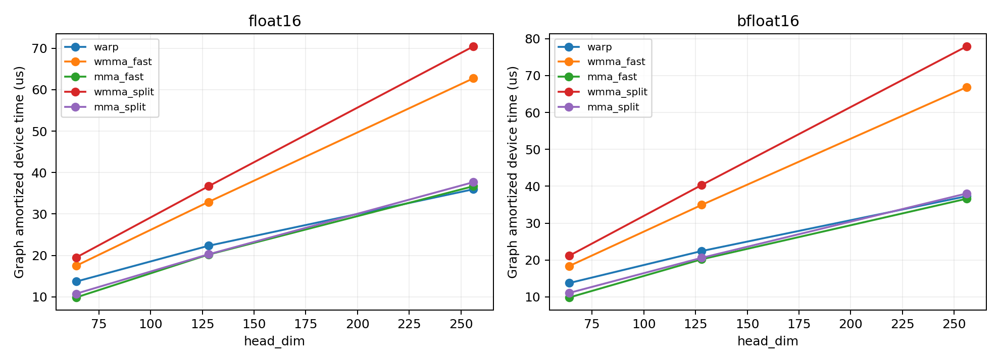
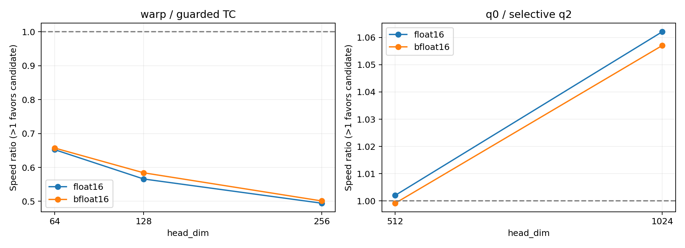

# Hopper 补测与 TC 精度改进

本轮结论：H200 NCU / Roofline、同卡性能、独立宽写回复测均已补齐；选择性
D1024 写回新增约 5.7%–6.2% 收益。保护式 TC 通过本轮全部严格测试，但慢于
warp，保留为实验，不作为默认加速方案。**纯 TC 同时保持严格精度与速度仍是
未解决的研究项**，不能把回退通过包装成纯 TC 的成功。

## PTX 是什么

PTX（Parallel Thread Execution）是 NVIDIA 的低层虚拟指令集，处于 CUDA C++
与具体 GPU 的机器指令 SASS 之间。可以把它看成“GPU 的中间汇编”，但它不是
最终机器码，也不是另一种显卡。通常的编译关系是 CUDA C++ → PTX → SASS。
[NVIDIA PTX ISA 简介](https://docs.nvidia.com/cuda/parallel-thread-execution/index.html#introduction)

三者不能混淆：Tensor Core 是计算硬件，WMMA 是使用它的 CUDA 编程接口；本项目
显式 PTX 用 `mma.sync` 指令调用同类矩阵乘加硬件，并用 warp shuffle 直接整理
寄存器数据。收益来自减少原 WMMA 实现的 shared-memory 中转，并不是“写成汇编
一定更快”，也不会自动修复原数值算法的精度问题。

## 本轮硬件计数器：阻塞已解除

作业 `17291971` 在 H200 `gh108` 完成 30 项单 kernel NCU 数据：
3 个维度（64/128/256）× 5 个后端（warp、WMMA fast/split、PTX fast/split）
× 2 种 cache-control（all/none）。GPU UUID 为
`GPU-e09d6d3e-02ea-4da2-395a-b12b71dcdbdb`，PCI bus `23:00.0`。
输入固定为 FP16 随机数据，16384 tokens，normalize=true，四次 launch 取第四次；
没有锁时钟。二进制与原始源码快照保留在该作业 scratch 目录。

本轮没有遇到先前 L40S 的 `driver resource was unavailable`。中途遇到的是
home 配额耗尽：`wmma_split_d128_none` 导出失败，NCU 进程未退出。将项目内约
158 MiB 未提交失败样本迁至 scratch，并以原路径符号链接保留访问后，暂停 batch
脚本、终止该失败采集进程，在同一 Slurm 分配的同一 GPU 上单独重采成功，再恢复
batch。原失败日志和 `_retry.log` 都保留，不把该问题归因为 DCGM。


[原始指标汇总 CSV](../tensor_core/results/hopper_gaps_17291971/ncu_summary.csv)。

恢复后 30 项原始 CSV 齐全。但维护时修改正在执行的 shell 文件导致后半阶段退出
（`ho: command not found`）；这是操作失误，所以 `17291971` 的 Slurm 状态为
FAILED，不能称为整项成功。计时与精度实验由独立作业 `17292654` 补跑；不覆盖
原始失败记录。后续采集脚本已把二进制 NCU 报告改存 scratch，并添加每次 90 秒
超时。迁移没有删除失败输入，CSV/JSON/日志仍在仓库。

补跑 `17292654` 实际仍分配到 `gh108`，且 GPU UUID 与上面的采集一致。新的结果
目录内 NCU CSV 当时是从 `17291971` 复制的原始记录，不是又采集了 30 次。
仓库整理后重复副本已归档，统一使用 `hopper_gaps_17291971/ncu`；来源与两次
作业的环境文件分别保留。[整理与恢复说明](repository_cleanup.md)。

D=128、cache-control=all 的结果：

| 指标 | WMMA fast | PTX fast | WMMA split | PTX split |
|---|---:|---:|---:|---:|
| NCU 时间（μs） | 6.304 | 4.992 | 6.880 | 4.832 |
| dynamic shared（B/block） | 9728 | 0 | 12800 | 0 |
| registers/thread | 32 | 32 | 32 | 32 |
| short scoreboard / active issue | 6.164 | 0.976 | 5.675 | 0.716 |
| MIO throttle / active issue | 9.675 | 2.112 | 9.630 | 1.455 |

这些数据支持“消除 shared 中转、降低相关等待”的解释；stall 比值不是百分比。
该次 PTX split 比 fast 更快也不能据此断言 split 普遍更快，需要多轮独立性能计时。
NCU 时间不与 Graph 时间混算，实测有用 FHT 工作量不能冒充 dense Tensor Core FLOPs。

## 宽写回与数值实验设计

补跑 `17292654` 已 COMPLETED，耗时 2 分 55 秒。严格 TC 原算法的失败以
`benchmark_rc=1`、`precision_validation_rc=1` 保留；`completed=true` 只表示
实验矩阵已完整执行，不表示各候选都满足数值验收。

宽写回使用三个独立 Python 进程，每个进程九轮交错，覆盖 FP16/BF16、D=512/1024、
16384/131072 tokens，normalize=true。固定 `f4_q0` 对照，`f4_q1` 只改变写回宽度，
`f8_q1` 另改变融合 block 大小。必须同时看独立进程中位数、min/max 和正确性，
不根据最快单轮切换默认，也不把 D=1024 的结果推广到 D=512。

精度实验新增 `HADAMARD_MMA_PRECISION` 编译参数，仅作用于独立 PTX split：

- `0`：原来的高低部分顺序 MMA 累加，保持旧算法。
- `1`：高、低部分分别以 FP32 accumulator 计算，最后相加。
- `2`：再分解一层 native 残差，低、第三部分先相加，再与高部分相加。

验收仍是实际 Dao v1.1.0、全张量 native 输出、FP16 `<0.01` / BF16 `<0.05`；
不切换成相对误差，不用 FP64 代替 PDF 的库参考。核心维度矩阵为每个候选 108
配置，并保留 warp 对照。更多残差项减少表示损失，但不保证恢复参考库的蝶形累加
次序，因此必须以实测验收为准，不能仅凭构造宣称严格合规。

### 已完成的计时与精度结果

H200、131072 tokens、normalize=true、五轮 Graph 摊销设备时间中位数，FP16：

| D | warp（μs） | WMMA fast → PTX fast（μs） | WMMA split → PTX split（μs） |
|---|---:|---:|---:|
| 64 | 13.671 | 17.485 → 9.841（1.777×） | 19.484 → 10.746（1.813×） |
| 128 | 22.316 | 32.906 → 20.187（1.630×） | 36.691 → 20.254（1.811×） |
| 256 | 35.959 | 62.748 → 36.690（1.710×） | 70.454 → 37.670（1.870×） |

PTX 的 D=64/128 比 warp 更快，但 D=256 没有超过 warp；这些是未经保护的
fast/split 实验路径，严格正确性失败仍保留，不能作为合规提交的加速数字。



宽写回三个进程结果稳定：131072 tokens、D=1024、`f4_q1` 相对 `f4_q0`，
FP16 为 1.060× / 1.062× / 1.063×，BF16 为 1.060× / 1.060× / 1.061×；
D=512 则 FP16 为 0.974× / 0.974× / 0.975×，BF16 为 0.973× / 0.972× / 0.972×。
因此新 `QUANT_VECTOR=2` 仅对 D=1024 开启宽写回，其他维度保留原写回，不全局启用。


三组精度实验结果：

| PTX split 参数 | 严格通过 | 最大误差 | 相对 p0 新修复 / 新回归 |
|---|---:|---:|---:|
| p0 原算法 | 101/108 | 0.25 | — |
| p1 独立累加 | 103/108 | 0.25 | 2 / 0 |
| p2 三段残差 | 107/108 | 0.015625 | 6 / 0 |

warp 三组均 108/108、误差 0。p2 剩余失败为 FP16 D=64、5 tokens、
normalize=false、outlier 模式（case 71）；不能用“107/108”掩盖这项失败。
精度改进有成本：FP16 p2 在 D=64/128/256 分别为 12.294/21.243/40.286 μs，
与原 p0 的 10.707/20.286/37.742 μs 相比均变慢，D=256 也慢于 warp。

[完整 NCU、计时和量化复测表](../tensor_core/results/hopper_gaps_17292654/summary.md)、
[精度通过率、修复/回归及性能成本](../tensor_core/results/hopper_gaps_17292654/precision_summary.md)。

### 保护式 TC 与选择性写回验证

`MMA_PRECISION=3` 只作用于 PTX split：在 p2 基础上，以 tile 输入最大值、维度和
scale 构造保守误差包络，检查 native 舍入后的上下界是否仍满足绝对误差阈值。
无法安全判定时，整个 tile 使用与参考一致顺序的 FP32 warp 蝶形重新计算；
这条路径是 **TC + warp 回退**，不能描述成纯 TC 精度修复。包络当前仍是需要
压力测试验证的保守构造，不声称对任意有限位模式的形式化证明。

`17294196` 已在 H200 `gh123` COMPLETED，耗时 2 分 2 秒。它与前一作业不是同一
张物理卡；以下 A/B 均取自本作业，不与 `gh108` 的计时混算。

- 保护式 TC 108/108，FP16/BF16 在该矩阵的最大误差均为 0.00048828125；
  warp 对照 108/108、误差 0。
- 192/192 幅度与相消压力配置通过，每配置 512 tokens。覆盖 FP16 输入缩放
  2^-16 至 2^7、BF16 2^-120 至 2^100 的选定档位；不是连续全域穷举。
- guard 的 memcheck / racecheck / synccheck 均 0 errors；racecheck 同时 0 warnings。
- 选择性写回和原配置各 132 配置 × warp / fused_warp，共 528 行全过；
  相同配置/后端的输出哈希差异为 0。

H200、131072 tokens、normalize=true：

| dtype / D | 严格 warp（μs） | 保护式 TC（μs） | 结论 |
|---|---:|---:|---|
| FP16 / 64 | 13.651 | 20.927 | 保护式 TC 更慢 |
| FP16 / 128 | 22.257 | 39.334 | 保护式 TC 更慢 |
| FP16 / 256 | 35.956 | 72.718 | 保护式 TC 更慢 |

保护分支增加了转换、判定、shuffle 与必要的重算，没有带来可用的加速。因此
默认继续使用严格 warp，不替换为保护式 TC，更不悄悄使用仍有精度失败的原 TC。

同作业九轮量化计时：D1024 FP16 从 170.600 降至 160.623 μs（1.062×），
BF16 从 172.215 降至 162.919 μs（1.057×）；D512 分别为 1.002× / 0.999×，
没有重现全局宽写回造成的约 2.5% 回退。选择性版本作为显式选项提供，通用默认不变。



[最终严格检查与性能成本](../tensor_core/results/guard_quant_17294196/summary.md)。

## 复现与产物

```bash
sbatch tensor_core/slurm/close_hopper_gaps.slurm
sbatch tensor_core/slurm/mma_precision_followup.slurm
sbatch tensor_core/slurm/guard_and_selective_quant.slurm
# 只对 D1024 开启宽写回；主项目两种构建方式均支持。
make CUDA_ARCH=90 WARPS=0 QUANT_VECTOR=2 OUT=build/h200-selective
cmake -S . -B build/h200-selective-cmake -DCMAKE_CUDA_ARCHITECTURES=90 \
  -DHADAMARD_WARPS_PER_BLOCK=0 -DHADAMARD_QUANT_VECTOR_STORE=2
cmake --build build/h200-selective-cmake -j4
# 每种参数使用独立 OUT，避免 make 复用旧编译参数。
make -C tensor_core mma-experiment CUDA_ARCH=90 WARPS=0 TC_VECTOR=1 \
  MMA_PRECISION=2 OUT=build/mma-p2
# 保护式 split：不是默认，也不是更快的提交路径。
make -C tensor_core mma-experiment CUDA_ARCH=90 WARPS=0 TC_VECTOR=1 \
  MMA_PRECISION=3 OUT=build/mma-guard
```

汇总工具 `tensor_core/scripts/summarize_hopper.py` 拒绝混合 GPU，要求完整的 30 项
NCU 与三个九轮量化复测；缺失计数器不能当成 0。报告读取实际 DRAM 流量，并按
H200 SXM 的 4800 GB/s、FP32 67 TFLOP/s 画非 TC 参考 roof。它不是 Tensor Core
利用率上限，缓存命中时 DRAM 点越过斜线不代表超越硬件带宽。

## 仍可继续提升的边界

交付检查：CPU 作业 `17294647` COMPLETED（31 秒），主项目 CMake、主项目 Make、
`mma-experiment MMA_PRECISION=3` 三套构建均成功。13 项专项 CPU 单测通过，
Python 编译、Slurm shell 语法和 `git diff --check` 通过。真实库 GPU 验收使用上述
CUDA 12.8 容器及固定 PyTorch/Dao 环境；登录节点系统 Python 缺少 torch，不能把
在该解释器中导入旧 `test_vs_library.py` 的失败当成 GPU 测试结果。

1. 纯 TC 的严格精度与加速还未同时实现；当前保护过于昂贵。可研究更紧的误差
   界、低成本危险输出检测和更少的回退，但必须重新验收，不放宽阈值。
2. PTX 仍限 D64/128/256 变换；D512/1024 与 PTX 专用融合量化属于扩展，未在
   本轮实现。现有 warp 的大维度与融合 INT4 不受影响，9.2 并非缺失。
3. 当前是算子级合成输入与压力测试，不是模型端到端加速。后续需要指定模型、
   真实激活分布及调用方式，才能报告端到端延迟/吞吐和量化任务质量。
