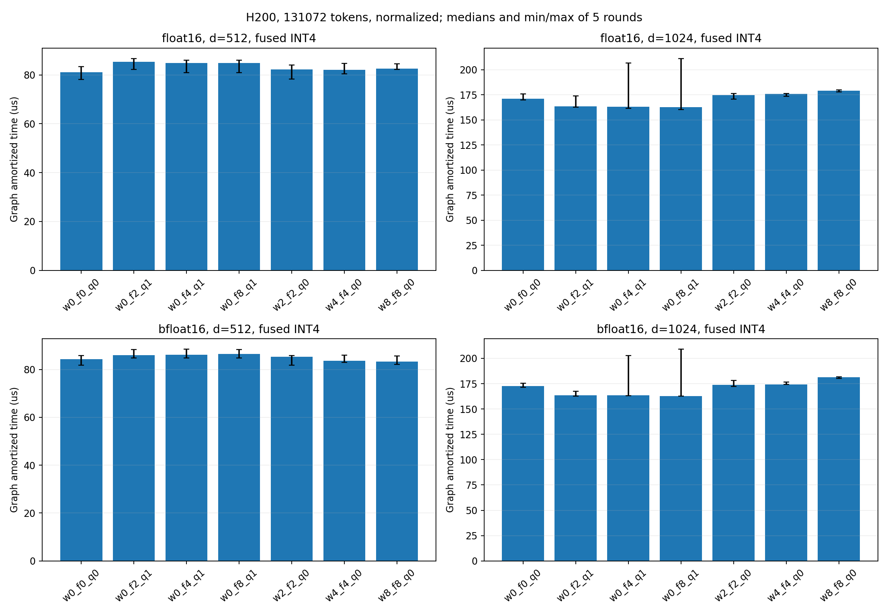

# 2026-09-09：参考库基线 → warp 调优 → TC 精度 → PTX 实验

本轮按上述顺序执行 GPU 作业。实现、编译通过、严格验收通过、性能收益是四个不同
状态；实验路径不接入默认分发。此前 H200 三次 CUDA Event 扫描保留，不与本轮
CUDA Graph 回放时间直接混算。

## 1. 参考库性能基线（已完成）

作业 `17289704`：H200 `gh112`，CUDA 12.8 容器、未修改的 Dao
`fast_hadamard_transform` v1.1.0，源码 commit
`1cc807efbd6cc001df359822d60bf6052dd66859`。本项目使用此前可选 `WARPS=0`。

矩阵：FP16/BF16 × d=64/128/256/512/1024 × tokens=1/128/16384/131072 ×
归一化开/关，共 80 个配置；每配置七条路径、五轮交错顺序，共 2800 条计时行。
本次全部输出检查通过。

### 公平比较边界

- 两侧同一 GPU、同一输入地址、dtype、scale、stream；输入预先驻留 GPU。
- C ABI 桥接避免另装 PyTorch C++ 扩展，但 Python/ctypes 与参考库调用开销不同。
  因此两侧均捕获 16 个调用为 CUDA Graph，测量 10 次回放并按 160 个节点摊销。
- 预热、Graph 构建、输出分配不计时。结果叫 **Graph 回放摊销设备时间**，不是
  Python 端到端 API 延迟，也不是 NCU 独立单 kernel 时间。
- 五轮旋转／反转后端顺序，保留中位数、min/max，不以单次最小值作为成绩。
- 融合对照是“Dao 变换＋本项目 standalone INT4 量化器”，不是 Dao 提供融合量化。
  INT4 协议、packed bytes 与 FP32 scale 一致；这个对照也不是最优二 kernel
  pipeline 的证明。

### 实测结果

以下均 FP16、131072 tokens、normalize=true，中位数 μs：

| d | Dao | warp | Dao/warp | Dao＋量化 | fused_warp | pipeline/fused |
|---:|---:|---:|---:|---:|---:|---:|
| 64 | 80.568 | 13.770 | 5.85× | 160.710 | 18.858 | 8.52× |
| 128 | 80.626 | 22.380 | 3.60× | 160.957 | 27.882 | 5.77× |
| 256 | 80.710 | 36.421 | 2.22× | 161.736 | 47.818 | 3.38× |
| 512 | 81.630 | 70.481 | 1.16× | 219.084 | 78.128 | 2.80× |
| 1024 | 249.396 | 169.180 | 1.47× | 544.036 | 169.388 | 3.21× |

小规模收益更有限：FP16 d=128，tokens=1 为 1.546→1.371 μs，tokens=128 为
1.694→1.510 μs；不能把大规模 3.60× 推广给所有规模。
上游该版本按输入行启动 block，本项目小 d 一个 block 处理多个 token，
是大规模小维度差异的一个结构性解释；具体占比仍需同条件 profiler 验证。

[完整表格与图](../tensor_core/results/libperf_17289704/benchmark/summary.md)


## 2. warp／融合 INT4 调优（已完成首轮测试）

作业 `17290172`，依赖第一阶段成功，在 H200 `gh119` 完成。新增选项：

- `FUSED_WARPS`：与变换的 `WARPS` 分开；不设置时继承原值，默认行为不变。
- `QUANT_VECTOR=1`：d=512 的每 lane 8 字节、d=1024 的 16 字节 INT4 输出使用
  宽 store；指针对齐与数组 `alignas(16)` 显式保证。默认关闭。
- 七组参数：`w0_f0_q0`、`w2_f2_q0`、`w4_f4_q0`、`w8_f8_q0`、
  `w0_f2_q1`、`w0_f4_q1`、`w0_f8_q1`。仅在相同 GPU 作业内部比较。

每组 132 个配置的参考库／融合一致性检查均通过，共 1848 行；跨参数同一用例／
后端输出哈希差异组数为 0。代表性 q1 候选通过 d=64/512/1024、BF16、tokens=5 的
9 项 sanitizer，均 0 errors，racecheck 同时 0 warnings。

七组按四档规模、五维度、两 dtype、normalize=true 做五轮交错计时。
131072 tokens 的 fused INT4 结果如下（中位数，括号内为 min—max，μs）：

| dtype / d | 原 w0_f0_q0 | q1 候选 | 候选时间 | 原/候选 |
|---|---:|---|---:|---:|
| FP16 / 1024 | 171.282 (169.786—175.991) | w0_f8_q1 | 162.568 (160.198—211.195) | 1.054× |
| BF16 / 1024 | 172.631 | w0_f8_q1 | 162.908 | 1.060× |
| FP16 / 512 | 81.022 (78.185—83.364) | w0_f4_q1 | 84.844 (80.906—86.068) | 0.955× |

SASS 确认：d=1024 从 16 条 `STG.E.U8` 变为 1 条 `STG.E.128`（不计 scale 写回）；
但宽写回并非所有维度都受益。d=1024 的中位数收益需独立重复确认，尤其候选存在
较大离群点；d=512 不采用。未把 q1 统一启用，也不把事后最快候选当作稳健自动分发。

[全部计时表](../tensor_core/results/warp_tune_17290172/benchmark/summary.md)、
[静态 SASS store 计数](../tensor_core/results/warp_tune_17290172/sass_store_counts.csv)。



## 3. TC split 精度定位（已完成，尚未全面修复）

作业 `17290602`，依赖第二阶段成功，在 H200 `gh119` 运行 23 秒完成。
读取旧严格验收中 split 的 11 个失败输入，
新增仅诊断用编译单元，记录真实 GPU 第一次 MMA 输出 `P` 和最终 native 转换前
FP32 值；先验证探针输出舍入后与生产 TC split 逐位一致，再进行分解：

1. 第一次 MMA 与 FP64 第一阶段差异；
2. `P_hi + P_lo` 对 `P` 的表示误差及其传播；
3. 后续 GPU 累加相对精确 hi/lo 第二阶段的差异；
4. 最后舍入相对参考库的绝对误差。

FP64 在这里仅用于定位误差，不代替 PDF 规定的参考库验收。原尾部 warp 回退的
token 不混入完整 TC tile 的错误归因；保存最大失败元素及其输入便于复现。

11 个用例的探针结果舍入后均与生产 TC split 逐位一致。定位到两类典型问题：

| 失败元素 | FP16 d=128 | BF16 d=64 |
|---|---:|---:|
| 库输出 | 21.234375 | 13.0625 |
| TC 输出 | 21.21875 | 13.0 |
| FP64 精确蝶形值 | 21.2265639305 | 13.0312957764 |
| 从 GPU P 精确完成后续变换 | 21.2265639305 | 13.0312957764 |
| 从 hi+lo 精确完成后续变换 | 21.2265639305 | 13.0312347412 |
| GPU 最终舍入前值 | 21.2265625 | 13.0312347412 |
| native 绝对误差 | 0.015625 | 0.0625 |

FP16 例中，高低分解没有改变该输出的精确值，后续 GPU 累加使其落在 native 舍入
中点，ties-to-even 选了另一侧；BF16 例中，hi+lo 的有限表示已经把值推过中点，
后续累加不是该元素的主要误差源。FP16 输入的第一次 MMA 也并非普遍精确：
本矩阵第一次 MMA 相对 FP64 的最大差异约 4.77e-7—3.81e-6。

更重要的是，参考库也不总是“FP64 精确值再舍入”：FP16 d=1024 的该用例里，两者
最大差异为 0.0625。因此不能简单把 TC 换成更精确算法就声称满足与参考库的固定
绝对误差要求，更不能改用 FP64 作为宽松验收依据。后续修复需分别研究残差表示、
累加次序和边界回退策略；本轮没有宣布 11 个失败已修复。

[逐阶段误差 CSV](../tensor_core/results/precision_17290602/diagnosis/stages.csv)、
[失败元素及输入](../tensor_core/results/precision_17290602/diagnosis/worst_elements.json)。

## 4. PTX 寄存器重排（实验已完成，保持非默认）

作业 `17290837`，依赖第三阶段成功，在 L40S `gl049` 运行 1 分 52 秒完成。独立文件
`tensor_core/src/hadamard_mma_experimental.cu`，不接入生产 API 默认分发：

- 用两个 `m16n8k16` 覆盖一个 16×16 tile；生成原来的块对角 Hadamard 常量。
- 第一次 MMA accumulator 到第二次 operand 的转换使用显式 warp shuffle，
  不经 shared memory；FP16/BF16、fast/split 仍分别实现原两种精度算法。
- 第一版只覆盖 d=64/128/256，尾部继续用 warp；不宣称覆盖大维度或 TC 融合。
- 按公开 PTX 布局设计，CPU 符号测试覆盖每个 lane 的 C→B 映射；不依赖不公开的
  WMMA fragment 内部表示。[NVIDIA PTX ISA](https://docs.nvidia.com/cuda/parallel-thread-execution/index.html#warp-level-matrix-fragment-mma-16816-float)
- 72 项精确模式 smoke 比较通过；memcheck/racecheck/synccheck 均 0 errors，
  racecheck 同时 0 warnings。108 个核心配置中，PTX fast/split 与对应 WMMA 的
  输出哈希差异均为 0，说明此次重排没有改变这些测试中的原算法输出。
- 严格库验收：warp 108/108；WMMA 和 PTX 均 fast 84/108、split 101/108。
  这是核心维度子矩阵，不能与旧 132 配置分母混用。`validation_rc=1` 是保留的
  精度失败，实验未因此冒充全通过。

五轮中位数，L40S、131072 tokens、normalize=true、Graph 摊销设备时间，μs：

| dtype / d | warp | 向量化 WMMA fast → PTX fast | 向量化 WMMA split → PTX split |
|---|---:|---:|---:|
| FP16 / 64 | 13.007 | 11.906 → 9.133（1.304×） | 13.573 → 9.634（1.409×） |
| BF16 / 64 | 12.929 | 13.171 → 9.145（1.440×） | 15.025 → 9.696（1.550×） |
| FP16 / 128 | 40.429 | 41.451 → 42.356（0.979×） | 43.091 → 39.261（1.098×） |
| FP16 / 256 | 205.245 | 204.442 → 204.162（基本不变） | 204.722 → 204.793（基本不变） |

d=64 有明显收益，FP16 PTX fast 相对 warp 约 1.42×；d=128 split 略有收益，
fast 反而变慢；d=256 没有明显改善。结果不能跨 GPU 套用，也不表示 TC 精度合格。
编译资源显示 PTX d=64 fast/split FP16 分别 33/36 registers、stack/local/static
shared 均 0，launch 的 dynamic shared 也为 0。WMMA 的 shared 主要为动态分配，
不能把其 `cuobjdump` 中 static SHARED=0 误读成 WMMA 不用 shared。

本轮 PTX/WMMA 的 NCU 在 L40S 均返回 `driver resource was unavailable`，提示
DCGM/其他采集器可能占用，原始日志保留；没有捏造 runtime stall 或新 Roofline 点。
此前 H100 的 40 次 NCU 成功记录仍有效，但不能拿来冒充新 PTX 的计数器。

[本轮 PTX 完整验收、计时及 NCU 状态](../tensor_core/results/mma_17290837/summary.md)。


### 复现入口

```bash
# 使用安装了匹配 CUDA PyTorch / Dao v1.1.0 的环境；CUDA_ARCH 按实际 GPU 指定
make -C tensor_core bridge CUDA_ARCH=90 WARPS=0 OUT=build/library-baseline
python tensor_core/scripts/benchmark_library.py \
  --variant tuned=tensor_core/build/library-baseline/libhadamard.so --output-dir results/new_library_benchmark

# 独立 PTX 实验：不改变生产默认
make -C tensor_core mma-experiment CUDA_ARCH=89 WARPS=0 TC_VECTOR=1 OUT=build/mma-experiment
tensor_core/build/mma-experiment/mma_smoke

# 集群脚本依次运行；相互依赖可用 sbatch --dependency=afterok:<上一job>
sbatch tensor_core/slurm/library_performance.slurm
sbatch tensor_core/slurm/warp_tuning.slurm
sbatch tensor_core/slurm/tc_precision.slurm
sbatch tensor_core/slurm/mma_experiment.slurm
```

上述四阶段结束时未完成：TC 全面精度修复、d=512/1024 的 PTX 路径、PTX 融合量化、
新 PTX 的 Hopper NCU、d=1024 宽写回收益的独立重复确认。
后续 H200 已补齐 30 项新 PTX/WMMA/warp NCU；最新进展与完成边界以
[Hopper 缺口补测](gap_closure.md) 为准，不再沿用“新 PTX 完全没有计数器”的旧状态。

## 调度记录

第二阶段曾被 controller 标为 `QOSMaxGRESPerUser`，随后正常分配并完成，不是硬编码只等一张卡。
队列已开放 L40S/A100/H100/H200，各阶段只请求一张卡，并用 afterok 串行依赖。
未修改 QoS 或其他作业。数据库 Reason 可能滞后，应以 controller 和实际产物为准。

CPU 作业 `17291054` 已完成 trace、PTX、smoke 和桥接编译检查。CPU C→B 符号布局
测试通过，FP64 分阶段公式在五个维度上通过整数输入精确一致性检查；这些不能替代 GPU 验证。
