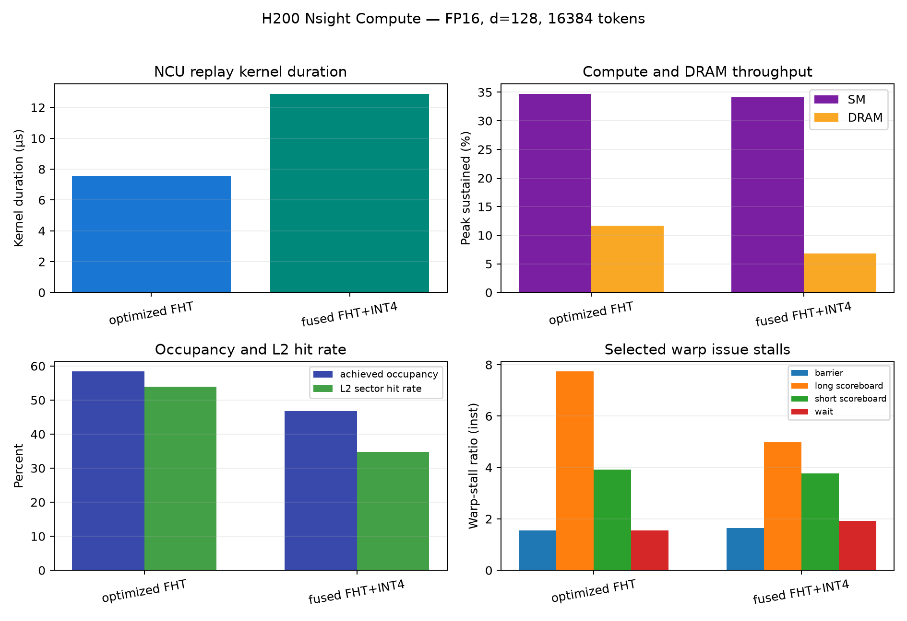

# H200 Nsight Compute hardware-counter run 16975372

- GPU: NVIDIA H200 (SM 9.0), node `gh112`
- CUDA / NCU: 13.0.88 / 2025.3.1
- Shape: FP16, d=128, 16384 tokens, normalize=true
- Sections: SpeedOfLight, MemoryWorkloadAnalysis, Occupancy, WarpStateStats
- Replay: one selected kernel, 18 passes, clock control disabled

| kernel | duration us | SM throughput | DRAM throughput | DRAM GB/s | achieved occupancy | L2 hit rate | registers/thread | static shared |
|---|---:|---:|---:|---:|---:|---:|---:|---:|
| optimized FHT | 7.552 | 34.73% | 11.63% | 555.90 | 58.39% | 53.99% | 19 | 1024 B |
| fused FHT+INT4 | 12.896 | 34.12% | 6.79% | 325.82 | 46.69% | 34.83% | 20 | 524 B |

Selected warp-stall ratios (per issue-active cycle):

| kernel | barrier | long scoreboard | short scoreboard | wait |
|---|---:|---:|---:|---:|
| optimized FHT | 1.55 | 7.73 | 3.92 | 1.56 |
| fused FHT+INT4 | 1.65 | 4.99 | 3.78 | 1.93 |

The optimized kernel is not limited by DRAM peak bandwidth: SM throughput is
34.73% while DRAM is 11.63%, and long-scoreboard stalls dominate the selected
stall reasons. The fused kernel lowers DRAM traffic/throughput but also lowers
achieved occupancy because token-wide max reduction, scale calculation, and
packing add dependencies to the FHT.

Both captures transferred about 4.20 MB from/to DRAM when bandwidth is
integrated over kernel duration. This is below logical tensor traffic because
the selected validation launches run after earlier kernels have warmed the
input in cache. Accordingly, these counters are used as a warm-cache kernel
diagnosis and are not mixed with the L40S timing Roofline.

`ncu_summary.csv` is the compact machine-readable extraction; `raw/` retains
the full NCU CSV export and the `.ncu-rep` files retain the replay reports.

