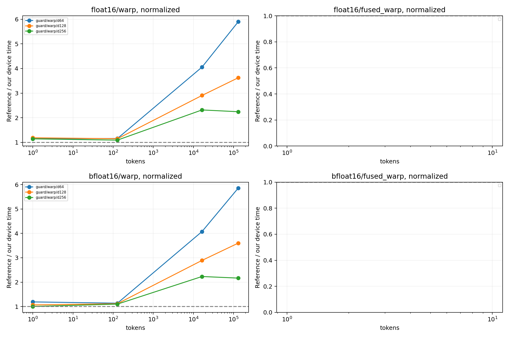

# 参考库同边界性能对照

GPU：NVIDIA H200
同一输入驻留 GPU，CUDA Graph 回放按节点数摊销的设备时间；不是 Python API 延迟，
也不是独立 profiler 单 kernel 时间。捕获/分配不计时；固定地址缓存状态由规模决定。
多轮交错后端顺序，中位数/min/max 均保留于 summary.csv。
融合对照为 Dao 变换 + 本项目同协议 standalone INT4，不声称 Dao 自带 INT4。

| dtype | tokens | d | normalize | 路径 | 本项目 μs | 对照 μs | 对照/本项目 | 全部检查通过 |
|---|---:|---:|---:|---|---:|---:|---:|---|
| bfloat16 | 1 | 128 | 0 | guard/mma_split | 1.393 | 1.482 | 1.064× | True |
| bfloat16 | 1 | 128 | 0 | guard/warp | 1.426 | 1.482 | 1.039× | True |
| bfloat16 | 1 | 128 | 1 | guard/mma_split | 1.433 | 1.498 | 1.046× | True |
| bfloat16 | 1 | 128 | 1 | guard/warp | 1.405 | 1.498 | 1.067× | True |
| bfloat16 | 1 | 256 | 0 | guard/mma_split | 2.286 | 1.518 | 0.664× | True |
| bfloat16 | 1 | 256 | 0 | guard/warp | 1.477 | 1.518 | 1.028× | True |
| bfloat16 | 1 | 256 | 1 | guard/mma_split | 2.501 | 1.509 | 0.603× | True |
| bfloat16 | 1 | 256 | 1 | guard/warp | 1.503 | 1.509 | 1.004× | True |
| bfloat16 | 1 | 64 | 0 | guard/mma_split | 1.417 | 1.542 | 1.089× | True |
| bfloat16 | 1 | 64 | 0 | guard/warp | 1.316 | 1.542 | 1.171× | True |
| bfloat16 | 1 | 64 | 1 | guard/mma_split | 1.408 | 1.558 | 1.106× | True |
| bfloat16 | 1 | 64 | 1 | guard/warp | 1.309 | 1.558 | 1.190× | True |
| bfloat16 | 128 | 128 | 0 | guard/mma_split | 2.391 | 1.630 | 0.682× | True |
| bfloat16 | 128 | 128 | 0 | guard/warp | 1.484 | 1.630 | 1.099× | True |
| bfloat16 | 128 | 128 | 1 | guard/mma_split | 2.540 | 1.671 | 0.658× | True |
| bfloat16 | 128 | 128 | 1 | guard/warp | 1.496 | 1.671 | 1.117× | True |
| bfloat16 | 128 | 256 | 0 | guard/mma_split | 2.417 | 1.673 | 0.692× | True |
| bfloat16 | 128 | 256 | 0 | guard/warp | 1.580 | 1.673 | 1.059× | True |
| bfloat16 | 128 | 256 | 1 | guard/mma_split | 2.592 | 1.733 | 0.669× | True |
| bfloat16 | 128 | 256 | 1 | guard/warp | 1.576 | 1.733 | 1.100× | True |
| bfloat16 | 128 | 64 | 0 | guard/mma_split | 2.914 | 1.713 | 0.588× | True |
| bfloat16 | 128 | 64 | 0 | guard/warp | 1.461 | 1.713 | 1.172× | True |
| bfloat16 | 128 | 64 | 1 | guard/mma_split | 2.474 | 1.678 | 0.678× | True |
| bfloat16 | 128 | 64 | 1 | guard/warp | 1.476 | 1.678 | 1.137× | True |
| bfloat16 | 131072 | 128 | 0 | guard/mma_split | 38.741 | 80.727 | 2.084× | True |
| bfloat16 | 131072 | 128 | 0 | guard/warp | 22.282 | 80.727 | 3.623× | True |
| bfloat16 | 131072 | 128 | 1 | guard/mma_split | 38.341 | 80.646 | 2.103× | True |
| bfloat16 | 131072 | 128 | 1 | guard/warp | 22.395 | 80.646 | 3.601× | True |
| bfloat16 | 131072 | 256 | 0 | guard/mma_split | 76.487 | 80.731 | 1.055× | True |
| bfloat16 | 131072 | 256 | 0 | guard/warp | 36.049 | 80.731 | 2.239× | True |
| bfloat16 | 131072 | 256 | 1 | guard/mma_split | 74.363 | 80.738 | 1.086× | True |
| bfloat16 | 131072 | 256 | 1 | guard/warp | 37.266 | 80.738 | 2.166× | True |
| bfloat16 | 131072 | 64 | 0 | guard/mma_split | 21.530 | 80.506 | 3.739× | True |
| bfloat16 | 131072 | 64 | 0 | guard/warp | 13.461 | 80.506 | 5.981× | True |
| bfloat16 | 131072 | 64 | 1 | guard/mma_split | 20.914 | 80.528 | 3.850× | True |
| bfloat16 | 131072 | 64 | 1 | guard/warp | 13.744 | 80.528 | 5.859× | True |
| bfloat16 | 16384 | 128 | 0 | guard/mma_split | 6.477 | 11.380 | 1.757× | True |
| bfloat16 | 16384 | 128 | 0 | guard/warp | 3.949 | 11.380 | 2.882× | True |
| bfloat16 | 16384 | 128 | 1 | guard/mma_split | 6.623 | 11.370 | 1.717× | True |
| bfloat16 | 16384 | 128 | 1 | guard/warp | 3.932 | 11.370 | 2.892× | True |
| bfloat16 | 16384 | 256 | 0 | guard/mma_split | 11.572 | 11.610 | 1.003× | True |
| bfloat16 | 16384 | 256 | 0 | guard/warp | 4.955 | 11.610 | 2.343× | True |
| bfloat16 | 16384 | 256 | 1 | guard/mma_split | 11.190 | 11.467 | 1.025× | True |
| bfloat16 | 16384 | 256 | 1 | guard/warp | 5.139 | 11.467 | 2.232× | True |
| bfloat16 | 16384 | 64 | 0 | guard/mma_split | 4.803 | 11.330 | 2.359× | True |
| bfloat16 | 16384 | 64 | 0 | guard/warp | 2.795 | 11.330 | 4.054× | True |
| bfloat16 | 16384 | 64 | 1 | guard/mma_split | 4.419 | 11.316 | 2.561× | True |
| bfloat16 | 16384 | 64 | 1 | guard/warp | 2.777 | 11.316 | 4.075× | True |
| float16 | 1 | 128 | 0 | guard/mma_split | 1.405 | 1.558 | 1.109× | True |
| float16 | 1 | 128 | 0 | guard/warp | 1.343 | 1.558 | 1.161× | True |
| float16 | 1 | 128 | 1 | guard/mma_split | 1.421 | 1.574 | 1.107× | True |
| float16 | 1 | 128 | 1 | guard/warp | 1.325 | 1.574 | 1.187× | True |
| float16 | 1 | 256 | 0 | guard/mma_split | 2.239 | 1.588 | 0.709× | True |
| float16 | 1 | 256 | 0 | guard/warp | 1.382 | 1.588 | 1.149× | True |
| float16 | 1 | 256 | 1 | guard/mma_split | 2.375 | 1.575 | 0.663× | True |
| float16 | 1 | 256 | 1 | guard/warp | 1.377 | 1.575 | 1.144× | True |
| float16 | 1 | 64 | 0 | guard/mma_split | 1.288 | 1.511 | 1.173× | True |
| float16 | 1 | 64 | 0 | guard/warp | 1.290 | 1.511 | 1.171× | True |
| float16 | 1 | 64 | 1 | guard/mma_split | 1.297 | 1.540 | 1.188× | True |
| float16 | 1 | 64 | 1 | guard/warp | 1.341 | 1.540 | 1.149× | True |
| float16 | 128 | 128 | 0 | guard/mma_split | 2.295 | 1.693 | 0.738× | True |
| float16 | 128 | 128 | 0 | guard/warp | 1.477 | 1.693 | 1.146× | True |
| float16 | 128 | 128 | 1 | guard/mma_split | 2.404 | 1.679 | 0.698× | True |
| float16 | 128 | 128 | 1 | guard/warp | 1.463 | 1.679 | 1.148× | True |
| float16 | 128 | 256 | 0 | guard/mma_split | 2.341 | 1.667 | 0.712× | True |
| float16 | 128 | 256 | 0 | guard/warp | 1.567 | 1.667 | 1.064× | True |
| float16 | 128 | 256 | 1 | guard/mma_split | 2.437 | 1.714 | 0.703× | True |
| float16 | 128 | 256 | 1 | guard/warp | 1.569 | 1.714 | 1.093× | True |
| float16 | 128 | 64 | 0 | guard/mma_split | 2.784 | 1.685 | 0.605× | True |
| float16 | 128 | 64 | 0 | guard/warp | 1.482 | 1.685 | 1.137× | True |
| float16 | 128 | 64 | 1 | guard/mma_split | 2.326 | 1.685 | 0.725× | True |
| float16 | 128 | 64 | 1 | guard/warp | 1.455 | 1.685 | 1.158× | True |
| float16 | 131072 | 128 | 0 | guard/mma_split | 38.859 | 80.658 | 2.076× | True |
| float16 | 131072 | 128 | 0 | guard/warp | 22.301 | 80.658 | 3.617× | True |
| float16 | 131072 | 128 | 1 | guard/mma_split | 39.334 | 80.657 | 2.051× | True |
| float16 | 131072 | 128 | 1 | guard/warp | 22.257 | 80.657 | 3.624× | True |
| float16 | 131072 | 256 | 0 | guard/mma_split | 75.111 | 80.740 | 1.075× | True |
| float16 | 131072 | 256 | 0 | guard/warp | 35.483 | 80.740 | 2.275× | True |
| float16 | 131072 | 256 | 1 | guard/mma_split | 72.718 | 80.725 | 1.110× | True |
| float16 | 131072 | 256 | 1 | guard/warp | 35.956 | 80.725 | 2.245× | True |
| float16 | 131072 | 64 | 0 | guard/mma_split | 22.308 | 80.484 | 3.608× | True |
| float16 | 131072 | 64 | 0 | guard/warp | 13.466 | 80.484 | 5.977× | True |
| float16 | 131072 | 64 | 1 | guard/mma_split | 20.927 | 80.503 | 3.847× | True |
| float16 | 131072 | 64 | 1 | guard/warp | 13.651 | 80.503 | 5.897× | True |
| float16 | 16384 | 128 | 0 | guard/mma_split | 6.405 | 11.390 | 1.778× | True |
| float16 | 16384 | 128 | 0 | guard/warp | 3.920 | 11.390 | 2.905× | True |
| float16 | 16384 | 128 | 1 | guard/mma_split | 6.483 | 11.402 | 1.759× | True |
| float16 | 16384 | 128 | 1 | guard/warp | 3.925 | 11.402 | 2.905× | True |
| float16 | 16384 | 256 | 0 | guard/mma_split | 11.182 | 11.498 | 1.028× | True |
| float16 | 16384 | 256 | 0 | guard/warp | 5.168 | 11.498 | 2.225× | True |
| float16 | 16384 | 256 | 1 | guard/mma_split | 10.807 | 11.503 | 1.064× | True |
| float16 | 16384 | 256 | 1 | guard/warp | 4.964 | 11.503 | 2.317× | True |
| float16 | 16384 | 64 | 0 | guard/mma_split | 4.788 | 11.319 | 2.364× | True |
| float16 | 16384 | 64 | 0 | guard/warp | 2.795 | 11.319 | 4.050× | True |
| float16 | 16384 | 64 | 1 | guard/mma_split | 4.227 | 11.314 | 2.677× | True |
| float16 | 16384 | 64 | 1 | guard/warp | 2.790 | 11.314 | 4.056× | True |

