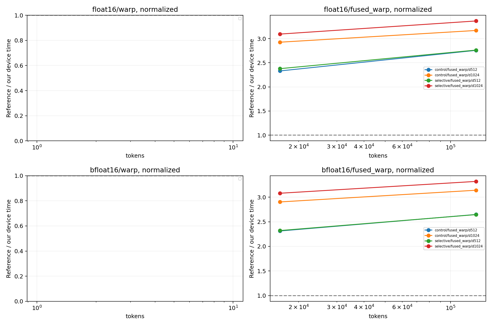

# 参考库同边界性能对照

GPU：NVIDIA H200
同一输入驻留 GPU，CUDA Graph 回放按节点数摊销的设备时间；不是 Python API 延迟，
也不是独立 profiler 单 kernel 时间。捕获/分配不计时；固定地址缓存状态由规模决定。
多轮交错后端顺序，中位数/min/max 均保留于 summary.csv。
融合对照为 Dao 变换 + 本项目同协议 standalone INT4，不声称 Dao 自带 INT4。

| dtype | tokens | d | normalize | 路径 | 本项目 μs | 对照 μs | 对照/本项目 | 全部检查通过 |
|---|---:|---:|---:|---|---:|---:|---:|---|
| bfloat16 | 131072 | 1024 | 1 | control/fused_warp | 172.215 | 540.937 | 3.141× | True |
| bfloat16 | 131072 | 1024 | 1 | selective/fused_warp | 162.919 | 540.937 | 3.320× | True |
| bfloat16 | 131072 | 512 | 1 | control/fused_warp | 81.933 | 216.989 | 2.648× | True |
| bfloat16 | 131072 | 512 | 1 | selective/fused_warp | 82.003 | 216.989 | 2.646× | True |
| bfloat16 | 16384 | 1024 | 1 | control/fused_warp | 24.413 | 70.870 | 2.903× | True |
| bfloat16 | 16384 | 1024 | 1 | selective/fused_warp | 23.013 | 70.870 | 3.080× | True |
| bfloat16 | 16384 | 512 | 1 | control/fused_warp | 11.684 | 27.020 | 2.313× | True |
| bfloat16 | 16384 | 512 | 1 | selective/fused_warp | 11.639 | 27.020 | 2.321× | True |
| float16 | 131072 | 1024 | 1 | control/fused_warp | 170.600 | 540.600 | 3.169× | True |
| float16 | 131072 | 1024 | 1 | selective/fused_warp | 160.623 | 540.600 | 3.366× | True |
| float16 | 131072 | 512 | 1 | control/fused_warp | 78.596 | 216.680 | 2.757× | True |
| float16 | 131072 | 512 | 1 | selective/fused_warp | 78.436 | 216.680 | 2.762× | True |
| float16 | 16384 | 1024 | 1 | control/fused_warp | 24.247 | 70.944 | 2.926× | True |
| float16 | 16384 | 1024 | 1 | selective/fused_warp | 22.929 | 70.944 | 3.094× | True |
| float16 | 16384 | 512 | 1 | control/fused_warp | 11.511 | 26.825 | 2.330× | True |
| float16 | 16384 | 512 | 1 | selective/fused_warp | 11.282 | 26.825 | 2.378× | True |

