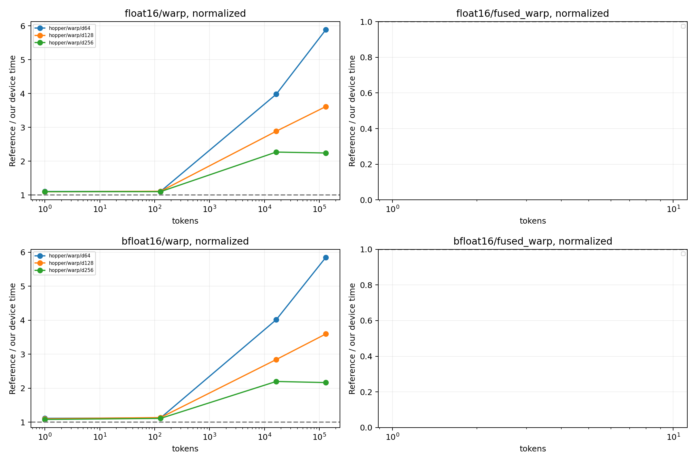

# 参考库同边界性能对照

GPU：NVIDIA H200
同一输入驻留 GPU，CUDA Graph 回放按节点数摊销的设备时间；不是 Python API 延迟，
也不是独立 profiler 单 kernel 时间。捕获/分配不计时；固定地址缓存状态由规模决定。
多轮交错后端顺序，中位数/min/max 均保留于 summary.csv。
融合对照为 Dao 变换 + 本项目同协议 standalone INT4，不声称 Dao 自带 INT4。

| dtype | tokens | d | normalize | 路径 | 本项目 μs | 对照 μs | 对照/本项目 | 全部检查通过 |
|---|---:|---:|---:|---|---:|---:|---:|---|
| bfloat16 | 1 | 128 | 0 | hopper/mma_fast | 1.417 | 1.572 | 1.110× | True |
| bfloat16 | 1 | 128 | 0 | hopper/mma_split | 1.436 | 1.572 | 1.095× | True |
| bfloat16 | 1 | 128 | 0 | hopper/warp | 1.418 | 1.572 | 1.109× | True |
| bfloat16 | 1 | 128 | 0 | hopper/wmma_fast | 1.431 | 1.572 | 1.099× | True |
| bfloat16 | 1 | 128 | 0 | hopper/wmma_split | 1.421 | 1.572 | 1.106× | True |
| bfloat16 | 1 | 128 | 1 | hopper/mma_fast | 1.418 | 1.532 | 1.080× | True |
| bfloat16 | 1 | 128 | 1 | hopper/mma_split | 1.408 | 1.532 | 1.088× | True |
| bfloat16 | 1 | 128 | 1 | hopper/warp | 1.396 | 1.532 | 1.097× | True |
| bfloat16 | 1 | 128 | 1 | hopper/wmma_fast | 1.440 | 1.532 | 1.064× | True |
| bfloat16 | 1 | 128 | 1 | hopper/wmma_split | 1.396 | 1.532 | 1.098× | True |
| bfloat16 | 1 | 256 | 0 | hopper/mma_fast | 1.532 | 1.646 | 1.075× | False |
| bfloat16 | 1 | 256 | 0 | hopper/mma_split | 1.592 | 1.646 | 1.034× | False |
| bfloat16 | 1 | 256 | 0 | hopper/warp | 1.498 | 1.646 | 1.099× | True |
| bfloat16 | 1 | 256 | 0 | hopper/wmma_fast | 1.775 | 1.646 | 0.928× | False |
| bfloat16 | 1 | 256 | 0 | hopper/wmma_split | 1.909 | 1.646 | 0.863× | False |
| bfloat16 | 1 | 256 | 1 | hopper/mma_fast | 1.536 | 1.634 | 1.064× | True |
| bfloat16 | 1 | 256 | 1 | hopper/mma_split | 1.558 | 1.634 | 1.049× | True |
| bfloat16 | 1 | 256 | 1 | hopper/warp | 1.514 | 1.634 | 1.080× | True |
| bfloat16 | 1 | 256 | 1 | hopper/wmma_fast | 1.793 | 1.634 | 0.911× | True |
| bfloat16 | 1 | 256 | 1 | hopper/wmma_split | 1.897 | 1.634 | 0.861× | True |
| bfloat16 | 1 | 64 | 0 | hopper/mma_fast | 1.400 | 1.529 | 1.092× | True |
| bfloat16 | 1 | 64 | 0 | hopper/mma_split | 1.405 | 1.529 | 1.088× | True |
| bfloat16 | 1 | 64 | 0 | hopper/warp | 1.390 | 1.529 | 1.100× | True |
| bfloat16 | 1 | 64 | 0 | hopper/wmma_fast | 1.425 | 1.529 | 1.072× | True |
| bfloat16 | 1 | 64 | 0 | hopper/wmma_split | 1.403 | 1.529 | 1.089× | True |
| bfloat16 | 1 | 64 | 1 | hopper/mma_fast | 1.386 | 1.560 | 1.125× | True |
| bfloat16 | 1 | 64 | 1 | hopper/mma_split | 1.420 | 1.560 | 1.098× | True |
| bfloat16 | 1 | 64 | 1 | hopper/warp | 1.402 | 1.560 | 1.112× | True |
| bfloat16 | 1 | 64 | 1 | hopper/wmma_fast | 1.398 | 1.560 | 1.116× | True |
| bfloat16 | 1 | 64 | 1 | hopper/wmma_split | 1.433 | 1.560 | 1.088× | True |
| bfloat16 | 128 | 128 | 0 | hopper/mma_fast | 1.587 | 1.731 | 1.091× | False |
| bfloat16 | 128 | 128 | 0 | hopper/mma_split | 1.684 | 1.731 | 1.028× | False |
| bfloat16 | 128 | 128 | 0 | hopper/warp | 1.551 | 1.731 | 1.116× | True |
| bfloat16 | 128 | 128 | 0 | hopper/wmma_fast | 1.934 | 1.731 | 0.895× | False |
| bfloat16 | 128 | 128 | 0 | hopper/wmma_split | 2.029 | 1.731 | 0.853× | False |
| bfloat16 | 128 | 128 | 1 | hopper/mma_fast | 1.646 | 1.729 | 1.050× | True |
| bfloat16 | 128 | 128 | 1 | hopper/mma_split | 1.661 | 1.729 | 1.041× | True |
| bfloat16 | 128 | 128 | 1 | hopper/warp | 1.524 | 1.729 | 1.134× | True |
| bfloat16 | 128 | 128 | 1 | hopper/wmma_fast | 1.951 | 1.729 | 0.886× | True |
| bfloat16 | 128 | 128 | 1 | hopper/wmma_split | 1.993 | 1.729 | 0.868× | True |
| bfloat16 | 128 | 256 | 0 | hopper/mma_fast | 1.641 | 1.746 | 1.064× | False |
| bfloat16 | 128 | 256 | 0 | hopper/mma_split | 1.670 | 1.746 | 1.046× | True |
| bfloat16 | 128 | 256 | 0 | hopper/warp | 1.606 | 1.746 | 1.087× | True |
| bfloat16 | 128 | 256 | 0 | hopper/wmma_fast | 1.918 | 1.746 | 0.910× | False |
| bfloat16 | 128 | 256 | 0 | hopper/wmma_split | 2.067 | 1.746 | 0.845× | True |
| bfloat16 | 128 | 256 | 1 | hopper/mma_fast | 1.639 | 1.766 | 1.077× | True |
| bfloat16 | 128 | 256 | 1 | hopper/mma_split | 1.685 | 1.766 | 1.048× | True |
| bfloat16 | 128 | 256 | 1 | hopper/warp | 1.591 | 1.766 | 1.110× | True |
| bfloat16 | 128 | 256 | 1 | hopper/wmma_fast | 1.948 | 1.766 | 0.906× | True |
| bfloat16 | 128 | 256 | 1 | hopper/wmma_split | 2.052 | 1.766 | 0.861× | True |
| bfloat16 | 128 | 64 | 0 | hopper/mma_fast | 1.631 | 1.707 | 1.047× | False |
| bfloat16 | 128 | 64 | 0 | hopper/mma_split | 1.639 | 1.707 | 1.041× | True |
| bfloat16 | 128 | 64 | 0 | hopper/warp | 1.486 | 1.707 | 1.149× | True |
| bfloat16 | 128 | 64 | 0 | hopper/wmma_fast | 1.936 | 1.707 | 0.882× | False |
| bfloat16 | 128 | 64 | 0 | hopper/wmma_split | 1.999 | 1.707 | 0.854× | True |
| bfloat16 | 128 | 64 | 1 | hopper/mma_fast | 1.615 | 1.704 | 1.055× | True |
| bfloat16 | 128 | 64 | 1 | hopper/mma_split | 1.645 | 1.704 | 1.036× | True |
| bfloat16 | 128 | 64 | 1 | hopper/warp | 1.514 | 1.704 | 1.125× | True |
| bfloat16 | 128 | 64 | 1 | hopper/wmma_fast | 1.916 | 1.704 | 0.889× | True |
| bfloat16 | 128 | 64 | 1 | hopper/wmma_split | 2.021 | 1.704 | 0.843× | True |
| bfloat16 | 131072 | 128 | 0 | hopper/mma_fast | 20.241 | 80.660 | 3.985× | False |
| bfloat16 | 131072 | 128 | 0 | hopper/mma_split | 20.645 | 80.660 | 3.907× | False |
| bfloat16 | 131072 | 128 | 0 | hopper/warp | 22.334 | 80.660 | 3.612× | True |
| bfloat16 | 131072 | 128 | 0 | hopper/wmma_fast | 34.942 | 80.660 | 2.308× | False |
| bfloat16 | 131072 | 128 | 0 | hopper/wmma_split | 40.316 | 80.660 | 2.001× | False |
| bfloat16 | 131072 | 128 | 1 | hopper/mma_fast | 20.196 | 80.636 | 3.993× | True |
| bfloat16 | 131072 | 128 | 1 | hopper/mma_split | 20.586 | 80.636 | 3.917× | True |
| bfloat16 | 131072 | 128 | 1 | hopper/warp | 22.428 | 80.636 | 3.595× | True |
| bfloat16 | 131072 | 128 | 1 | hopper/wmma_fast | 34.934 | 80.636 | 2.308× | True |
| bfloat16 | 131072 | 128 | 1 | hopper/wmma_split | 40.335 | 80.636 | 1.999× | True |
| bfloat16 | 131072 | 256 | 0 | hopper/mma_fast | 36.725 | 80.729 | 2.198× | False |
| bfloat16 | 131072 | 256 | 0 | hopper/mma_split | 38.037 | 80.729 | 2.122× | False |
| bfloat16 | 131072 | 256 | 0 | hopper/warp | 36.120 | 80.729 | 2.235× | True |
| bfloat16 | 131072 | 256 | 0 | hopper/wmma_fast | 66.797 | 80.729 | 1.209× | False |
| bfloat16 | 131072 | 256 | 0 | hopper/wmma_split | 77.899 | 80.729 | 1.036× | False |
| bfloat16 | 131072 | 256 | 1 | hopper/mma_fast | 36.596 | 80.717 | 2.206× | True |
| bfloat16 | 131072 | 256 | 1 | hopper/mma_split | 38.028 | 80.717 | 2.123× | True |
| bfloat16 | 131072 | 256 | 1 | hopper/warp | 37.287 | 80.717 | 2.165× | True |
| bfloat16 | 131072 | 256 | 1 | hopper/wmma_fast | 66.834 | 80.717 | 1.208× | True |
| bfloat16 | 131072 | 256 | 1 | hopper/wmma_split | 77.901 | 80.717 | 1.036× | True |
| bfloat16 | 131072 | 64 | 0 | hopper/mma_fast | 9.796 | 80.488 | 8.216× | False |
| bfloat16 | 131072 | 64 | 0 | hopper/mma_split | 11.075 | 80.488 | 7.267× | False |
| bfloat16 | 131072 | 64 | 0 | hopper/warp | 13.458 | 80.488 | 5.981× | True |
| bfloat16 | 131072 | 64 | 0 | hopper/wmma_fast | 18.291 | 80.488 | 4.400× | False |
| bfloat16 | 131072 | 64 | 0 | hopper/wmma_split | 21.145 | 80.488 | 3.806× | False |
| bfloat16 | 131072 | 64 | 1 | hopper/mma_fast | 9.847 | 80.452 | 8.170× | True |
| bfloat16 | 131072 | 64 | 1 | hopper/mma_split | 11.077 | 80.452 | 7.263× | True |
| bfloat16 | 131072 | 64 | 1 | hopper/warp | 13.754 | 80.452 | 5.849× | True |
| bfloat16 | 131072 | 64 | 1 | hopper/wmma_fast | 18.376 | 80.452 | 4.378× | True |
| bfloat16 | 131072 | 64 | 1 | hopper/wmma_split | 21.168 | 80.452 | 3.801× | True |
| bfloat16 | 16384 | 128 | 0 | hopper/mma_fast | 3.640 | 11.390 | 3.129× | False |
| bfloat16 | 16384 | 128 | 0 | hopper/mma_split | 3.826 | 11.390 | 2.977× | False |
| bfloat16 | 16384 | 128 | 0 | hopper/warp | 3.988 | 11.390 | 2.856× | True |
| bfloat16 | 16384 | 128 | 0 | hopper/wmma_fast | 5.753 | 11.390 | 1.980× | False |
| bfloat16 | 16384 | 128 | 0 | hopper/wmma_split | 6.525 | 11.390 | 1.746× | False |
| bfloat16 | 16384 | 128 | 1 | hopper/mma_fast | 3.637 | 11.378 | 3.128× | True |
| bfloat16 | 16384 | 128 | 1 | hopper/mma_split | 3.848 | 11.378 | 2.957× | True |
| bfloat16 | 16384 | 128 | 1 | hopper/warp | 4.003 | 11.378 | 2.843× | True |
| bfloat16 | 16384 | 128 | 1 | hopper/wmma_fast | 5.772 | 11.378 | 1.971× | True |
| bfloat16 | 16384 | 128 | 1 | hopper/wmma_split | 6.564 | 11.378 | 1.733× | True |
| bfloat16 | 16384 | 256 | 0 | hopper/mma_fast | 5.235 | 11.545 | 2.205× | False |
| bfloat16 | 16384 | 256 | 0 | hopper/mma_split | 5.715 | 11.545 | 2.020× | False |
| bfloat16 | 16384 | 256 | 0 | hopper/warp | 4.981 | 11.545 | 2.318× | True |
| bfloat16 | 16384 | 256 | 0 | hopper/wmma_fast | 9.881 | 11.545 | 1.168× | False |
| bfloat16 | 16384 | 256 | 0 | hopper/wmma_split | 11.362 | 11.545 | 1.016× | False |
| bfloat16 | 16384 | 256 | 1 | hopper/mma_fast | 5.260 | 11.517 | 2.189× | True |
| bfloat16 | 16384 | 256 | 1 | hopper/mma_split | 5.763 | 11.517 | 1.999× | True |
| bfloat16 | 16384 | 256 | 1 | hopper/warp | 5.241 | 11.517 | 2.197× | True |
| bfloat16 | 16384 | 256 | 1 | hopper/wmma_fast | 9.770 | 11.517 | 1.179× | True |
| bfloat16 | 16384 | 256 | 1 | hopper/wmma_split | 11.315 | 11.517 | 1.018× | True |
| bfloat16 | 16384 | 64 | 0 | hopper/mma_fast | 2.694 | 11.323 | 4.204× | False |
| bfloat16 | 16384 | 64 | 0 | hopper/mma_split | 2.948 | 11.323 | 3.841× | False |
| bfloat16 | 16384 | 64 | 0 | hopper/warp | 2.800 | 11.323 | 4.044× | True |
| bfloat16 | 16384 | 64 | 0 | hopper/wmma_fast | 3.720 | 11.323 | 3.044× | False |
| bfloat16 | 16384 | 64 | 0 | hopper/wmma_split | 4.070 | 11.323 | 2.782× | False |
| bfloat16 | 16384 | 64 | 1 | hopper/mma_fast | 2.699 | 11.296 | 4.186× | True |
| bfloat16 | 16384 | 64 | 1 | hopper/mma_split | 2.934 | 11.296 | 3.851× | True |
| bfloat16 | 16384 | 64 | 1 | hopper/warp | 2.814 | 11.296 | 4.015× | True |
| bfloat16 | 16384 | 64 | 1 | hopper/wmma_fast | 3.712 | 11.296 | 3.044× | True |
| bfloat16 | 16384 | 64 | 1 | hopper/wmma_split | 4.104 | 11.296 | 2.752× | True |
| float16 | 1 | 128 | 0 | hopper/mma_fast | 1.433 | 1.560 | 1.088× | True |
| float16 | 1 | 128 | 0 | hopper/mma_split | 1.411 | 1.560 | 1.105× | True |
| float16 | 1 | 128 | 0 | hopper/warp | 1.437 | 1.560 | 1.085× | True |
| float16 | 1 | 128 | 0 | hopper/wmma_fast | 1.410 | 1.560 | 1.106× | True |
| float16 | 1 | 128 | 0 | hopper/wmma_split | 1.405 | 1.560 | 1.110× | True |
| float16 | 1 | 128 | 1 | hopper/mma_fast | 1.443 | 1.554 | 1.077× | True |
| float16 | 1 | 128 | 1 | hopper/mma_split | 1.417 | 1.554 | 1.097× | True |
| float16 | 1 | 128 | 1 | hopper/warp | 1.416 | 1.554 | 1.098× | True |
| float16 | 1 | 128 | 1 | hopper/wmma_fast | 1.421 | 1.554 | 1.094× | True |
| float16 | 1 | 128 | 1 | hopper/wmma_split | 1.406 | 1.554 | 1.106× | True |
| float16 | 1 | 256 | 0 | hopper/mma_fast | 1.558 | 1.611 | 1.034× | False |
| float16 | 1 | 256 | 0 | hopper/mma_split | 1.550 | 1.611 | 1.039× | True |
| float16 | 1 | 256 | 0 | hopper/warp | 1.506 | 1.611 | 1.070× | True |
| float16 | 1 | 256 | 0 | hopper/wmma_fast | 1.782 | 1.611 | 0.904× | False |
| float16 | 1 | 256 | 0 | hopper/wmma_split | 1.812 | 1.611 | 0.889× | True |
| float16 | 1 | 256 | 1 | hopper/mma_fast | 1.513 | 1.639 | 1.084× | True |
| float16 | 1 | 256 | 1 | hopper/mma_split | 1.574 | 1.639 | 1.042× | True |
| float16 | 1 | 256 | 1 | hopper/warp | 1.488 | 1.639 | 1.102× | True |
| float16 | 1 | 256 | 1 | hopper/wmma_fast | 1.792 | 1.639 | 0.915× | True |
| float16 | 1 | 256 | 1 | hopper/wmma_split | 1.846 | 1.639 | 0.888× | True |
| float16 | 1 | 64 | 0 | hopper/mma_fast | 1.436 | 1.595 | 1.110× | True |
| float16 | 1 | 64 | 0 | hopper/mma_split | 1.450 | 1.595 | 1.100× | True |
| float16 | 1 | 64 | 0 | hopper/warp | 1.444 | 1.595 | 1.105× | True |
| float16 | 1 | 64 | 0 | hopper/wmma_fast | 1.445 | 1.595 | 1.104× | True |
| float16 | 1 | 64 | 0 | hopper/wmma_split | 1.472 | 1.595 | 1.084× | True |
| float16 | 1 | 64 | 1 | hopper/mma_fast | 1.382 | 1.561 | 1.130× | True |
| float16 | 1 | 64 | 1 | hopper/mma_split | 1.428 | 1.561 | 1.094× | True |
| float16 | 1 | 64 | 1 | hopper/warp | 1.413 | 1.561 | 1.105× | True |
| float16 | 1 | 64 | 1 | hopper/wmma_fast | 1.403 | 1.561 | 1.113× | True |
| float16 | 1 | 64 | 1 | hopper/wmma_split | 1.412 | 1.561 | 1.106× | True |
| float16 | 128 | 128 | 0 | hopper/mma_fast | 1.637 | 1.703 | 1.040× | False |
| float16 | 128 | 128 | 0 | hopper/mma_split | 1.641 | 1.703 | 1.038× | True |
| float16 | 128 | 128 | 0 | hopper/warp | 1.539 | 1.703 | 1.106× | True |
| float16 | 128 | 128 | 0 | hopper/wmma_fast | 1.958 | 1.703 | 0.870× | False |
| float16 | 128 | 128 | 0 | hopper/wmma_split | 1.963 | 1.703 | 0.868× | True |
| float16 | 128 | 128 | 1 | hopper/mma_fast | 1.626 | 1.701 | 1.047× | True |
| float16 | 128 | 128 | 1 | hopper/mma_split | 1.671 | 1.701 | 1.018× | True |
| float16 | 128 | 128 | 1 | hopper/warp | 1.529 | 1.701 | 1.113× | True |
| float16 | 128 | 128 | 1 | hopper/wmma_fast | 1.931 | 1.701 | 0.881× | True |
| float16 | 128 | 128 | 1 | hopper/wmma_split | 1.957 | 1.701 | 0.869× | True |
| float16 | 128 | 256 | 0 | hopper/mma_fast | 1.652 | 1.712 | 1.037× | False |
| float16 | 128 | 256 | 0 | hopper/mma_split | 1.672 | 1.712 | 1.024× | True |
| float16 | 128 | 256 | 0 | hopper/warp | 1.568 | 1.712 | 1.092× | True |
| float16 | 128 | 256 | 0 | hopper/wmma_fast | 1.939 | 1.712 | 0.883× | False |
| float16 | 128 | 256 | 0 | hopper/wmma_split | 1.978 | 1.712 | 0.866× | True |
| float16 | 128 | 256 | 1 | hopper/mma_fast | 1.622 | 1.762 | 1.087× | True |
| float16 | 128 | 256 | 1 | hopper/mma_split | 1.681 | 1.762 | 1.049× | True |
| float16 | 128 | 256 | 1 | hopper/warp | 1.599 | 1.762 | 1.102× | True |
| float16 | 128 | 256 | 1 | hopper/wmma_fast | 1.927 | 1.762 | 0.914× | True |
| float16 | 128 | 256 | 1 | hopper/wmma_split | 2.014 | 1.762 | 0.875× | True |
| float16 | 128 | 64 | 0 | hopper/mma_fast | 1.634 | 1.672 | 1.023× | False |
| float16 | 128 | 64 | 0 | hopper/mma_split | 1.629 | 1.672 | 1.027× | True |
| float16 | 128 | 64 | 0 | hopper/warp | 1.527 | 1.672 | 1.095× | True |
| float16 | 128 | 64 | 0 | hopper/wmma_fast | 1.919 | 1.672 | 0.871× | False |
| float16 | 128 | 64 | 0 | hopper/wmma_split | 1.976 | 1.672 | 0.846× | True |
| float16 | 128 | 64 | 1 | hopper/mma_fast | 1.611 | 1.707 | 1.059× | True |
| float16 | 128 | 64 | 1 | hopper/mma_split | 1.659 | 1.707 | 1.029× | True |
| float16 | 128 | 64 | 1 | hopper/warp | 1.539 | 1.707 | 1.109× | True |
| float16 | 128 | 64 | 1 | hopper/wmma_fast | 1.912 | 1.707 | 0.892× | True |
| float16 | 128 | 64 | 1 | hopper/wmma_split | 2.000 | 1.707 | 0.853× | True |
| float16 | 131072 | 128 | 0 | hopper/mma_fast | 20.240 | 80.631 | 3.984× | False |
| float16 | 131072 | 128 | 0 | hopper/mma_split | 20.250 | 80.631 | 3.982× | False |
| float16 | 131072 | 128 | 0 | hopper/warp | 22.323 | 80.631 | 3.612× | True |
| float16 | 131072 | 128 | 0 | hopper/wmma_fast | 33.115 | 80.631 | 2.435× | False |
| float16 | 131072 | 128 | 0 | hopper/wmma_split | 36.926 | 80.631 | 2.184× | False |
| float16 | 131072 | 128 | 1 | hopper/mma_fast | 20.187 | 80.690 | 3.997× | True |
| float16 | 131072 | 128 | 1 | hopper/mma_split | 20.254 | 80.690 | 3.984× | True |
| float16 | 131072 | 128 | 1 | hopper/warp | 22.316 | 80.690 | 3.616× | True |
| float16 | 131072 | 128 | 1 | hopper/wmma_fast | 32.906 | 80.690 | 2.452× | True |
| float16 | 131072 | 128 | 1 | hopper/wmma_split | 36.691 | 80.690 | 2.199× | True |
| float16 | 131072 | 256 | 0 | hopper/mma_fast | 36.692 | 80.834 | 2.203× | False |
| float16 | 131072 | 256 | 0 | hopper/mma_split | 37.676 | 80.834 | 2.146× | False |
| float16 | 131072 | 256 | 0 | hopper/warp | 35.528 | 80.834 | 2.275× | True |
| float16 | 131072 | 256 | 0 | hopper/wmma_fast | 62.760 | 80.834 | 1.288× | False |
| float16 | 131072 | 256 | 0 | hopper/wmma_split | 70.400 | 80.834 | 1.148× | False |
| float16 | 131072 | 256 | 1 | hopper/mma_fast | 36.690 | 80.674 | 2.199× | True |
| float16 | 131072 | 256 | 1 | hopper/mma_split | 37.670 | 80.674 | 2.142× | True |
| float16 | 131072 | 256 | 1 | hopper/warp | 35.959 | 80.674 | 2.243× | True |
| float16 | 131072 | 256 | 1 | hopper/wmma_fast | 62.748 | 80.674 | 1.286× | True |
| float16 | 131072 | 256 | 1 | hopper/wmma_split | 70.454 | 80.674 | 1.145× | True |
| float16 | 131072 | 64 | 0 | hopper/mma_fast | 9.842 | 80.470 | 8.176× | False |
| float16 | 131072 | 64 | 0 | hopper/mma_split | 10.779 | 80.470 | 7.466× | True |
| float16 | 131072 | 64 | 0 | hopper/warp | 13.459 | 80.470 | 5.979× | True |
| float16 | 131072 | 64 | 0 | hopper/wmma_fast | 17.487 | 80.470 | 4.602× | False |
| float16 | 131072 | 64 | 0 | hopper/wmma_split | 19.448 | 80.470 | 4.138× | True |
| float16 | 131072 | 64 | 1 | hopper/mma_fast | 9.841 | 80.467 | 8.177× | True |
| float16 | 131072 | 64 | 1 | hopper/mma_split | 10.746 | 80.467 | 7.488× | True |
| float16 | 131072 | 64 | 1 | hopper/warp | 13.671 | 80.467 | 5.886× | True |
| float16 | 131072 | 64 | 1 | hopper/wmma_fast | 17.485 | 80.467 | 4.602× | True |
| float16 | 131072 | 64 | 1 | hopper/wmma_split | 19.484 | 80.467 | 4.130× | True |
| float16 | 16384 | 128 | 0 | hopper/mma_fast | 3.649 | 11.326 | 3.104× | False |
| float16 | 16384 | 128 | 0 | hopper/mma_split | 3.761 | 11.326 | 3.012× | False |
| float16 | 16384 | 128 | 0 | hopper/warp | 3.923 | 11.326 | 2.887× | True |
| float16 | 16384 | 128 | 0 | hopper/wmma_fast | 5.601 | 11.326 | 2.022× | False |
| float16 | 16384 | 128 | 0 | hopper/wmma_split | 6.070 | 11.326 | 1.866× | False |
| float16 | 16384 | 128 | 1 | hopper/mma_fast | 3.644 | 11.360 | 3.118× | True |
| float16 | 16384 | 128 | 1 | hopper/mma_split | 3.743 | 11.360 | 3.035× | True |
| float16 | 16384 | 128 | 1 | hopper/warp | 3.935 | 11.360 | 2.887× | True |
| float16 | 16384 | 128 | 1 | hopper/wmma_fast | 5.577 | 11.360 | 2.037× | True |
| float16 | 16384 | 128 | 1 | hopper/wmma_split | 6.071 | 11.360 | 1.871× | True |
| float16 | 16384 | 256 | 0 | hopper/mma_fast | 5.238 | 11.484 | 2.192× | False |
| float16 | 16384 | 256 | 0 | hopper/mma_split | 5.590 | 11.484 | 2.054× | False |
| float16 | 16384 | 256 | 0 | hopper/warp | 5.115 | 11.484 | 2.245× | True |
| float16 | 16384 | 256 | 0 | hopper/wmma_fast | 9.419 | 11.484 | 1.219× | False |
| float16 | 16384 | 256 | 0 | hopper/wmma_split | 10.492 | 11.484 | 1.095× | False |
| float16 | 16384 | 256 | 1 | hopper/mma_fast | 5.245 | 11.496 | 2.192× | True |
| float16 | 16384 | 256 | 1 | hopper/mma_split | 5.625 | 11.496 | 2.044× | True |
| float16 | 16384 | 256 | 1 | hopper/warp | 5.062 | 11.496 | 2.271× | True |
| float16 | 16384 | 256 | 1 | hopper/wmma_fast | 9.383 | 11.496 | 1.225× | True |
| float16 | 16384 | 256 | 1 | hopper/wmma_split | 10.455 | 11.496 | 1.100× | True |
| float16 | 16384 | 64 | 0 | hopper/mma_fast | 2.675 | 11.304 | 4.225× | False |
| float16 | 16384 | 64 | 0 | hopper/mma_split | 2.948 | 11.304 | 3.835× | False |
| float16 | 16384 | 64 | 0 | hopper/warp | 2.832 | 11.304 | 3.991× | True |
| float16 | 16384 | 64 | 0 | hopper/wmma_fast | 3.656 | 11.304 | 3.092× | False |
| float16 | 16384 | 64 | 0 | hopper/wmma_split | 3.901 | 11.304 | 2.898× | False |
| float16 | 16384 | 64 | 1 | hopper/mma_fast | 2.634 | 11.317 | 4.296× | True |
| float16 | 16384 | 64 | 1 | hopper/mma_split | 2.979 | 11.317 | 3.798× | True |
| float16 | 16384 | 64 | 1 | hopper/warp | 2.843 | 11.317 | 3.980× | True |
| float16 | 16384 | 64 | 1 | hopper/wmma_fast | 3.628 | 11.317 | 3.119× | True |
| float16 | 16384 | 64 | 1 | hopper/wmma_split | 3.912 | 11.317 | 2.892× | True |

