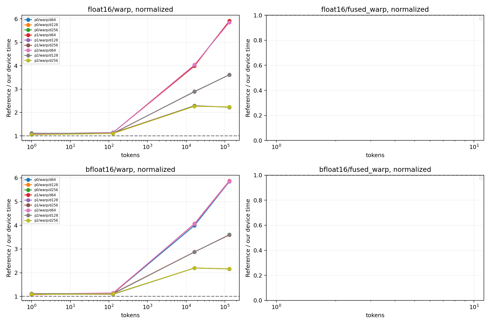

# 参考库同边界性能对照

GPU：NVIDIA H200
同一输入驻留 GPU，CUDA Graph 回放按节点数摊销的设备时间；不是 Python API 延迟，
也不是独立 profiler 单 kernel 时间。捕获/分配不计时；固定地址缓存状态由规模决定。
多轮交错后端顺序，中位数/min/max 均保留于 summary.csv。
融合对照为 Dao 变换 + 本项目同协议 standalone INT4，不声称 Dao 自带 INT4。

| dtype | tokens | d | normalize | 路径 | 本项目 μs | 对照 μs | 对照/本项目 | 全部检查通过 |
|---|---:|---:|---:|---|---:|---:|---:|---|
| bfloat16 | 1 | 128 | 0 | p0/mma_split | 1.441 | 1.574 | 1.092× | True |
| bfloat16 | 1 | 128 | 0 | p0/warp | 1.417 | 1.574 | 1.111× | True |
| bfloat16 | 1 | 128 | 0 | p1/mma_split | 1.424 | 1.574 | 1.105× | True |
| bfloat16 | 1 | 128 | 0 | p1/warp | 1.423 | 1.574 | 1.106× | True |
| bfloat16 | 1 | 128 | 0 | p2/mma_split | 1.405 | 1.574 | 1.120× | True |
| bfloat16 | 1 | 128 | 0 | p2/warp | 1.451 | 1.574 | 1.085× | True |
| bfloat16 | 1 | 128 | 1 | p0/mma_split | 1.413 | 1.596 | 1.129× | True |
| bfloat16 | 1 | 128 | 1 | p0/warp | 1.446 | 1.596 | 1.104× | True |
| bfloat16 | 1 | 128 | 1 | p1/mma_split | 1.432 | 1.596 | 1.114× | True |
| bfloat16 | 1 | 128 | 1 | p1/warp | 1.446 | 1.596 | 1.104× | True |
| bfloat16 | 1 | 128 | 1 | p2/mma_split | 1.414 | 1.596 | 1.129× | True |
| bfloat16 | 1 | 128 | 1 | p2/warp | 1.425 | 1.596 | 1.120× | True |
| bfloat16 | 1 | 256 | 0 | p0/mma_split | 1.607 | 1.629 | 1.014× | False |
| bfloat16 | 1 | 256 | 0 | p0/warp | 1.502 | 1.629 | 1.085× | True |
| bfloat16 | 1 | 256 | 0 | p1/mma_split | 1.580 | 1.629 | 1.031× | False |
| bfloat16 | 1 | 256 | 0 | p1/warp | 1.507 | 1.629 | 1.081× | True |
| bfloat16 | 1 | 256 | 0 | p2/mma_split | 1.601 | 1.629 | 1.018× | True |
| bfloat16 | 1 | 256 | 0 | p2/warp | 1.529 | 1.629 | 1.066× | True |
| bfloat16 | 1 | 256 | 1 | p0/mma_split | 1.607 | 1.656 | 1.030× | True |
| bfloat16 | 1 | 256 | 1 | p0/warp | 1.509 | 1.656 | 1.097× | True |
| bfloat16 | 1 | 256 | 1 | p1/mma_split | 1.572 | 1.656 | 1.053× | True |
| bfloat16 | 1 | 256 | 1 | p1/warp | 1.520 | 1.656 | 1.090× | True |
| bfloat16 | 1 | 256 | 1 | p2/mma_split | 1.647 | 1.656 | 1.005× | True |
| bfloat16 | 1 | 256 | 1 | p2/warp | 1.526 | 1.656 | 1.085× | True |
| bfloat16 | 1 | 64 | 0 | p0/mma_split | 1.400 | 1.557 | 1.112× | True |
| bfloat16 | 1 | 64 | 0 | p0/warp | 1.414 | 1.557 | 1.102× | True |
| bfloat16 | 1 | 64 | 0 | p1/mma_split | 1.394 | 1.557 | 1.117× | True |
| bfloat16 | 1 | 64 | 0 | p1/warp | 1.432 | 1.557 | 1.088× | True |
| bfloat16 | 1 | 64 | 0 | p2/mma_split | 1.432 | 1.557 | 1.087× | True |
| bfloat16 | 1 | 64 | 0 | p2/warp | 1.402 | 1.557 | 1.111× | True |
| bfloat16 | 1 | 64 | 1 | p0/mma_split | 1.385 | 1.527 | 1.102× | True |
| bfloat16 | 1 | 64 | 1 | p0/warp | 1.418 | 1.527 | 1.077× | True |
| bfloat16 | 1 | 64 | 1 | p1/mma_split | 1.393 | 1.527 | 1.096× | True |
| bfloat16 | 1 | 64 | 1 | p1/warp | 1.425 | 1.527 | 1.072× | True |
| bfloat16 | 1 | 64 | 1 | p2/mma_split | 1.401 | 1.527 | 1.090× | True |
| bfloat16 | 1 | 64 | 1 | p2/warp | 1.393 | 1.527 | 1.096× | True |
| bfloat16 | 128 | 128 | 0 | p0/mma_split | 1.668 | 1.704 | 1.021× | False |
| bfloat16 | 128 | 128 | 0 | p0/warp | 1.559 | 1.704 | 1.093× | True |
| bfloat16 | 128 | 128 | 0 | p1/mma_split | 1.654 | 1.704 | 1.030× | False |
| bfloat16 | 128 | 128 | 0 | p1/warp | 1.563 | 1.704 | 1.090× | True |
| bfloat16 | 128 | 128 | 0 | p2/mma_split | 1.736 | 1.704 | 0.982× | True |
| bfloat16 | 128 | 128 | 0 | p2/warp | 1.543 | 1.704 | 1.104× | True |
| bfloat16 | 128 | 128 | 1 | p0/mma_split | 1.693 | 1.717 | 1.014× | True |
| bfloat16 | 128 | 128 | 1 | p0/warp | 1.523 | 1.717 | 1.128× | True |
| bfloat16 | 128 | 128 | 1 | p1/mma_split | 1.675 | 1.717 | 1.025× | True |
| bfloat16 | 128 | 128 | 1 | p1/warp | 1.532 | 1.717 | 1.121× | True |
| bfloat16 | 128 | 128 | 1 | p2/mma_split | 1.720 | 1.717 | 0.998× | True |
| bfloat16 | 128 | 128 | 1 | p2/warp | 1.548 | 1.717 | 1.109× | True |
| bfloat16 | 128 | 256 | 0 | p0/mma_split | 1.688 | 1.738 | 1.030× | True |
| bfloat16 | 128 | 256 | 0 | p0/warp | 1.605 | 1.738 | 1.083× | True |
| bfloat16 | 128 | 256 | 0 | p1/mma_split | 1.657 | 1.738 | 1.049× | True |
| bfloat16 | 128 | 256 | 0 | p1/warp | 1.605 | 1.738 | 1.083× | True |
| bfloat16 | 128 | 256 | 0 | p2/mma_split | 1.722 | 1.738 | 1.009× | True |
| bfloat16 | 128 | 256 | 0 | p2/warp | 1.614 | 1.738 | 1.077× | True |
| bfloat16 | 128 | 256 | 1 | p0/mma_split | 1.674 | 1.753 | 1.048× | True |
| bfloat16 | 128 | 256 | 1 | p0/warp | 1.609 | 1.753 | 1.089× | True |
| bfloat16 | 128 | 256 | 1 | p1/mma_split | 1.676 | 1.753 | 1.046× | True |
| bfloat16 | 128 | 256 | 1 | p1/warp | 1.603 | 1.753 | 1.094× | True |
| bfloat16 | 128 | 256 | 1 | p2/mma_split | 1.746 | 1.753 | 1.004× | True |
| bfloat16 | 128 | 256 | 1 | p2/warp | 1.589 | 1.753 | 1.103× | True |
| bfloat16 | 128 | 64 | 0 | p0/mma_split | 1.649 | 1.685 | 1.021× | True |
| bfloat16 | 128 | 64 | 0 | p0/warp | 1.514 | 1.685 | 1.113× | True |
| bfloat16 | 128 | 64 | 0 | p1/mma_split | 1.671 | 1.685 | 1.008× | True |
| bfloat16 | 128 | 64 | 0 | p1/warp | 1.493 | 1.685 | 1.128× | True |
| bfloat16 | 128 | 64 | 0 | p2/mma_split | 1.704 | 1.685 | 0.989× | True |
| bfloat16 | 128 | 64 | 0 | p2/warp | 1.483 | 1.685 | 1.136× | True |
| bfloat16 | 128 | 64 | 1 | p0/mma_split | 1.632 | 1.716 | 1.052× | True |
| bfloat16 | 128 | 64 | 1 | p0/warp | 1.526 | 1.716 | 1.125× | True |
| bfloat16 | 128 | 64 | 1 | p1/mma_split | 1.650 | 1.716 | 1.040× | True |
| bfloat16 | 128 | 64 | 1 | p1/warp | 1.522 | 1.716 | 1.128× | True |
| bfloat16 | 128 | 64 | 1 | p2/mma_split | 1.713 | 1.716 | 1.002× | True |
| bfloat16 | 128 | 64 | 1 | p2/warp | 1.498 | 1.716 | 1.146× | True |
| bfloat16 | 131072 | 128 | 0 | p0/mma_split | 20.684 | 80.633 | 3.898× | False |
| bfloat16 | 131072 | 128 | 0 | p0/warp | 22.324 | 80.633 | 3.612× | True |
| bfloat16 | 131072 | 128 | 0 | p1/mma_split | 20.767 | 80.633 | 3.883× | False |
| bfloat16 | 131072 | 128 | 0 | p1/warp | 22.297 | 80.633 | 3.616× | True |
| bfloat16 | 131072 | 128 | 0 | p2/mma_split | 21.910 | 80.633 | 3.680× | True |
| bfloat16 | 131072 | 128 | 0 | p2/warp | 22.320 | 80.633 | 3.613× | True |
| bfloat16 | 131072 | 128 | 1 | p0/mma_split | 20.624 | 80.651 | 3.910× | True |
| bfloat16 | 131072 | 128 | 1 | p0/warp | 22.480 | 80.651 | 3.588× | True |
| bfloat16 | 131072 | 128 | 1 | p1/mma_split | 20.786 | 80.651 | 3.880× | True |
| bfloat16 | 131072 | 128 | 1 | p1/warp | 22.406 | 80.651 | 3.600× | True |
| bfloat16 | 131072 | 128 | 1 | p2/mma_split | 21.973 | 80.651 | 3.671× | True |
| bfloat16 | 131072 | 128 | 1 | p2/warp | 22.362 | 80.651 | 3.607× | True |
| bfloat16 | 131072 | 256 | 0 | p0/mma_split | 38.063 | 80.752 | 2.122× | False |
| bfloat16 | 131072 | 256 | 0 | p0/warp | 36.208 | 80.752 | 2.230× | True |
| bfloat16 | 131072 | 256 | 0 | p1/mma_split | 38.643 | 80.752 | 2.090× | False |
| bfloat16 | 131072 | 256 | 0 | p1/warp | 36.227 | 80.752 | 2.229× | True |
| bfloat16 | 131072 | 256 | 0 | p2/mma_split | 42.757 | 80.752 | 1.889× | False |
| bfloat16 | 131072 | 256 | 0 | p2/warp | 36.228 | 80.752 | 2.229× | True |
| bfloat16 | 131072 | 256 | 1 | p0/mma_split | 38.084 | 80.889 | 2.124× | True |
| bfloat16 | 131072 | 256 | 1 | p0/warp | 37.449 | 80.889 | 2.160× | True |
| bfloat16 | 131072 | 256 | 1 | p1/mma_split | 38.585 | 80.889 | 2.096× | True |
| bfloat16 | 131072 | 256 | 1 | p1/warp | 37.448 | 80.889 | 2.160× | True |
| bfloat16 | 131072 | 256 | 1 | p2/mma_split | 42.784 | 80.889 | 1.891× | True |
| bfloat16 | 131072 | 256 | 1 | p2/warp | 37.354 | 80.889 | 2.165× | True |
| bfloat16 | 131072 | 64 | 0 | p0/mma_split | 11.013 | 80.593 | 7.318× | False |
| bfloat16 | 131072 | 64 | 0 | p0/warp | 13.473 | 80.593 | 5.982× | True |
| bfloat16 | 131072 | 64 | 0 | p1/mma_split | 11.080 | 80.593 | 7.274× | False |
| bfloat16 | 131072 | 64 | 0 | p1/warp | 13.504 | 80.593 | 5.968× | True |
| bfloat16 | 131072 | 64 | 0 | p2/mma_split | 12.543 | 80.593 | 6.426× | True |
| bfloat16 | 131072 | 64 | 0 | p2/warp | 13.489 | 80.593 | 5.975× | True |
| bfloat16 | 131072 | 64 | 1 | p0/mma_split | 11.083 | 80.562 | 7.269× | True |
| bfloat16 | 131072 | 64 | 1 | p0/warp | 13.789 | 80.562 | 5.843× | True |
| bfloat16 | 131072 | 64 | 1 | p1/mma_split | 11.101 | 80.562 | 7.257× | True |
| bfloat16 | 131072 | 64 | 1 | p1/warp | 13.710 | 80.562 | 5.876× | True |
| bfloat16 | 131072 | 64 | 1 | p2/mma_split | 12.530 | 80.562 | 6.429× | True |
| bfloat16 | 131072 | 64 | 1 | p2/warp | 13.757 | 80.562 | 5.856× | True |
| bfloat16 | 16384 | 128 | 0 | p0/mma_split | 3.853 | 11.364 | 2.949× | False |
| bfloat16 | 16384 | 128 | 0 | p0/warp | 3.971 | 11.364 | 2.862× | True |
| bfloat16 | 16384 | 128 | 0 | p1/mma_split | 3.857 | 11.364 | 2.946× | False |
| bfloat16 | 16384 | 128 | 0 | p1/warp | 3.949 | 11.364 | 2.877× | True |
| bfloat16 | 16384 | 128 | 0 | p2/mma_split | 4.151 | 11.364 | 2.737× | True |
| bfloat16 | 16384 | 128 | 0 | p2/warp | 3.954 | 11.364 | 2.874× | True |
| bfloat16 | 16384 | 128 | 1 | p0/mma_split | 3.822 | 11.407 | 2.985× | True |
| bfloat16 | 16384 | 128 | 1 | p0/warp | 3.961 | 11.407 | 2.880× | True |
| bfloat16 | 16384 | 128 | 1 | p1/mma_split | 3.889 | 11.407 | 2.933× | True |
| bfloat16 | 16384 | 128 | 1 | p1/warp | 3.972 | 11.407 | 2.872× | True |
| bfloat16 | 16384 | 128 | 1 | p2/mma_split | 4.127 | 11.407 | 2.764× | True |
| bfloat16 | 16384 | 128 | 1 | p2/warp | 3.968 | 11.407 | 2.874× | True |
| bfloat16 | 16384 | 256 | 0 | p0/mma_split | 5.825 | 11.519 | 1.978× | False |
| bfloat16 | 16384 | 256 | 0 | p0/warp | 5.012 | 11.519 | 2.298× | True |
| bfloat16 | 16384 | 256 | 0 | p1/mma_split | 5.926 | 11.519 | 1.944× | False |
| bfloat16 | 16384 | 256 | 0 | p1/warp | 5.038 | 11.519 | 2.287× | True |
| bfloat16 | 16384 | 256 | 0 | p2/mma_split | 6.509 | 11.519 | 1.770× | True |
| bfloat16 | 16384 | 256 | 0 | p2/warp | 5.018 | 11.519 | 2.296× | True |
| bfloat16 | 16384 | 256 | 1 | p0/mma_split | 5.777 | 11.469 | 1.985× | True |
| bfloat16 | 16384 | 256 | 1 | p0/warp | 5.224 | 11.469 | 2.196× | True |
| bfloat16 | 16384 | 256 | 1 | p1/mma_split | 5.937 | 11.469 | 1.932× | True |
| bfloat16 | 16384 | 256 | 1 | p1/warp | 5.216 | 11.469 | 2.199× | True |
| bfloat16 | 16384 | 256 | 1 | p2/mma_split | 6.537 | 11.469 | 1.755× | True |
| bfloat16 | 16384 | 256 | 1 | p2/warp | 5.214 | 11.469 | 2.200× | True |
| bfloat16 | 16384 | 64 | 0 | p0/mma_split | 2.933 | 11.281 | 3.846× | False |
| bfloat16 | 16384 | 64 | 0 | p0/warp | 2.806 | 11.281 | 4.020× | True |
| bfloat16 | 16384 | 64 | 0 | p1/mma_split | 2.757 | 11.281 | 4.092× | False |
| bfloat16 | 16384 | 64 | 0 | p1/warp | 2.832 | 11.281 | 3.984× | True |
| bfloat16 | 16384 | 64 | 0 | p2/mma_split | 3.089 | 11.281 | 3.651× | True |
| bfloat16 | 16384 | 64 | 0 | p2/warp | 2.836 | 11.281 | 3.978× | True |
| bfloat16 | 16384 | 64 | 1 | p0/mma_split | 2.891 | 11.287 | 3.905× | True |
| bfloat16 | 16384 | 64 | 1 | p0/warp | 2.829 | 11.287 | 3.990× | True |
| bfloat16 | 16384 | 64 | 1 | p1/mma_split | 2.842 | 11.287 | 3.972× | True |
| bfloat16 | 16384 | 64 | 1 | p1/warp | 2.774 | 11.287 | 4.068× | True |
| bfloat16 | 16384 | 64 | 1 | p2/mma_split | 3.088 | 11.287 | 3.655× | True |
| bfloat16 | 16384 | 64 | 1 | p2/warp | 2.784 | 11.287 | 4.055× | True |
| float16 | 1 | 128 | 0 | p0/mma_split | 1.429 | 1.560 | 1.092× | True |
| float16 | 1 | 128 | 0 | p0/warp | 1.416 | 1.560 | 1.102× | True |
| float16 | 1 | 128 | 0 | p1/mma_split | 1.445 | 1.560 | 1.079× | True |
| float16 | 1 | 128 | 0 | p1/warp | 1.408 | 1.560 | 1.108× | True |
| float16 | 1 | 128 | 0 | p2/mma_split | 1.397 | 1.560 | 1.116× | True |
| float16 | 1 | 128 | 0 | p2/warp | 1.427 | 1.560 | 1.093× | True |
| float16 | 1 | 128 | 1 | p0/mma_split | 1.404 | 1.576 | 1.123× | True |
| float16 | 1 | 128 | 1 | p0/warp | 1.449 | 1.576 | 1.088× | True |
| float16 | 1 | 128 | 1 | p1/mma_split | 1.425 | 1.576 | 1.106× | True |
| float16 | 1 | 128 | 1 | p1/warp | 1.430 | 1.576 | 1.103× | True |
| float16 | 1 | 128 | 1 | p2/mma_split | 1.420 | 1.576 | 1.110× | True |
| float16 | 1 | 128 | 1 | p2/warp | 1.413 | 1.576 | 1.115× | True |
| float16 | 1 | 256 | 0 | p0/mma_split | 1.579 | 1.614 | 1.022× | True |
| float16 | 1 | 256 | 0 | p0/warp | 1.495 | 1.614 | 1.079× | True |
| float16 | 1 | 256 | 0 | p1/mma_split | 1.595 | 1.614 | 1.012× | True |
| float16 | 1 | 256 | 0 | p1/warp | 1.492 | 1.614 | 1.082× | True |
| float16 | 1 | 256 | 0 | p2/mma_split | 1.620 | 1.614 | 0.996× | True |
| float16 | 1 | 256 | 0 | p2/warp | 1.489 | 1.614 | 1.084× | True |
| float16 | 1 | 256 | 1 | p0/mma_split | 1.586 | 1.599 | 1.008× | True |
| float16 | 1 | 256 | 1 | p0/warp | 1.502 | 1.599 | 1.065× | True |
| float16 | 1 | 256 | 1 | p1/mma_split | 1.586 | 1.599 | 1.008× | True |
| float16 | 1 | 256 | 1 | p1/warp | 1.505 | 1.599 | 1.062× | True |
| float16 | 1 | 256 | 1 | p2/mma_split | 1.592 | 1.599 | 1.004× | True |
| float16 | 1 | 256 | 1 | p2/warp | 1.522 | 1.599 | 1.050× | True |
| float16 | 1 | 64 | 0 | p0/mma_split | 1.448 | 1.595 | 1.102× | True |
| float16 | 1 | 64 | 0 | p0/warp | 1.464 | 1.595 | 1.090× | True |
| float16 | 1 | 64 | 0 | p1/mma_split | 1.439 | 1.595 | 1.109× | True |
| float16 | 1 | 64 | 0 | p1/warp | 1.474 | 1.595 | 1.083× | True |
| float16 | 1 | 64 | 0 | p2/mma_split | 1.483 | 1.595 | 1.076× | True |
| float16 | 1 | 64 | 0 | p2/warp | 1.455 | 1.595 | 1.097× | True |
| float16 | 1 | 64 | 1 | p0/mma_split | 1.434 | 1.513 | 1.055× | True |
| float16 | 1 | 64 | 1 | p0/warp | 1.406 | 1.513 | 1.077× | True |
| float16 | 1 | 64 | 1 | p1/mma_split | 1.412 | 1.513 | 1.072× | True |
| float16 | 1 | 64 | 1 | p1/warp | 1.390 | 1.513 | 1.089× | True |
| float16 | 1 | 64 | 1 | p2/mma_split | 1.404 | 1.513 | 1.078× | True |
| float16 | 1 | 64 | 1 | p2/warp | 1.415 | 1.513 | 1.069× | True |
| float16 | 128 | 128 | 0 | p0/mma_split | 1.663 | 1.718 | 1.033× | True |
| float16 | 128 | 128 | 0 | p0/warp | 1.532 | 1.718 | 1.121× | True |
| float16 | 128 | 128 | 0 | p1/mma_split | 1.636 | 1.718 | 1.050× | True |
| float16 | 128 | 128 | 0 | p1/warp | 1.555 | 1.718 | 1.105× | True |
| float16 | 128 | 128 | 0 | p2/mma_split | 1.684 | 1.718 | 1.020× | True |
| float16 | 128 | 128 | 0 | p2/warp | 1.558 | 1.718 | 1.103× | True |
| float16 | 128 | 128 | 1 | p0/mma_split | 1.681 | 1.708 | 1.016× | True |
| float16 | 128 | 128 | 1 | p0/warp | 1.545 | 1.708 | 1.105× | True |
| float16 | 128 | 128 | 1 | p1/mma_split | 1.675 | 1.708 | 1.020× | True |
| float16 | 128 | 128 | 1 | p1/warp | 1.533 | 1.708 | 1.114× | True |
| float16 | 128 | 128 | 1 | p2/mma_split | 1.686 | 1.708 | 1.013× | True |
| float16 | 128 | 128 | 1 | p2/warp | 1.539 | 1.708 | 1.110× | True |
| float16 | 128 | 256 | 0 | p0/mma_split | 1.689 | 1.754 | 1.038× | True |
| float16 | 128 | 256 | 0 | p0/warp | 1.573 | 1.754 | 1.115× | True |
| float16 | 128 | 256 | 0 | p1/mma_split | 1.694 | 1.754 | 1.036× | True |
| float16 | 128 | 256 | 0 | p1/warp | 1.576 | 1.754 | 1.113× | True |
| float16 | 128 | 256 | 0 | p2/mma_split | 1.700 | 1.754 | 1.032× | True |
| float16 | 128 | 256 | 0 | p2/warp | 1.559 | 1.754 | 1.125× | True |
| float16 | 128 | 256 | 1 | p0/mma_split | 1.674 | 1.776 | 1.061× | True |
| float16 | 128 | 256 | 1 | p0/warp | 1.597 | 1.776 | 1.112× | True |
| float16 | 128 | 256 | 1 | p1/mma_split | 1.678 | 1.776 | 1.058× | True |
| float16 | 128 | 256 | 1 | p1/warp | 1.580 | 1.776 | 1.124× | True |
| float16 | 128 | 256 | 1 | p2/mma_split | 1.705 | 1.776 | 1.042× | True |
| float16 | 128 | 256 | 1 | p2/warp | 1.610 | 1.776 | 1.103× | True |
| float16 | 128 | 64 | 0 | p0/mma_split | 1.656 | 1.674 | 1.011× | True |
| float16 | 128 | 64 | 0 | p0/warp | 1.530 | 1.674 | 1.094× | True |
| float16 | 128 | 64 | 0 | p1/mma_split | 1.678 | 1.674 | 0.997× | True |
| float16 | 128 | 64 | 0 | p1/warp | 1.508 | 1.674 | 1.110× | True |
| float16 | 128 | 64 | 0 | p2/mma_split | 1.706 | 1.674 | 0.981× | True |
| float16 | 128 | 64 | 0 | p2/warp | 1.502 | 1.674 | 1.114× | True |
| float16 | 128 | 64 | 1 | p0/mma_split | 1.668 | 1.715 | 1.028× | True |
| float16 | 128 | 64 | 1 | p0/warp | 1.498 | 1.715 | 1.145× | True |
| float16 | 128 | 64 | 1 | p1/mma_split | 1.674 | 1.715 | 1.025× | True |
| float16 | 128 | 64 | 1 | p1/warp | 1.506 | 1.715 | 1.139× | True |
| float16 | 128 | 64 | 1 | p2/mma_split | 1.708 | 1.715 | 1.004× | True |
| float16 | 128 | 64 | 1 | p2/warp | 1.509 | 1.715 | 1.136× | True |
| float16 | 131072 | 128 | 0 | p0/mma_split | 20.199 | 80.673 | 3.994× | False |
| float16 | 131072 | 128 | 0 | p0/warp | 22.361 | 80.673 | 3.608× | True |
| float16 | 131072 | 128 | 0 | p1/mma_split | 20.525 | 80.673 | 3.930× | False |
| float16 | 131072 | 128 | 0 | p1/warp | 22.334 | 80.673 | 3.612× | True |
| float16 | 131072 | 128 | 0 | p2/mma_split | 21.361 | 80.673 | 3.777× | False |
| float16 | 131072 | 128 | 0 | p2/warp | 22.319 | 80.673 | 3.615× | True |
| float16 | 131072 | 128 | 1 | p0/mma_split | 20.286 | 80.738 | 3.980× | True |
| float16 | 131072 | 128 | 1 | p0/warp | 22.370 | 80.738 | 3.609× | True |
| float16 | 131072 | 128 | 1 | p1/mma_split | 20.476 | 80.738 | 3.943× | True |
| float16 | 131072 | 128 | 1 | p1/warp | 22.353 | 80.738 | 3.612× | True |
| float16 | 131072 | 128 | 1 | p2/mma_split | 21.243 | 80.738 | 3.801× | True |
| float16 | 131072 | 128 | 1 | p2/warp | 22.341 | 80.738 | 3.614× | True |
| float16 | 131072 | 256 | 0 | p0/mma_split | 37.738 | 80.700 | 2.138× | False |
| float16 | 131072 | 256 | 0 | p0/warp | 35.734 | 80.700 | 2.258× | True |
| float16 | 131072 | 256 | 0 | p1/mma_split | 38.027 | 80.700 | 2.122× | False |
| float16 | 131072 | 256 | 0 | p1/warp | 35.611 | 80.700 | 2.266× | True |
| float16 | 131072 | 256 | 0 | p2/mma_split | 40.297 | 80.700 | 2.003× | False |
| float16 | 131072 | 256 | 0 | p2/warp | 35.745 | 80.700 | 2.258× | True |
| float16 | 131072 | 256 | 1 | p0/mma_split | 37.742 | 80.895 | 2.143× | True |
| float16 | 131072 | 256 | 1 | p0/warp | 36.360 | 80.895 | 2.225× | True |
| float16 | 131072 | 256 | 1 | p1/mma_split | 38.090 | 80.895 | 2.124× | True |
| float16 | 131072 | 256 | 1 | p1/warp | 36.209 | 80.895 | 2.234× | True |
| float16 | 131072 | 256 | 1 | p2/mma_split | 40.286 | 80.895 | 2.008× | True |
| float16 | 131072 | 256 | 1 | p2/warp | 36.101 | 80.895 | 2.241× | True |
| float16 | 131072 | 64 | 0 | p0/mma_split | 10.735 | 80.494 | 7.498× | True |
| float16 | 131072 | 64 | 0 | p0/warp | 13.490 | 80.494 | 5.967× | True |
| float16 | 131072 | 64 | 0 | p1/mma_split | 10.965 | 80.494 | 7.341× | True |
| float16 | 131072 | 64 | 0 | p1/warp | 13.480 | 80.494 | 5.971× | True |
| float16 | 131072 | 64 | 0 | p2/mma_split | 12.440 | 80.494 | 6.471× | True |
| float16 | 131072 | 64 | 0 | p2/warp | 13.455 | 80.494 | 5.982× | True |
| float16 | 131072 | 64 | 1 | p0/mma_split | 10.707 | 80.564 | 7.525× | True |
| float16 | 131072 | 64 | 1 | p0/warp | 13.651 | 80.564 | 5.902× | True |
| float16 | 131072 | 64 | 1 | p1/mma_split | 10.902 | 80.564 | 7.390× | True |
| float16 | 131072 | 64 | 1 | p1/warp | 13.626 | 80.564 | 5.913× | True |
| float16 | 131072 | 64 | 1 | p2/mma_split | 12.294 | 80.564 | 6.553× | True |
| float16 | 131072 | 64 | 1 | p2/warp | 13.773 | 80.564 | 5.849× | True |
| float16 | 16384 | 128 | 0 | p0/mma_split | 3.751 | 11.372 | 3.032× | False |
| float16 | 16384 | 128 | 0 | p0/warp | 3.951 | 11.372 | 2.879× | True |
| float16 | 16384 | 128 | 0 | p1/mma_split | 3.859 | 11.372 | 2.947× | True |
| float16 | 16384 | 128 | 0 | p1/warp | 3.935 | 11.372 | 2.890× | True |
| float16 | 16384 | 128 | 0 | p2/mma_split | 3.940 | 11.372 | 2.886× | True |
| float16 | 16384 | 128 | 0 | p2/warp | 3.919 | 11.372 | 2.902× | True |
| float16 | 16384 | 128 | 1 | p0/mma_split | 3.758 | 11.382 | 3.029× | True |
| float16 | 16384 | 128 | 1 | p0/warp | 3.929 | 11.382 | 2.897× | True |
| float16 | 16384 | 128 | 1 | p1/mma_split | 3.818 | 11.382 | 2.981× | True |
| float16 | 16384 | 128 | 1 | p1/warp | 3.943 | 11.382 | 2.886× | True |
| float16 | 16384 | 128 | 1 | p2/mma_split | 3.914 | 11.382 | 2.908× | True |
| float16 | 16384 | 128 | 1 | p2/warp | 3.930 | 11.382 | 2.896× | True |
| float16 | 16384 | 256 | 0 | p0/mma_split | 5.593 | 11.460 | 2.049× | False |
| float16 | 16384 | 256 | 0 | p0/warp | 5.102 | 11.460 | 2.246× | True |
| float16 | 16384 | 256 | 0 | p1/mma_split | 5.725 | 11.460 | 2.002× | False |
| float16 | 16384 | 256 | 0 | p1/warp | 5.028 | 11.460 | 2.279× | True |
| float16 | 16384 | 256 | 0 | p2/mma_split | 6.233 | 11.460 | 1.839× | False |
| float16 | 16384 | 256 | 0 | p2/warp | 5.075 | 11.460 | 2.258× | True |
| float16 | 16384 | 256 | 1 | p0/mma_split | 5.622 | 11.501 | 2.046× | True |
| float16 | 16384 | 256 | 1 | p0/warp | 5.025 | 11.501 | 2.289× | True |
| float16 | 16384 | 256 | 1 | p1/mma_split | 5.704 | 11.501 | 2.016× | True |
| float16 | 16384 | 256 | 1 | p1/warp | 5.039 | 11.501 | 2.282× | True |
| float16 | 16384 | 256 | 1 | p2/mma_split | 6.160 | 11.501 | 1.867× | True |
| float16 | 16384 | 256 | 1 | p2/warp | 5.078 | 11.501 | 2.265× | True |
| float16 | 16384 | 64 | 0 | p0/mma_split | 2.931 | 11.324 | 3.863× | False |
| float16 | 16384 | 64 | 0 | p0/warp | 2.838 | 11.324 | 3.991× | True |
| float16 | 16384 | 64 | 0 | p1/mma_split | 2.852 | 11.324 | 3.970× | True |
| float16 | 16384 | 64 | 0 | p1/warp | 2.849 | 11.324 | 3.974× | True |
| float16 | 16384 | 64 | 0 | p2/mma_split | 3.008 | 11.324 | 3.765× | True |
| float16 | 16384 | 64 | 0 | p2/warp | 2.862 | 11.324 | 3.957× | True |
| float16 | 16384 | 64 | 1 | p0/mma_split | 2.951 | 11.329 | 3.839× | True |
| float16 | 16384 | 64 | 1 | p0/warp | 2.816 | 11.329 | 4.023× | True |
| float16 | 16384 | 64 | 1 | p1/mma_split | 2.848 | 11.329 | 3.978× | True |
| float16 | 16384 | 64 | 1 | p1/warp | 2.841 | 11.329 | 3.987× | True |
| float16 | 16384 | 64 | 1 | p2/mma_split | 3.008 | 11.329 | 3.766× | True |
| float16 | 16384 | 64 | 1 | p2/warp | 2.805 | 11.329 | 4.039× | True |

