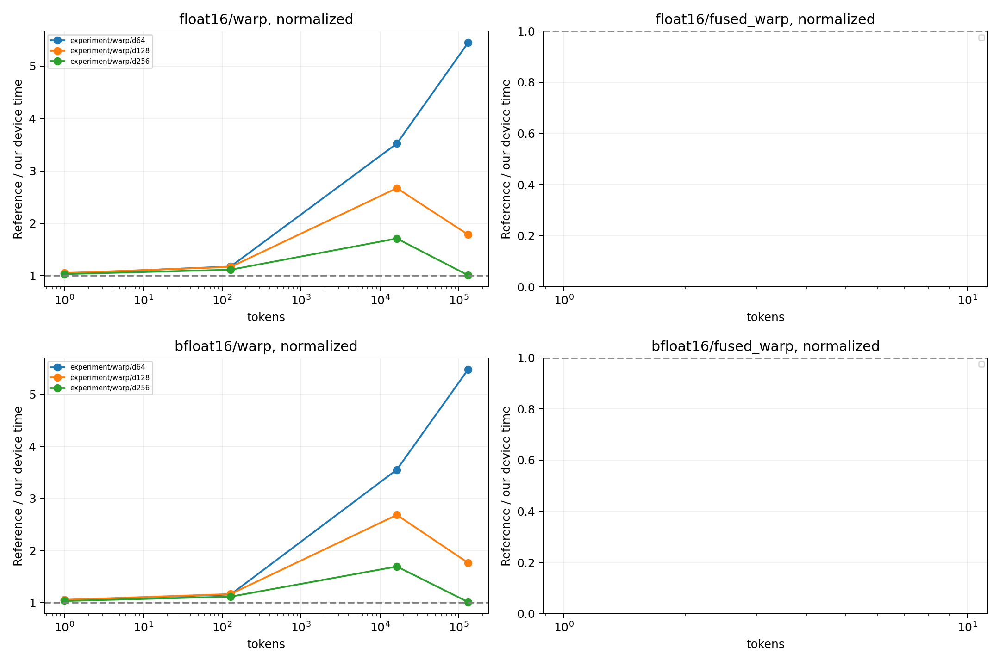

# 参考库同边界性能对照

GPU：NVIDIA L40S
同一输入驻留 GPU，CUDA Graph 回放按节点数摊销的设备时间；不是 Python API 延迟，
也不是独立 profiler 单 kernel 时间。捕获/分配不计时；固定地址缓存状态由规模决定。
多轮交错后端顺序，中位数/min/max 均保留于 summary.csv。
融合对照为 Dao 变换 + 本项目同协议 standalone INT4，不声称 Dao 自带 INT4。

| dtype | tokens | d | normalize | 路径 | 本项目 μs | 对照 μs | 对照/本项目 | 全部检查通过 |
|---|---:|---:|---:|---|---:|---:|---:|---|
| bfloat16 | 1 | 128 | 0 | experiment/mma_fast | 1.162 | 1.225 | 1.055× | True |
| bfloat16 | 1 | 128 | 0 | experiment/mma_split | 1.164 | 1.225 | 1.053× | True |
| bfloat16 | 1 | 128 | 0 | experiment/warp | 1.162 | 1.225 | 1.054× | True |
| bfloat16 | 1 | 128 | 0 | experiment/wmma_fast | 1.161 | 1.225 | 1.055× | True |
| bfloat16 | 1 | 128 | 0 | experiment/wmma_split | 1.159 | 1.225 | 1.057× | True |
| bfloat16 | 1 | 128 | 1 | experiment/mma_fast | 1.175 | 1.239 | 1.054× | True |
| bfloat16 | 1 | 128 | 1 | experiment/mma_split | 1.175 | 1.239 | 1.054× | True |
| bfloat16 | 1 | 128 | 1 | experiment/warp | 1.173 | 1.239 | 1.056× | True |
| bfloat16 | 1 | 128 | 1 | experiment/wmma_fast | 1.175 | 1.239 | 1.054× | True |
| bfloat16 | 1 | 128 | 1 | experiment/wmma_split | 1.178 | 1.239 | 1.051× | True |
| bfloat16 | 1 | 256 | 0 | experiment/mma_fast | 1.176 | 1.260 | 1.071× | False |
| bfloat16 | 1 | 256 | 0 | experiment/mma_split | 1.201 | 1.260 | 1.049× | False |
| bfloat16 | 1 | 256 | 0 | experiment/warp | 1.209 | 1.260 | 1.042× | True |
| bfloat16 | 1 | 256 | 0 | experiment/wmma_fast | 1.329 | 1.260 | 0.948× | False |
| bfloat16 | 1 | 256 | 0 | experiment/wmma_split | 1.371 | 1.260 | 0.919× | False |
| bfloat16 | 1 | 256 | 1 | experiment/mma_fast | 1.179 | 1.263 | 1.071× | True |
| bfloat16 | 1 | 256 | 1 | experiment/mma_split | 1.200 | 1.263 | 1.052× | True |
| bfloat16 | 1 | 256 | 1 | experiment/warp | 1.221 | 1.263 | 1.034× | True |
| bfloat16 | 1 | 256 | 1 | experiment/wmma_fast | 1.332 | 1.263 | 0.948× | True |
| bfloat16 | 1 | 256 | 1 | experiment/wmma_split | 1.373 | 1.263 | 0.919× | True |
| bfloat16 | 1 | 64 | 0 | experiment/mma_fast | 1.143 | 1.205 | 1.054× | True |
| bfloat16 | 1 | 64 | 0 | experiment/mma_split | 1.145 | 1.205 | 1.053× | True |
| bfloat16 | 1 | 64 | 0 | experiment/warp | 1.144 | 1.205 | 1.054× | True |
| bfloat16 | 1 | 64 | 0 | experiment/wmma_fast | 1.142 | 1.205 | 1.055× | True |
| bfloat16 | 1 | 64 | 0 | experiment/wmma_split | 1.140 | 1.205 | 1.057× | True |
| bfloat16 | 1 | 64 | 1 | experiment/mma_fast | 1.155 | 1.219 | 1.055× | True |
| bfloat16 | 1 | 64 | 1 | experiment/mma_split | 1.158 | 1.219 | 1.053× | True |
| bfloat16 | 1 | 64 | 1 | experiment/warp | 1.157 | 1.219 | 1.054× | True |
| bfloat16 | 1 | 64 | 1 | experiment/wmma_fast | 1.158 | 1.219 | 1.053× | True |
| bfloat16 | 1 | 64 | 1 | experiment/wmma_split | 1.157 | 1.219 | 1.054× | True |
| bfloat16 | 128 | 128 | 0 | experiment/mma_fast | 1.235 | 1.420 | 1.150× | False |
| bfloat16 | 128 | 128 | 0 | experiment/mma_split | 1.261 | 1.420 | 1.126× | False |
| bfloat16 | 128 | 128 | 0 | experiment/warp | 1.221 | 1.420 | 1.163× | True |
| bfloat16 | 128 | 128 | 0 | experiment/wmma_fast | 1.415 | 1.420 | 1.004× | False |
| bfloat16 | 128 | 128 | 0 | experiment/wmma_split | 1.472 | 1.420 | 0.965× | False |
| bfloat16 | 128 | 128 | 1 | experiment/mma_fast | 1.240 | 1.421 | 1.146× | True |
| bfloat16 | 128 | 128 | 1 | experiment/mma_split | 1.270 | 1.421 | 1.119× | True |
| bfloat16 | 128 | 128 | 1 | experiment/warp | 1.217 | 1.421 | 1.168× | True |
| bfloat16 | 128 | 128 | 1 | experiment/wmma_fast | 1.428 | 1.421 | 0.995× | True |
| bfloat16 | 128 | 128 | 1 | experiment/wmma_split | 1.479 | 1.421 | 0.961× | True |
| bfloat16 | 128 | 256 | 0 | experiment/mma_fast | 1.237 | 1.445 | 1.169× | False |
| bfloat16 | 128 | 256 | 0 | experiment/mma_split | 1.262 | 1.445 | 1.145× | True |
| bfloat16 | 128 | 256 | 0 | experiment/warp | 1.293 | 1.445 | 1.117× | True |
| bfloat16 | 128 | 256 | 0 | experiment/wmma_fast | 1.417 | 1.445 | 1.020× | False |
| bfloat16 | 128 | 256 | 0 | experiment/wmma_split | 1.473 | 1.445 | 0.981× | True |
| bfloat16 | 128 | 256 | 1 | experiment/mma_fast | 1.240 | 1.452 | 1.171× | True |
| bfloat16 | 128 | 256 | 1 | experiment/mma_split | 1.266 | 1.452 | 1.147× | True |
| bfloat16 | 128 | 256 | 1 | experiment/warp | 1.300 | 1.452 | 1.117× | True |
| bfloat16 | 128 | 256 | 1 | experiment/wmma_fast | 1.419 | 1.452 | 1.023× | True |
| bfloat16 | 128 | 256 | 1 | experiment/wmma_split | 1.475 | 1.452 | 0.985× | True |
| bfloat16 | 128 | 64 | 0 | experiment/mma_fast | 1.234 | 1.405 | 1.139× | False |
| bfloat16 | 128 | 64 | 0 | experiment/mma_split | 1.251 | 1.405 | 1.123× | True |
| bfloat16 | 128 | 64 | 0 | experiment/warp | 1.205 | 1.405 | 1.166× | True |
| bfloat16 | 128 | 64 | 0 | experiment/wmma_fast | 1.417 | 1.405 | 0.992× | False |
| bfloat16 | 128 | 64 | 0 | experiment/wmma_split | 1.476 | 1.405 | 0.952× | True |
| bfloat16 | 128 | 64 | 1 | experiment/mma_fast | 1.230 | 1.397 | 1.136× | True |
| bfloat16 | 128 | 64 | 1 | experiment/mma_split | 1.251 | 1.397 | 1.117× | True |
| bfloat16 | 128 | 64 | 1 | experiment/warp | 1.206 | 1.397 | 1.159× | True |
| bfloat16 | 128 | 64 | 1 | experiment/wmma_fast | 1.415 | 1.397 | 0.987× | True |
| bfloat16 | 128 | 64 | 1 | experiment/wmma_split | 1.467 | 1.397 | 0.953× | True |
| bfloat16 | 131072 | 128 | 0 | experiment/mma_fast | 44.497 | 71.845 | 1.615× | False |
| bfloat16 | 131072 | 128 | 0 | experiment/mma_split | 45.556 | 71.845 | 1.577× | False |
| bfloat16 | 131072 | 128 | 0 | experiment/warp | 42.650 | 71.845 | 1.685× | True |
| bfloat16 | 131072 | 128 | 0 | experiment/wmma_fast | 42.372 | 71.845 | 1.696× | False |
| bfloat16 | 131072 | 128 | 0 | experiment/wmma_split | 43.029 | 71.845 | 1.670× | False |
| bfloat16 | 131072 | 128 | 1 | experiment/mma_fast | 42.558 | 70.908 | 1.666× | True |
| bfloat16 | 131072 | 128 | 1 | experiment/mma_split | 39.142 | 70.908 | 1.812× | True |
| bfloat16 | 131072 | 128 | 1 | experiment/warp | 40.154 | 70.908 | 1.766× | True |
| bfloat16 | 131072 | 128 | 1 | experiment/wmma_fast | 41.520 | 70.908 | 1.708× | True |
| bfloat16 | 131072 | 128 | 1 | experiment/wmma_split | 43.231 | 70.908 | 1.640× | True |
| bfloat16 | 131072 | 256 | 0 | experiment/mma_fast | 205.091 | 206.672 | 1.008× | False |
| bfloat16 | 131072 | 256 | 0 | experiment/mma_split | 204.546 | 206.672 | 1.010× | False |
| bfloat16 | 131072 | 256 | 0 | experiment/warp | 205.331 | 206.672 | 1.007× | True |
| bfloat16 | 131072 | 256 | 0 | experiment/wmma_fast | 204.658 | 206.672 | 1.010× | False |
| bfloat16 | 131072 | 256 | 0 | experiment/wmma_split | 204.772 | 206.672 | 1.009× | False |
| bfloat16 | 131072 | 256 | 1 | experiment/mma_fast | 205.467 | 207.340 | 1.009× | True |
| bfloat16 | 131072 | 256 | 1 | experiment/mma_split | 205.651 | 207.340 | 1.008× | True |
| bfloat16 | 131072 | 256 | 1 | experiment/warp | 204.562 | 207.340 | 1.014× | True |
| bfloat16 | 131072 | 256 | 1 | experiment/wmma_fast | 203.859 | 207.340 | 1.017× | True |
| bfloat16 | 131072 | 256 | 1 | experiment/wmma_split | 204.597 | 207.340 | 1.013× | True |
| bfloat16 | 131072 | 64 | 0 | experiment/mma_fast | 9.113 | 70.829 | 7.773× | False |
| bfloat16 | 131072 | 64 | 0 | experiment/mma_split | 9.656 | 70.829 | 7.336× | False |
| bfloat16 | 131072 | 64 | 0 | experiment/warp | 12.876 | 70.829 | 5.501× | True |
| bfloat16 | 131072 | 64 | 0 | experiment/wmma_fast | 13.109 | 70.829 | 5.403× | False |
| bfloat16 | 131072 | 64 | 0 | experiment/wmma_split | 14.971 | 70.829 | 4.731× | False |
| bfloat16 | 131072 | 64 | 1 | experiment/mma_fast | 9.145 | 70.826 | 7.745× | True |
| bfloat16 | 131072 | 64 | 1 | experiment/mma_split | 9.696 | 70.826 | 7.304× | True |
| bfloat16 | 131072 | 64 | 1 | experiment/warp | 12.929 | 70.826 | 5.478× | True |
| bfloat16 | 131072 | 64 | 1 | experiment/wmma_fast | 13.171 | 70.826 | 5.377× | True |
| bfloat16 | 131072 | 64 | 1 | experiment/wmma_split | 15.025 | 70.826 | 4.714× | True |
| bfloat16 | 16384 | 128 | 0 | experiment/mma_fast | 3.531 | 10.171 | 2.880× | False |
| bfloat16 | 16384 | 128 | 0 | experiment/mma_split | 3.646 | 10.171 | 2.790× | False |
| bfloat16 | 16384 | 128 | 0 | experiment/warp | 3.783 | 10.171 | 2.689× | True |
| bfloat16 | 16384 | 128 | 0 | experiment/wmma_fast | 4.418 | 10.171 | 2.302× | False |
| bfloat16 | 16384 | 128 | 0 | experiment/wmma_split | 4.865 | 10.171 | 2.091× | False |
| bfloat16 | 16384 | 128 | 1 | experiment/mma_fast | 3.524 | 10.164 | 2.884× | True |
| bfloat16 | 16384 | 128 | 1 | experiment/mma_split | 3.640 | 10.164 | 2.792× | True |
| bfloat16 | 16384 | 128 | 1 | experiment/warp | 3.785 | 10.164 | 2.685× | True |
| bfloat16 | 16384 | 128 | 1 | experiment/wmma_fast | 4.429 | 10.164 | 2.295× | True |
| bfloat16 | 16384 | 128 | 1 | experiment/wmma_split | 4.882 | 10.164 | 2.082× | True |
| bfloat16 | 16384 | 256 | 0 | experiment/mma_fast | 5.433 | 10.193 | 1.876× | False |
| bfloat16 | 16384 | 256 | 0 | experiment/mma_split | 5.672 | 10.193 | 1.797× | False |
| bfloat16 | 16384 | 256 | 0 | experiment/warp | 5.939 | 10.193 | 1.716× | True |
| bfloat16 | 16384 | 256 | 0 | experiment/wmma_fast | 7.327 | 10.193 | 1.391× | False |
| bfloat16 | 16384 | 256 | 0 | experiment/wmma_split | 8.222 | 10.193 | 1.240× | False |
| bfloat16 | 16384 | 256 | 1 | experiment/mma_fast | 5.432 | 10.205 | 1.879× | True |
| bfloat16 | 16384 | 256 | 1 | experiment/mma_split | 5.681 | 10.205 | 1.796× | True |
| bfloat16 | 16384 | 256 | 1 | experiment/warp | 6.020 | 10.205 | 1.695× | True |
| bfloat16 | 16384 | 256 | 1 | experiment/wmma_fast | 7.334 | 10.205 | 1.392× | True |
| bfloat16 | 16384 | 256 | 1 | experiment/wmma_split | 8.247 | 10.205 | 1.237× | True |
| bfloat16 | 16384 | 64 | 0 | experiment/mma_fast | 2.650 | 10.143 | 3.828× | False |
| bfloat16 | 16384 | 64 | 0 | experiment/mma_split | 2.710 | 10.143 | 3.743× | False |
| bfloat16 | 16384 | 64 | 0 | experiment/warp | 2.859 | 10.143 | 3.548× | True |
| bfloat16 | 16384 | 64 | 0 | experiment/wmma_fast | 2.862 | 10.143 | 3.544× | False |
| bfloat16 | 16384 | 64 | 0 | experiment/wmma_split | 3.106 | 10.143 | 3.266× | False |
| bfloat16 | 16384 | 64 | 1 | experiment/mma_fast | 2.659 | 10.148 | 3.816× | True |
| bfloat16 | 16384 | 64 | 1 | experiment/mma_split | 2.710 | 10.148 | 3.745× | True |
| bfloat16 | 16384 | 64 | 1 | experiment/warp | 2.855 | 10.148 | 3.554× | True |
| bfloat16 | 16384 | 64 | 1 | experiment/wmma_fast | 2.854 | 10.148 | 3.555× | True |
| bfloat16 | 16384 | 64 | 1 | experiment/wmma_split | 3.105 | 10.148 | 3.268× | True |
| float16 | 1 | 128 | 0 | experiment/mma_fast | 1.159 | 1.223 | 1.055× | True |
| float16 | 1 | 128 | 0 | experiment/mma_split | 1.160 | 1.223 | 1.054× | True |
| float16 | 1 | 128 | 0 | experiment/warp | 1.159 | 1.223 | 1.055× | True |
| float16 | 1 | 128 | 0 | experiment/wmma_fast | 1.161 | 1.223 | 1.054× | True |
| float16 | 1 | 128 | 0 | experiment/wmma_split | 1.161 | 1.223 | 1.053× | True |
| float16 | 1 | 128 | 1 | experiment/mma_fast | 1.173 | 1.235 | 1.053× | True |
| float16 | 1 | 128 | 1 | experiment/mma_split | 1.173 | 1.235 | 1.053× | True |
| float16 | 1 | 128 | 1 | experiment/warp | 1.173 | 1.235 | 1.053× | True |
| float16 | 1 | 128 | 1 | experiment/wmma_fast | 1.173 | 1.235 | 1.053× | True |
| float16 | 1 | 128 | 1 | experiment/wmma_split | 1.175 | 1.235 | 1.052× | True |
| float16 | 1 | 256 | 0 | experiment/mma_fast | 1.177 | 1.256 | 1.067× | False |
| float16 | 1 | 256 | 0 | experiment/mma_split | 1.200 | 1.256 | 1.046× | True |
| float16 | 1 | 256 | 0 | experiment/warp | 1.216 | 1.256 | 1.033× | True |
| float16 | 1 | 256 | 0 | experiment/wmma_fast | 1.305 | 1.256 | 0.963× | False |
| float16 | 1 | 256 | 0 | experiment/wmma_split | 1.332 | 1.256 | 0.943× | True |
| float16 | 1 | 256 | 1 | experiment/mma_fast | 1.176 | 1.258 | 1.069× | True |
| float16 | 1 | 256 | 1 | experiment/mma_split | 1.200 | 1.258 | 1.048× | True |
| float16 | 1 | 256 | 1 | experiment/warp | 1.217 | 1.258 | 1.033× | True |
| float16 | 1 | 256 | 1 | experiment/wmma_fast | 1.309 | 1.258 | 0.961× | True |
| float16 | 1 | 256 | 1 | experiment/wmma_split | 1.337 | 1.258 | 0.941× | True |
| float16 | 1 | 64 | 0 | experiment/mma_fast | 1.121 | 1.191 | 1.062× | True |
| float16 | 1 | 64 | 0 | experiment/mma_split | 1.127 | 1.191 | 1.056× | True |
| float16 | 1 | 64 | 0 | experiment/warp | 1.137 | 1.191 | 1.047× | True |
| float16 | 1 | 64 | 0 | experiment/wmma_fast | 1.122 | 1.191 | 1.062× | True |
| float16 | 1 | 64 | 0 | experiment/wmma_split | 1.132 | 1.191 | 1.052× | True |
| float16 | 1 | 64 | 1 | experiment/mma_fast | 1.126 | 1.193 | 1.060× | True |
| float16 | 1 | 64 | 1 | experiment/mma_split | 1.133 | 1.193 | 1.052× | True |
| float16 | 1 | 64 | 1 | experiment/warp | 1.143 | 1.193 | 1.044× | True |
| float16 | 1 | 64 | 1 | experiment/wmma_fast | 1.126 | 1.193 | 1.059× | True |
| float16 | 1 | 64 | 1 | experiment/wmma_split | 1.134 | 1.193 | 1.051× | True |
| float16 | 128 | 128 | 0 | experiment/mma_fast | 1.236 | 1.413 | 1.144× | False |
| float16 | 128 | 128 | 0 | experiment/mma_split | 1.258 | 1.413 | 1.123× | True |
| float16 | 128 | 128 | 0 | experiment/warp | 1.219 | 1.413 | 1.159× | True |
| float16 | 128 | 128 | 0 | experiment/wmma_fast | 1.391 | 1.413 | 1.016× | False |
| float16 | 128 | 128 | 0 | experiment/wmma_split | 1.421 | 1.413 | 0.995× | True |
| float16 | 128 | 128 | 1 | experiment/mma_fast | 1.240 | 1.419 | 1.144× | True |
| float16 | 128 | 128 | 1 | experiment/mma_split | 1.267 | 1.419 | 1.120× | True |
| float16 | 128 | 128 | 1 | experiment/warp | 1.213 | 1.419 | 1.169× | True |
| float16 | 128 | 128 | 1 | experiment/wmma_fast | 1.399 | 1.419 | 1.014× | True |
| float16 | 128 | 128 | 1 | experiment/wmma_split | 1.422 | 1.419 | 0.998× | True |
| float16 | 128 | 256 | 0 | experiment/mma_fast | 1.235 | 1.444 | 1.169× | False |
| float16 | 128 | 256 | 0 | experiment/mma_split | 1.262 | 1.444 | 1.144× | True |
| float16 | 128 | 256 | 0 | experiment/warp | 1.291 | 1.444 | 1.119× | True |
| float16 | 128 | 256 | 0 | experiment/wmma_fast | 1.388 | 1.444 | 1.040× | False |
| float16 | 128 | 256 | 0 | experiment/wmma_split | 1.418 | 1.444 | 1.018× | True |
| float16 | 128 | 256 | 1 | experiment/mma_fast | 1.242 | 1.450 | 1.168× | True |
| float16 | 128 | 256 | 1 | experiment/mma_split | 1.264 | 1.450 | 1.147× | True |
| float16 | 128 | 256 | 1 | experiment/warp | 1.299 | 1.450 | 1.116× | True |
| float16 | 128 | 256 | 1 | experiment/wmma_fast | 1.394 | 1.450 | 1.040× | True |
| float16 | 128 | 256 | 1 | experiment/wmma_split | 1.419 | 1.450 | 1.022× | True |
| float16 | 128 | 64 | 0 | experiment/mma_fast | 1.232 | 1.417 | 1.150× | False |
| float16 | 128 | 64 | 0 | experiment/mma_split | 1.254 | 1.417 | 1.131× | True |
| float16 | 128 | 64 | 0 | experiment/warp | 1.206 | 1.417 | 1.175× | True |
| float16 | 128 | 64 | 0 | experiment/wmma_fast | 1.389 | 1.417 | 1.020× | False |
| float16 | 128 | 64 | 0 | experiment/wmma_split | 1.421 | 1.417 | 0.998× | True |
| float16 | 128 | 64 | 1 | experiment/mma_fast | 1.233 | 1.409 | 1.143× | True |
| float16 | 128 | 64 | 1 | experiment/mma_split | 1.254 | 1.409 | 1.124× | True |
| float16 | 128 | 64 | 1 | experiment/warp | 1.197 | 1.409 | 1.177× | True |
| float16 | 128 | 64 | 1 | experiment/wmma_fast | 1.393 | 1.409 | 1.011× | True |
| float16 | 128 | 64 | 1 | experiment/wmma_split | 1.418 | 1.409 | 0.994× | True |
| float16 | 131072 | 128 | 0 | experiment/mma_fast | 44.332 | 70.890 | 1.599× | False |
| float16 | 131072 | 128 | 0 | experiment/mma_split | 45.865 | 70.890 | 1.546× | False |
| float16 | 131072 | 128 | 0 | experiment/warp | 43.122 | 70.890 | 1.644× | True |
| float16 | 131072 | 128 | 0 | experiment/wmma_fast | 41.856 | 70.890 | 1.694× | False |
| float16 | 131072 | 128 | 0 | experiment/wmma_split | 42.314 | 70.890 | 1.675× | False |
| float16 | 131072 | 128 | 1 | experiment/mma_fast | 42.356 | 72.185 | 1.704× | True |
| float16 | 131072 | 128 | 1 | experiment/mma_split | 39.261 | 72.185 | 1.839× | True |
| float16 | 131072 | 128 | 1 | experiment/warp | 40.429 | 72.185 | 1.785× | True |
| float16 | 131072 | 128 | 1 | experiment/wmma_fast | 41.451 | 72.185 | 1.741× | True |
| float16 | 131072 | 128 | 1 | experiment/wmma_split | 43.091 | 72.185 | 1.675× | True |
| float16 | 131072 | 256 | 0 | experiment/mma_fast | 204.859 | 208.036 | 1.016× | False |
| float16 | 131072 | 256 | 0 | experiment/mma_split | 204.748 | 208.036 | 1.016× | False |
| float16 | 131072 | 256 | 0 | experiment/warp | 204.471 | 208.036 | 1.017× | True |
| float16 | 131072 | 256 | 0 | experiment/wmma_fast | 204.625 | 208.036 | 1.017× | False |
| float16 | 131072 | 256 | 0 | experiment/wmma_split | 204.218 | 208.036 | 1.019× | False |
| float16 | 131072 | 256 | 1 | experiment/mma_fast | 204.162 | 207.306 | 1.015× | True |
| float16 | 131072 | 256 | 1 | experiment/mma_split | 204.793 | 207.306 | 1.012× | True |
| float16 | 131072 | 256 | 1 | experiment/warp | 205.245 | 207.306 | 1.010× | True |
| float16 | 131072 | 256 | 1 | experiment/wmma_fast | 204.442 | 207.306 | 1.014× | True |
| float16 | 131072 | 256 | 1 | experiment/wmma_split | 204.722 | 207.306 | 1.013× | True |
| float16 | 131072 | 64 | 0 | experiment/mma_fast | 9.140 | 70.832 | 7.749× | False |
| float16 | 131072 | 64 | 0 | experiment/mma_split | 9.622 | 70.832 | 7.361× | True |
| float16 | 131072 | 64 | 0 | experiment/warp | 12.981 | 70.832 | 5.457× | True |
| float16 | 131072 | 64 | 0 | experiment/wmma_fast | 11.843 | 70.832 | 5.981× | False |
| float16 | 131072 | 64 | 0 | experiment/wmma_split | 13.421 | 70.832 | 5.278× | True |
| float16 | 131072 | 64 | 1 | experiment/mma_fast | 9.133 | 70.832 | 7.756× | True |
| float16 | 131072 | 64 | 1 | experiment/mma_split | 9.634 | 70.832 | 7.352× | True |
| float16 | 131072 | 64 | 1 | experiment/warp | 13.007 | 70.832 | 5.446× | True |
| float16 | 131072 | 64 | 1 | experiment/wmma_fast | 11.906 | 70.832 | 5.949× | True |
| float16 | 131072 | 64 | 1 | experiment/wmma_split | 13.573 | 70.832 | 5.219× | True |
| float16 | 16384 | 128 | 0 | experiment/mma_fast | 3.549 | 10.165 | 2.864× | False |
| float16 | 16384 | 128 | 0 | experiment/mma_split | 3.647 | 10.165 | 2.787× | False |
| float16 | 16384 | 128 | 0 | experiment/warp | 3.787 | 10.165 | 2.684× | True |
| float16 | 16384 | 128 | 0 | experiment/wmma_fast | 4.103 | 10.165 | 2.477× | False |
| float16 | 16384 | 128 | 0 | experiment/wmma_split | 4.505 | 10.165 | 2.256× | False |
| float16 | 16384 | 128 | 1 | experiment/mma_fast | 3.538 | 10.158 | 2.871× | True |
| float16 | 16384 | 128 | 1 | experiment/mma_split | 3.647 | 10.158 | 2.785× | True |
| float16 | 16384 | 128 | 1 | experiment/warp | 3.803 | 10.158 | 2.671× | True |
| float16 | 16384 | 128 | 1 | experiment/wmma_fast | 4.126 | 10.158 | 2.462× | True |
| float16 | 16384 | 128 | 1 | experiment/wmma_split | 4.518 | 10.158 | 2.249× | True |
| float16 | 16384 | 256 | 0 | experiment/mma_fast | 5.449 | 10.191 | 1.870× | False |
| float16 | 16384 | 256 | 0 | experiment/mma_split | 5.648 | 10.191 | 1.804× | False |
| float16 | 16384 | 256 | 0 | experiment/warp | 5.922 | 10.191 | 1.721× | True |
| float16 | 16384 | 256 | 0 | experiment/wmma_fast | 6.753 | 10.191 | 1.509× | False |
| float16 | 16384 | 256 | 0 | experiment/wmma_split | 7.443 | 10.191 | 1.369× | False |
| float16 | 16384 | 256 | 1 | experiment/mma_fast | 5.455 | 10.206 | 1.871× | True |
| float16 | 16384 | 256 | 1 | experiment/mma_split | 5.668 | 10.206 | 1.801× | True |
| float16 | 16384 | 256 | 1 | experiment/warp | 5.965 | 10.206 | 1.711× | True |
| float16 | 16384 | 256 | 1 | experiment/wmma_fast | 6.774 | 10.206 | 1.507× | True |
| float16 | 16384 | 256 | 1 | experiment/wmma_split | 7.487 | 10.206 | 1.363× | True |
| float16 | 16384 | 64 | 0 | experiment/mma_fast | 2.675 | 10.141 | 3.791× | False |
| float16 | 16384 | 64 | 0 | experiment/mma_split | 2.590 | 10.141 | 3.915× | False |
| float16 | 16384 | 64 | 0 | experiment/warp | 2.887 | 10.141 | 3.513× | True |
| float16 | 16384 | 64 | 0 | experiment/wmma_fast | 2.743 | 10.141 | 3.698× | False |
| float16 | 16384 | 64 | 0 | experiment/wmma_split | 2.965 | 10.141 | 3.420× | False |
| float16 | 16384 | 64 | 1 | experiment/mma_fast | 2.663 | 10.141 | 3.808× | True |
| float16 | 16384 | 64 | 1 | experiment/mma_split | 2.589 | 10.141 | 3.918× | True |
| float16 | 16384 | 64 | 1 | experiment/warp | 2.880 | 10.141 | 3.522× | True |
| float16 | 16384 | 64 | 1 | experiment/wmma_fast | 2.749 | 10.141 | 3.689× | True |
| float16 | 16384 | 64 | 1 | experiment/wmma_split | 2.967 | 10.141 | 3.418× | True |

