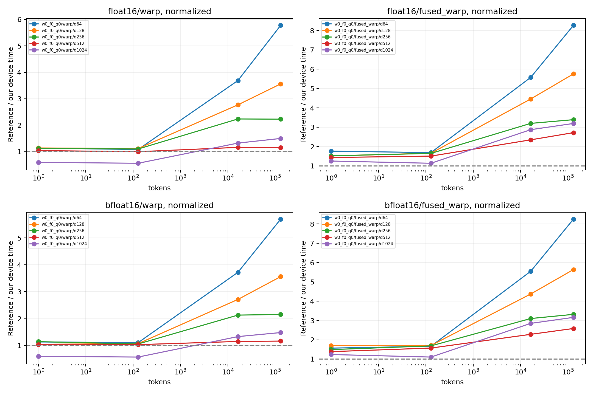

# 参考库同边界性能对照

GPU：NVIDIA H200
同一输入驻留 GPU，CUDA Graph 回放按节点数摊销的设备时间；不是 Python API 延迟，
也不是独立 profiler 单 kernel 时间。捕获/分配不计时；固定地址缓存状态由规模决定。
多轮交错后端顺序，中位数/min/max 均保留于 summary.csv。
融合对照为 Dao 变换 + 本项目同协议 standalone INT4，不声称 Dao 自带 INT4。

| dtype | tokens | d | normalize | 路径 | 本项目 μs | 对照 μs | 对照/本项目 | 全部检查通过 |
|---|---:|---:|---:|---|---:|---:|---:|---|
| bfloat16 | 1 | 1024 | 1 | w0_f0_q0/fused_warp | 2.744 | 3.388 | 1.234× | True |
| bfloat16 | 1 | 1024 | 1 | w0_f0_q0/warp | 3.503 | 2.110 | 0.602× | True |
| bfloat16 | 1 | 1024 | 1 | w0_f2_q1/fused_warp | 2.731 | 3.388 | 1.241× | True |
| bfloat16 | 1 | 1024 | 1 | w0_f2_q1/warp | 3.456 | 2.110 | 0.611× | True |
| bfloat16 | 1 | 1024 | 1 | w0_f4_q1/fused_warp | 2.647 | 3.388 | 1.280× | True |
| bfloat16 | 1 | 1024 | 1 | w0_f4_q1/warp | 3.471 | 2.110 | 0.608× | True |
| bfloat16 | 1 | 1024 | 1 | w0_f8_q1/fused_warp | 2.664 | 3.388 | 1.271× | True |
| bfloat16 | 1 | 1024 | 1 | w0_f8_q1/warp | 3.480 | 2.110 | 0.606× | True |
| bfloat16 | 1 | 1024 | 1 | w2_f2_q0/fused_warp | 2.749 | 3.388 | 1.232× | True |
| bfloat16 | 1 | 1024 | 1 | w2_f2_q0/warp | 3.446 | 2.110 | 0.612× | True |
| bfloat16 | 1 | 1024 | 1 | w4_f4_q0/fused_warp | 2.716 | 3.388 | 1.247× | True |
| bfloat16 | 1 | 1024 | 1 | w4_f4_q0/warp | 3.500 | 2.110 | 0.603× | True |
| bfloat16 | 1 | 1024 | 1 | w8_f8_q0/fused_warp | 2.703 | 3.388 | 1.253× | True |
| bfloat16 | 1 | 1024 | 1 | w8_f8_q0/warp | 3.491 | 2.110 | 0.605× | True |
| bfloat16 | 1 | 128 | 1 | w0_f0_q0/fused_warp | 1.916 | 3.254 | 1.698× | True |
| bfloat16 | 1 | 128 | 1 | w0_f0_q0/warp | 1.701 | 1.782 | 1.048× | True |
| bfloat16 | 1 | 128 | 1 | w0_f2_q1/fused_warp | 1.906 | 3.254 | 1.707× | True |
| bfloat16 | 1 | 128 | 1 | w0_f2_q1/warp | 1.666 | 1.782 | 1.070× | True |
| bfloat16 | 1 | 128 | 1 | w0_f4_q1/fused_warp | 1.973 | 3.254 | 1.649× | True |
| bfloat16 | 1 | 128 | 1 | w0_f4_q1/warp | 1.723 | 1.782 | 1.034× | True |
| bfloat16 | 1 | 128 | 1 | w0_f8_q1/fused_warp | 2.010 | 3.254 | 1.619× | True |
| bfloat16 | 1 | 128 | 1 | w0_f8_q1/warp | 1.671 | 1.782 | 1.066× | True |
| bfloat16 | 1 | 128 | 1 | w2_f2_q0/fused_warp | 1.997 | 3.254 | 1.629× | True |
| bfloat16 | 1 | 128 | 1 | w2_f2_q0/warp | 1.709 | 1.782 | 1.042× | True |
| bfloat16 | 1 | 128 | 1 | w4_f4_q0/fused_warp | 1.899 | 3.254 | 1.714× | True |
| bfloat16 | 1 | 128 | 1 | w4_f4_q0/warp | 1.717 | 1.782 | 1.038× | True |
| bfloat16 | 1 | 128 | 1 | w8_f8_q0/fused_warp | 2.010 | 3.254 | 1.619× | True |
| bfloat16 | 1 | 128 | 1 | w8_f8_q0/warp | 1.630 | 1.782 | 1.093× | True |
| bfloat16 | 1 | 256 | 1 | w0_f0_q0/fused_warp | 2.070 | 3.085 | 1.491× | True |
| bfloat16 | 1 | 256 | 1 | w0_f0_q0/warp | 1.680 | 1.926 | 1.146× | True |
| bfloat16 | 1 | 256 | 1 | w0_f2_q1/fused_warp | 1.984 | 3.085 | 1.555× | True |
| bfloat16 | 1 | 256 | 1 | w0_f2_q1/warp | 1.717 | 1.926 | 1.121× | True |
| bfloat16 | 1 | 256 | 1 | w0_f4_q1/fused_warp | 2.098 | 3.085 | 1.471× | True |
| bfloat16 | 1 | 256 | 1 | w0_f4_q1/warp | 1.778 | 1.926 | 1.083× | True |
| bfloat16 | 1 | 256 | 1 | w0_f8_q1/fused_warp | 2.076 | 3.085 | 1.486× | True |
| bfloat16 | 1 | 256 | 1 | w0_f8_q1/warp | 1.696 | 1.926 | 1.135× | True |
| bfloat16 | 1 | 256 | 1 | w2_f2_q0/fused_warp | 2.009 | 3.085 | 1.536× | True |
| bfloat16 | 1 | 256 | 1 | w2_f2_q0/warp | 1.837 | 1.926 | 1.048× | True |
| bfloat16 | 1 | 256 | 1 | w4_f4_q0/fused_warp | 2.094 | 3.085 | 1.474× | True |
| bfloat16 | 1 | 256 | 1 | w4_f4_q0/warp | 1.683 | 1.926 | 1.144× | True |
| bfloat16 | 1 | 256 | 1 | w8_f8_q0/fused_warp | 2.095 | 3.085 | 1.473× | True |
| bfloat16 | 1 | 256 | 1 | w8_f8_q0/warp | 1.684 | 1.926 | 1.143× | True |
| bfloat16 | 1 | 512 | 1 | w0_f0_q0/fused_warp | 2.247 | 3.111 | 1.385× | True |
| bfloat16 | 1 | 512 | 1 | w0_f0_q0/warp | 1.883 | 1.956 | 1.039× | True |
| bfloat16 | 1 | 512 | 1 | w0_f2_q1/fused_warp | 2.208 | 3.111 | 1.409× | True |
| bfloat16 | 1 | 512 | 1 | w0_f2_q1/warp | 1.833 | 1.956 | 1.067× | True |
| bfloat16 | 1 | 512 | 1 | w0_f4_q1/fused_warp | 2.289 | 3.111 | 1.359× | True |
| bfloat16 | 1 | 512 | 1 | w0_f4_q1/warp | 1.908 | 1.956 | 1.025× | True |
| bfloat16 | 1 | 512 | 1 | w0_f8_q1/fused_warp | 2.210 | 3.111 | 1.408× | True |
| bfloat16 | 1 | 512 | 1 | w0_f8_q1/warp | 1.832 | 1.956 | 1.068× | True |
| bfloat16 | 1 | 512 | 1 | w2_f2_q0/fused_warp | 2.176 | 3.111 | 1.430× | True |
| bfloat16 | 1 | 512 | 1 | w2_f2_q0/warp | 1.942 | 1.956 | 1.007× | True |
| bfloat16 | 1 | 512 | 1 | w4_f4_q0/fused_warp | 2.260 | 3.111 | 1.377× | True |
| bfloat16 | 1 | 512 | 1 | w4_f4_q0/warp | 1.809 | 1.956 | 1.082× | True |
| bfloat16 | 1 | 512 | 1 | w8_f8_q0/fused_warp | 2.195 | 3.111 | 1.418× | True |
| bfloat16 | 1 | 512 | 1 | w8_f8_q0/warp | 1.861 | 1.956 | 1.051× | True |
| bfloat16 | 1 | 64 | 1 | w0_f0_q0/fused_warp | 1.947 | 3.048 | 1.566× | True |
| bfloat16 | 1 | 64 | 1 | w0_f0_q0/warp | 1.620 | 1.840 | 1.136× | True |
| bfloat16 | 1 | 64 | 1 | w0_f2_q1/fused_warp | 1.926 | 3.048 | 1.583× | True |
| bfloat16 | 1 | 64 | 1 | w0_f2_q1/warp | 1.620 | 1.840 | 1.136× | True |
| bfloat16 | 1 | 64 | 1 | w0_f4_q1/fused_warp | 1.907 | 3.048 | 1.598× | True |
| bfloat16 | 1 | 64 | 1 | w0_f4_q1/warp | 1.692 | 1.840 | 1.087× | True |
| bfloat16 | 1 | 64 | 1 | w0_f8_q1/fused_warp | 1.967 | 3.048 | 1.550× | True |
| bfloat16 | 1 | 64 | 1 | w0_f8_q1/warp | 1.638 | 1.840 | 1.123× | True |
| bfloat16 | 1 | 64 | 1 | w2_f2_q0/fused_warp | 1.898 | 3.048 | 1.606× | True |
| bfloat16 | 1 | 64 | 1 | w2_f2_q0/warp | 1.678 | 1.840 | 1.097× | True |
| bfloat16 | 1 | 64 | 1 | w4_f4_q0/fused_warp | 1.918 | 3.048 | 1.590× | True |
| bfloat16 | 1 | 64 | 1 | w4_f4_q0/warp | 1.668 | 1.840 | 1.103× | True |
| bfloat16 | 1 | 64 | 1 | w8_f8_q0/fused_warp | 1.952 | 3.048 | 1.562× | True |
| bfloat16 | 1 | 64 | 1 | w8_f8_q0/warp | 1.603 | 1.840 | 1.148× | True |
| bfloat16 | 128 | 1024 | 1 | w0_f0_q0/fused_warp | 3.436 | 3.792 | 1.103× | True |
| bfloat16 | 128 | 1024 | 1 | w0_f0_q0/warp | 3.934 | 2.260 | 0.574× | True |
| bfloat16 | 128 | 1024 | 1 | w0_f2_q1/fused_warp | 2.808 | 3.792 | 1.350× | True |
| bfloat16 | 128 | 1024 | 1 | w0_f2_q1/warp | 3.896 | 2.260 | 0.580× | True |
| bfloat16 | 128 | 1024 | 1 | w0_f4_q1/fused_warp | 2.822 | 3.792 | 1.344× | True |
| bfloat16 | 128 | 1024 | 1 | w0_f4_q1/warp | 3.964 | 2.260 | 0.570× | True |
| bfloat16 | 128 | 1024 | 1 | w0_f8_q1/fused_warp | 3.420 | 3.792 | 1.109× | True |
| bfloat16 | 128 | 1024 | 1 | w0_f8_q1/warp | 3.907 | 2.260 | 0.578× | True |
| bfloat16 | 128 | 1024 | 1 | w2_f2_q0/fused_warp | 2.869 | 3.792 | 1.322× | True |
| bfloat16 | 128 | 1024 | 1 | w2_f2_q0/warp | 3.674 | 2.260 | 0.615× | True |
| bfloat16 | 128 | 1024 | 1 | w4_f4_q0/fused_warp | 3.373 | 3.792 | 1.124× | True |
| bfloat16 | 128 | 1024 | 1 | w4_f4_q0/warp | 3.904 | 2.260 | 0.579× | True |
| bfloat16 | 128 | 1024 | 1 | w8_f8_q0/fused_warp | 4.281 | 3.792 | 0.886× | True |
| bfloat16 | 128 | 1024 | 1 | w8_f8_q0/warp | 4.393 | 2.260 | 0.514× | True |
| bfloat16 | 128 | 128 | 1 | w0_f0_q0/fused_warp | 2.055 | 3.502 | 1.704× | True |
| bfloat16 | 128 | 128 | 1 | w0_f0_q0/warp | 1.832 | 1.966 | 1.073× | True |
| bfloat16 | 128 | 128 | 1 | w0_f2_q1/fused_warp | 2.097 | 3.502 | 1.670× | True |
| bfloat16 | 128 | 128 | 1 | w0_f2_q1/warp | 1.825 | 1.966 | 1.077× | True |
| bfloat16 | 128 | 128 | 1 | w0_f4_q1/fused_warp | 2.100 | 3.502 | 1.668× | True |
| bfloat16 | 128 | 128 | 1 | w0_f4_q1/warp | 1.792 | 1.966 | 1.097× | True |
| bfloat16 | 128 | 128 | 1 | w0_f8_q1/fused_warp | 2.068 | 3.502 | 1.693× | True |
| bfloat16 | 128 | 128 | 1 | w0_f8_q1/warp | 1.866 | 1.966 | 1.053× | True |
| bfloat16 | 128 | 128 | 1 | w2_f2_q0/fused_warp | 2.132 | 3.502 | 1.643× | True |
| bfloat16 | 128 | 128 | 1 | w2_f2_q0/warp | 1.856 | 1.966 | 1.059× | True |
| bfloat16 | 128 | 128 | 1 | w4_f4_q0/fused_warp | 2.053 | 3.502 | 1.706× | True |
| bfloat16 | 128 | 128 | 1 | w4_f4_q0/warp | 1.813 | 1.966 | 1.084× | True |
| bfloat16 | 128 | 128 | 1 | w8_f8_q0/fused_warp | 2.105 | 3.502 | 1.664× | True |
| bfloat16 | 128 | 128 | 1 | w8_f8_q0/warp | 1.858 | 1.966 | 1.058× | True |
| bfloat16 | 128 | 256 | 1 | w0_f0_q0/fused_warp | 2.120 | 3.566 | 1.682× | True |
| bfloat16 | 128 | 256 | 1 | w0_f0_q0/warp | 1.893 | 2.008 | 1.061× | True |
| bfloat16 | 128 | 256 | 1 | w0_f2_q1/fused_warp | 2.176 | 3.566 | 1.638× | True |
| bfloat16 | 128 | 256 | 1 | w0_f2_q1/warp | 1.848 | 2.008 | 1.087× | True |
| bfloat16 | 128 | 256 | 1 | w0_f4_q1/fused_warp | 2.157 | 3.566 | 1.653× | True |
| bfloat16 | 128 | 256 | 1 | w0_f4_q1/warp | 1.874 | 2.008 | 1.071× | True |
| bfloat16 | 128 | 256 | 1 | w0_f8_q1/fused_warp | 2.217 | 3.566 | 1.608× | True |
| bfloat16 | 128 | 256 | 1 | w0_f8_q1/warp | 1.922 | 2.008 | 1.045× | True |
| bfloat16 | 128 | 256 | 1 | w2_f2_q0/fused_warp | 2.218 | 3.566 | 1.608× | True |
| bfloat16 | 128 | 256 | 1 | w2_f2_q0/warp | 1.908 | 2.008 | 1.052× | True |
| bfloat16 | 128 | 256 | 1 | w4_f4_q0/fused_warp | 2.116 | 3.566 | 1.685× | True |
| bfloat16 | 128 | 256 | 1 | w4_f4_q0/warp | 1.865 | 2.008 | 1.077× | True |
| bfloat16 | 128 | 256 | 1 | w8_f8_q0/fused_warp | 2.259 | 3.566 | 1.578× | True |
| bfloat16 | 128 | 256 | 1 | w8_f8_q0/warp | 1.968 | 2.008 | 1.021× | True |
| bfloat16 | 128 | 512 | 1 | w0_f0_q0/fused_warp | 2.310 | 3.625 | 1.570× | True |
| bfloat16 | 128 | 512 | 1 | w0_f0_q0/warp | 2.041 | 2.113 | 1.035× | True |
| bfloat16 | 128 | 512 | 1 | w0_f2_q1/fused_warp | 2.374 | 3.625 | 1.527× | True |
| bfloat16 | 128 | 512 | 1 | w0_f2_q1/warp | 2.074 | 2.113 | 1.019× | True |
| bfloat16 | 128 | 512 | 1 | w0_f4_q1/fused_warp | 2.348 | 3.625 | 1.544× | True |
| bfloat16 | 128 | 512 | 1 | w0_f4_q1/warp | 1.997 | 2.113 | 1.058× | True |
| bfloat16 | 128 | 512 | 1 | w0_f8_q1/fused_warp | 2.581 | 3.625 | 1.405× | True |
| bfloat16 | 128 | 512 | 1 | w0_f8_q1/warp | 2.071 | 2.113 | 1.020× | True |
| bfloat16 | 128 | 512 | 1 | w2_f2_q0/fused_warp | 2.396 | 3.625 | 1.513× | True |
| bfloat16 | 128 | 512 | 1 | w2_f2_q0/warp | 2.022 | 2.113 | 1.045× | True |
| bfloat16 | 128 | 512 | 1 | w4_f4_q0/fused_warp | 2.306 | 3.625 | 1.572× | True |
| bfloat16 | 128 | 512 | 1 | w4_f4_q0/warp | 2.018 | 2.113 | 1.047× | True |
| bfloat16 | 128 | 512 | 1 | w8_f8_q0/fused_warp | 2.640 | 3.625 | 1.373× | True |
| bfloat16 | 128 | 512 | 1 | w8_f8_q0/warp | 2.260 | 2.113 | 0.935× | True |
| bfloat16 | 128 | 64 | 1 | w0_f0_q0/fused_warp | 2.051 | 3.414 | 1.664× | True |
| bfloat16 | 128 | 64 | 1 | w0_f0_q0/warp | 1.759 | 1.952 | 1.110× | True |
| bfloat16 | 128 | 64 | 1 | w0_f2_q1/fused_warp | 2.066 | 3.414 | 1.652× | True |
| bfloat16 | 128 | 64 | 1 | w0_f2_q1/warp | 1.738 | 1.952 | 1.123× | True |
| bfloat16 | 128 | 64 | 1 | w0_f4_q1/fused_warp | 2.013 | 3.414 | 1.696× | True |
| bfloat16 | 128 | 64 | 1 | w0_f4_q1/warp | 1.789 | 1.952 | 1.091× | True |
| bfloat16 | 128 | 64 | 1 | w0_f8_q1/fused_warp | 2.030 | 3.414 | 1.682× | True |
| bfloat16 | 128 | 64 | 1 | w0_f8_q1/warp | 1.737 | 1.952 | 1.123× | True |
| bfloat16 | 128 | 64 | 1 | w2_f2_q0/fused_warp | 2.029 | 3.414 | 1.683× | True |
| bfloat16 | 128 | 64 | 1 | w2_f2_q0/warp | 1.810 | 1.952 | 1.078× | True |
| bfloat16 | 128 | 64 | 1 | w4_f4_q0/fused_warp | 1.992 | 3.414 | 1.714× | True |
| bfloat16 | 128 | 64 | 1 | w4_f4_q0/warp | 1.805 | 1.952 | 1.081× | True |
| bfloat16 | 128 | 64 | 1 | w8_f8_q0/fused_warp | 2.032 | 3.414 | 1.680× | True |
| bfloat16 | 128 | 64 | 1 | w8_f8_q0/warp | 1.802 | 1.952 | 1.083× | True |
| bfloat16 | 131072 | 1024 | 1 | w0_f0_q0/fused_warp | 172.631 | 545.573 | 3.160× | True |
| bfloat16 | 131072 | 1024 | 1 | w0_f0_q0/warp | 169.799 | 251.896 | 1.483× | True |
| bfloat16 | 131072 | 1024 | 1 | w0_f2_q1/fused_warp | 163.558 | 545.573 | 3.336× | True |
| bfloat16 | 131072 | 1024 | 1 | w0_f2_q1/warp | 171.043 | 251.896 | 1.473× | True |
| bfloat16 | 131072 | 1024 | 1 | w0_f4_q1/fused_warp | 163.383 | 545.573 | 3.339× | True |
| bfloat16 | 131072 | 1024 | 1 | w0_f4_q1/warp | 169.843 | 251.896 | 1.483× | True |
| bfloat16 | 131072 | 1024 | 1 | w0_f8_q1/fused_warp | 162.908 | 545.573 | 3.349× | True |
| bfloat16 | 131072 | 1024 | 1 | w0_f8_q1/warp | 170.406 | 251.896 | 1.478× | True |
| bfloat16 | 131072 | 1024 | 1 | w2_f2_q0/fused_warp | 173.986 | 545.573 | 3.136× | True |
| bfloat16 | 131072 | 1024 | 1 | w2_f2_q0/warp | 169.499 | 251.896 | 1.486× | True |
| bfloat16 | 131072 | 1024 | 1 | w4_f4_q0/fused_warp | 174.102 | 545.573 | 3.134× | True |
| bfloat16 | 131072 | 1024 | 1 | w4_f4_q0/warp | 170.993 | 251.896 | 1.473× | True |
| bfloat16 | 131072 | 1024 | 1 | w8_f8_q0/fused_warp | 181.476 | 545.573 | 3.006× | True |
| bfloat16 | 131072 | 1024 | 1 | w8_f8_q0/warp | 176.528 | 251.896 | 1.427× | True |
| bfloat16 | 131072 | 128 | 1 | w0_f0_q0/fused_warp | 28.654 | 161.512 | 5.637× | True |
| bfloat16 | 131072 | 128 | 1 | w0_f0_q0/warp | 22.805 | 81.200 | 3.561× | True |
| bfloat16 | 131072 | 128 | 1 | w0_f2_q1/fused_warp | 41.901 | 161.512 | 3.855× | True |
| bfloat16 | 131072 | 128 | 1 | w0_f2_q1/warp | 22.801 | 81.200 | 3.561× | True |
| bfloat16 | 131072 | 128 | 1 | w0_f4_q1/fused_warp | 28.665 | 161.512 | 5.634× | True |
| bfloat16 | 131072 | 128 | 1 | w0_f4_q1/warp | 22.843 | 81.200 | 3.555× | True |
| bfloat16 | 131072 | 128 | 1 | w0_f8_q1/fused_warp | 28.905 | 161.512 | 5.588× | True |
| bfloat16 | 131072 | 128 | 1 | w0_f8_q1/warp | 22.808 | 81.200 | 3.560× | True |
| bfloat16 | 131072 | 128 | 1 | w2_f2_q0/fused_warp | 41.962 | 161.512 | 3.849× | True |
| bfloat16 | 131072 | 128 | 1 | w2_f2_q0/warp | 41.714 | 81.200 | 1.947× | True |
| bfloat16 | 131072 | 128 | 1 | w4_f4_q0/fused_warp | 28.723 | 161.512 | 5.623× | True |
| bfloat16 | 131072 | 128 | 1 | w4_f4_q0/warp | 22.790 | 81.200 | 3.563× | True |
| bfloat16 | 131072 | 128 | 1 | w8_f8_q0/fused_warp | 28.784 | 161.512 | 5.611× | True |
| bfloat16 | 131072 | 128 | 1 | w8_f8_q0/warp | 22.328 | 81.200 | 3.637× | True |
| bfloat16 | 131072 | 256 | 1 | w0_f0_q0/fused_warp | 48.900 | 162.172 | 3.316× | True |
| bfloat16 | 131072 | 256 | 1 | w0_f0_q0/warp | 37.695 | 81.218 | 2.155× | True |
| bfloat16 | 131072 | 256 | 1 | w0_f2_q1/fused_warp | 48.962 | 162.172 | 3.312× | True |
| bfloat16 | 131072 | 256 | 1 | w0_f2_q1/warp | 37.791 | 81.218 | 2.149× | True |
| bfloat16 | 131072 | 256 | 1 | w0_f4_q1/fused_warp | 48.928 | 162.172 | 3.314× | True |
| bfloat16 | 131072 | 256 | 1 | w0_f4_q1/warp | 37.714 | 81.218 | 2.153× | True |
| bfloat16 | 131072 | 256 | 1 | w0_f8_q1/fused_warp | 48.937 | 162.172 | 3.314× | True |
| bfloat16 | 131072 | 256 | 1 | w0_f8_q1/warp | 37.687 | 81.218 | 2.155× | True |
| bfloat16 | 131072 | 256 | 1 | w2_f2_q0/fused_warp | 48.939 | 162.172 | 3.314× | True |
| bfloat16 | 131072 | 256 | 1 | w2_f2_q0/warp | 42.374 | 81.218 | 1.917× | True |
| bfloat16 | 131072 | 256 | 1 | w4_f4_q0/fused_warp | 48.920 | 162.172 | 3.315× | True |
| bfloat16 | 131072 | 256 | 1 | w4_f4_q0/warp | 37.745 | 81.218 | 2.152× | True |
| bfloat16 | 131072 | 256 | 1 | w8_f8_q0/fused_warp | 48.876 | 162.172 | 3.318× | True |
| bfloat16 | 131072 | 256 | 1 | w8_f8_q0/warp | 37.810 | 81.218 | 2.148× | True |
| bfloat16 | 131072 | 512 | 1 | w0_f0_q0/fused_warp | 84.336 | 217.927 | 2.584× | True |
| bfloat16 | 131072 | 512 | 1 | w0_f0_q0/warp | 70.279 | 82.026 | 1.167× | True |
| bfloat16 | 131072 | 512 | 1 | w0_f2_q1/fused_warp | 85.912 | 217.927 | 2.537× | True |
| bfloat16 | 131072 | 512 | 1 | w0_f2_q1/warp | 70.300 | 82.026 | 1.167× | True |
| bfloat16 | 131072 | 512 | 1 | w0_f4_q1/fused_warp | 86.105 | 217.927 | 2.531× | True |
| bfloat16 | 131072 | 512 | 1 | w0_f4_q1/warp | 70.332 | 82.026 | 1.166× | True |
| bfloat16 | 131072 | 512 | 1 | w0_f8_q1/fused_warp | 86.447 | 217.927 | 2.521× | True |
| bfloat16 | 131072 | 512 | 1 | w0_f8_q1/warp | 70.652 | 82.026 | 1.161× | True |
| bfloat16 | 131072 | 512 | 1 | w2_f2_q0/fused_warp | 85.270 | 217.927 | 2.556× | True |
| bfloat16 | 131072 | 512 | 1 | w2_f2_q0/warp | 71.000 | 82.026 | 1.155× | True |
| bfloat16 | 131072 | 512 | 1 | w4_f4_q0/fused_warp | 83.589 | 217.927 | 2.607× | True |
| bfloat16 | 131072 | 512 | 1 | w4_f4_q0/warp | 70.478 | 82.026 | 1.164× | True |
| bfloat16 | 131072 | 512 | 1 | w8_f8_q0/fused_warp | 83.250 | 217.927 | 2.618× | True |
| bfloat16 | 131072 | 512 | 1 | w8_f8_q0/warp | 71.277 | 82.026 | 1.151× | True |
| bfloat16 | 131072 | 64 | 1 | w0_f0_q0/fused_warp | 19.540 | 161.210 | 8.250× | True |
| bfloat16 | 131072 | 64 | 1 | w0_f0_q0/warp | 14.244 | 81.112 | 5.694× | True |
| bfloat16 | 131072 | 64 | 1 | w0_f2_q1/fused_warp | 41.510 | 161.210 | 3.884× | True |
| bfloat16 | 131072 | 64 | 1 | w0_f2_q1/warp | 14.097 | 81.112 | 5.754× | True |
| bfloat16 | 131072 | 64 | 1 | w0_f4_q1/fused_warp | 21.764 | 161.210 | 7.407× | True |
| bfloat16 | 131072 | 64 | 1 | w0_f4_q1/warp | 14.156 | 81.112 | 5.730× | True |
| bfloat16 | 131072 | 64 | 1 | w0_f8_q1/fused_warp | 19.723 | 161.210 | 8.174× | True |
| bfloat16 | 131072 | 64 | 1 | w0_f8_q1/warp | 14.011 | 81.112 | 5.789× | True |
| bfloat16 | 131072 | 64 | 1 | w2_f2_q0/fused_warp | 41.465 | 161.210 | 3.888× | True |
| bfloat16 | 131072 | 64 | 1 | w2_f2_q0/warp | 41.484 | 81.112 | 1.955× | True |
| bfloat16 | 131072 | 64 | 1 | w4_f4_q0/fused_warp | 21.763 | 161.210 | 7.408× | True |
| bfloat16 | 131072 | 64 | 1 | w4_f4_q0/warp | 21.815 | 81.112 | 3.718× | True |
| bfloat16 | 131072 | 64 | 1 | w8_f8_q0/fused_warp | 19.575 | 161.210 | 8.236× | True |
| bfloat16 | 131072 | 64 | 1 | w8_f8_q0/warp | 14.233 | 81.112 | 5.699× | True |
| bfloat16 | 16384 | 1024 | 1 | w0_f0_q0/fused_warp | 24.916 | 70.966 | 2.848× | True |
| bfloat16 | 16384 | 1024 | 1 | w0_f0_q0/warp | 25.333 | 33.799 | 1.334× | True |
| bfloat16 | 16384 | 1024 | 1 | w0_f2_q1/fused_warp | 23.443 | 70.966 | 3.027× | True |
| bfloat16 | 16384 | 1024 | 1 | w0_f2_q1/warp | 25.278 | 33.799 | 1.337× | True |
| bfloat16 | 16384 | 1024 | 1 | w0_f4_q1/fused_warp | 23.479 | 70.966 | 3.023× | True |
| bfloat16 | 16384 | 1024 | 1 | w0_f4_q1/warp | 25.322 | 33.799 | 1.335× | True |
| bfloat16 | 16384 | 1024 | 1 | w0_f8_q1/fused_warp | 23.549 | 70.966 | 3.014× | True |
| bfloat16 | 16384 | 1024 | 1 | w0_f8_q1/warp | 25.282 | 33.799 | 1.337× | True |
| bfloat16 | 16384 | 1024 | 1 | w2_f2_q0/fused_warp | 24.656 | 70.966 | 2.878× | True |
| bfloat16 | 16384 | 1024 | 1 | w2_f2_q0/warp | 25.150 | 33.799 | 1.344× | True |
| bfloat16 | 16384 | 1024 | 1 | w4_f4_q0/fused_warp | 24.881 | 70.966 | 2.852× | True |
| bfloat16 | 16384 | 1024 | 1 | w4_f4_q0/warp | 25.238 | 33.799 | 1.339× | True |
| bfloat16 | 16384 | 1024 | 1 | w8_f8_q0/fused_warp | 26.797 | 70.966 | 2.648× | True |
| bfloat16 | 16384 | 1024 | 1 | w8_f8_q0/warp | 26.002 | 33.799 | 1.300× | True |
| bfloat16 | 16384 | 128 | 1 | w0_f0_q0/fused_warp | 5.225 | 22.835 | 4.370× | True |
| bfloat16 | 16384 | 128 | 1 | w0_f0_q0/warp | 4.307 | 11.685 | 2.713× | True |
| bfloat16 | 16384 | 128 | 1 | w0_f2_q1/fused_warp | 7.053 | 22.835 | 3.238× | True |
| bfloat16 | 16384 | 128 | 1 | w0_f2_q1/warp | 4.260 | 11.685 | 2.743× | True |
| bfloat16 | 16384 | 128 | 1 | w0_f4_q1/fused_warp | 5.168 | 22.835 | 4.419× | True |
| bfloat16 | 16384 | 128 | 1 | w0_f4_q1/warp | 4.274 | 11.685 | 2.734× | True |
| bfloat16 | 16384 | 128 | 1 | w0_f8_q1/fused_warp | 5.144 | 22.835 | 4.439× | True |
| bfloat16 | 16384 | 128 | 1 | w0_f8_q1/warp | 4.285 | 11.685 | 2.727× | True |
| bfloat16 | 16384 | 128 | 1 | w2_f2_q0/fused_warp | 7.041 | 22.835 | 3.243× | True |
| bfloat16 | 16384 | 128 | 1 | w2_f2_q0/warp | 6.622 | 11.685 | 1.764× | True |
| bfloat16 | 16384 | 128 | 1 | w4_f4_q0/fused_warp | 5.184 | 22.835 | 4.405× | True |
| bfloat16 | 16384 | 128 | 1 | w4_f4_q0/warp | 4.362 | 11.685 | 2.679× | True |
| bfloat16 | 16384 | 128 | 1 | w8_f8_q0/fused_warp | 5.126 | 22.835 | 4.455× | True |
| bfloat16 | 16384 | 128 | 1 | w8_f8_q0/warp | 3.892 | 11.685 | 3.002× | True |
| bfloat16 | 16384 | 256 | 1 | w0_f0_q0/fused_warp | 7.533 | 23.350 | 3.100× | True |
| bfloat16 | 16384 | 256 | 1 | w0_f0_q0/warp | 5.542 | 11.816 | 2.132× | True |
| bfloat16 | 16384 | 256 | 1 | w0_f2_q1/fused_warp | 7.668 | 23.350 | 3.045× | True |
| bfloat16 | 16384 | 256 | 1 | w0_f2_q1/warp | 5.498 | 11.816 | 2.149× | True |
| bfloat16 | 16384 | 256 | 1 | w0_f4_q1/fused_warp | 7.492 | 23.350 | 3.117× | True |
| bfloat16 | 16384 | 256 | 1 | w0_f4_q1/warp | 5.477 | 11.816 | 2.158× | True |
| bfloat16 | 16384 | 256 | 1 | w0_f8_q1/fused_warp | 7.640 | 23.350 | 3.056× | True |
| bfloat16 | 16384 | 256 | 1 | w0_f8_q1/warp | 5.503 | 11.816 | 2.147× | True |
| bfloat16 | 16384 | 256 | 1 | w2_f2_q0/fused_warp | 7.644 | 23.350 | 3.055× | True |
| bfloat16 | 16384 | 256 | 1 | w2_f2_q0/warp | 6.854 | 11.816 | 1.724× | True |
| bfloat16 | 16384 | 256 | 1 | w4_f4_q0/fused_warp | 7.508 | 23.350 | 3.110× | True |
| bfloat16 | 16384 | 256 | 1 | w4_f4_q0/warp | 5.536 | 11.816 | 2.134× | True |
| bfloat16 | 16384 | 256 | 1 | w8_f8_q0/fused_warp | 7.672 | 23.350 | 3.044× | True |
| bfloat16 | 16384 | 256 | 1 | w8_f8_q0/warp | 5.505 | 11.816 | 2.147× | True |
| bfloat16 | 16384 | 512 | 1 | w0_f0_q0/fused_warp | 11.974 | 27.311 | 2.281× | True |
| bfloat16 | 16384 | 512 | 1 | w0_f0_q0/warp | 10.798 | 12.451 | 1.153× | True |
| bfloat16 | 16384 | 512 | 1 | w0_f2_q1/fused_warp | 12.302 | 27.311 | 2.220× | True |
| bfloat16 | 16384 | 512 | 1 | w0_f2_q1/warp | 10.821 | 12.451 | 1.151× | True |
| bfloat16 | 16384 | 512 | 1 | w0_f4_q1/fused_warp | 12.319 | 27.311 | 2.217× | True |
| bfloat16 | 16384 | 512 | 1 | w0_f4_q1/warp | 10.720 | 12.451 | 1.161× | True |
| bfloat16 | 16384 | 512 | 1 | w0_f8_q1/fused_warp | 12.500 | 27.311 | 2.185× | True |
| bfloat16 | 16384 | 512 | 1 | w0_f8_q1/warp | 10.826 | 12.451 | 1.150× | True |
| bfloat16 | 16384 | 512 | 1 | w2_f2_q0/fused_warp | 12.145 | 27.311 | 2.249× | True |
| bfloat16 | 16384 | 512 | 1 | w2_f2_q0/warp | 10.638 | 12.451 | 1.170× | True |
| bfloat16 | 16384 | 512 | 1 | w4_f4_q0/fused_warp | 11.904 | 27.311 | 2.294× | True |
| bfloat16 | 16384 | 512 | 1 | w4_f4_q0/warp | 10.763 | 12.451 | 1.157× | True |
| bfloat16 | 16384 | 512 | 1 | w8_f8_q0/fused_warp | 12.248 | 27.311 | 2.230× | True |
| bfloat16 | 16384 | 512 | 1 | w8_f8_q0/warp | 10.789 | 12.451 | 1.154× | True |
| bfloat16 | 16384 | 64 | 1 | w0_f0_q0/fused_warp | 4.094 | 22.711 | 5.548× | True |
| bfloat16 | 16384 | 64 | 1 | w0_f0_q0/warp | 3.143 | 11.691 | 3.719× | True |
| bfloat16 | 16384 | 64 | 1 | w0_f2_q1/fused_warp | 6.892 | 22.711 | 3.295× | True |
| bfloat16 | 16384 | 64 | 1 | w0_f2_q1/warp | 3.098 | 11.691 | 3.774× | True |
| bfloat16 | 16384 | 64 | 1 | w0_f4_q1/fused_warp | 4.536 | 22.711 | 5.006× | True |
| bfloat16 | 16384 | 64 | 1 | w0_f4_q1/warp | 3.114 | 11.691 | 3.755× | True |
| bfloat16 | 16384 | 64 | 1 | w0_f8_q1/fused_warp | 4.041 | 22.711 | 5.620× | True |
| bfloat16 | 16384 | 64 | 1 | w0_f8_q1/warp | 3.087 | 11.691 | 3.787× | True |
| bfloat16 | 16384 | 64 | 1 | w2_f2_q0/fused_warp | 6.873 | 22.711 | 3.305× | True |
| bfloat16 | 16384 | 64 | 1 | w2_f2_q0/warp | 6.578 | 11.691 | 1.777× | True |
| bfloat16 | 16384 | 64 | 1 | w4_f4_q0/fused_warp | 4.527 | 22.711 | 5.017× | True |
| bfloat16 | 16384 | 64 | 1 | w4_f4_q0/warp | 4.126 | 11.691 | 2.833× | True |
| bfloat16 | 16384 | 64 | 1 | w8_f8_q0/fused_warp | 4.046 | 22.711 | 5.613× | True |
| bfloat16 | 16384 | 64 | 1 | w8_f8_q0/warp | 3.137 | 11.691 | 3.727× | True |
| float16 | 1 | 1024 | 1 | w0_f0_q0/fused_warp | 2.715 | 3.391 | 1.249× | True |
| float16 | 1 | 1024 | 1 | w0_f0_q0/warp | 3.536 | 2.100 | 0.594× | True |
| float16 | 1 | 1024 | 1 | w0_f2_q1/fused_warp | 2.706 | 3.391 | 1.253× | True |
| float16 | 1 | 1024 | 1 | w0_f2_q1/warp | 3.492 | 2.100 | 0.601× | True |
| float16 | 1 | 1024 | 1 | w0_f4_q1/fused_warp | 2.636 | 3.391 | 1.286× | True |
| float16 | 1 | 1024 | 1 | w0_f4_q1/warp | 3.510 | 2.100 | 0.598× | True |
| float16 | 1 | 1024 | 1 | w0_f8_q1/fused_warp | 2.707 | 3.391 | 1.253× | True |
| float16 | 1 | 1024 | 1 | w0_f8_q1/warp | 3.524 | 2.100 | 0.596× | True |
| float16 | 1 | 1024 | 1 | w2_f2_q0/fused_warp | 2.722 | 3.391 | 1.246× | True |
| float16 | 1 | 1024 | 1 | w2_f2_q0/warp | 3.475 | 2.100 | 0.604× | True |
| float16 | 1 | 1024 | 1 | w4_f4_q0/fused_warp | 2.731 | 3.391 | 1.242× | True |
| float16 | 1 | 1024 | 1 | w4_f4_q0/warp | 3.482 | 2.100 | 0.603× | True |
| float16 | 1 | 1024 | 1 | w8_f8_q0/fused_warp | 2.678 | 3.391 | 1.266× | True |
| float16 | 1 | 1024 | 1 | w8_f8_q0/warp | 3.522 | 2.100 | 0.596× | True |
| float16 | 1 | 128 | 1 | w0_f0_q0/fused_warp | 1.968 | 2.976 | 1.512× | True |
| float16 | 1 | 128 | 1 | w0_f0_q0/warp | 1.663 | 1.892 | 1.138× | True |
| float16 | 1 | 128 | 1 | w0_f2_q1/fused_warp | 1.882 | 2.976 | 1.582× | True |
| float16 | 1 | 128 | 1 | w0_f2_q1/warp | 1.664 | 1.892 | 1.137× | True |
| float16 | 1 | 128 | 1 | w0_f4_q1/fused_warp | 2.002 | 2.976 | 1.487× | True |
| float16 | 1 | 128 | 1 | w0_f4_q1/warp | 1.727 | 1.892 | 1.096× | True |
| float16 | 1 | 128 | 1 | w0_f8_q1/fused_warp | 1.909 | 2.976 | 1.559× | True |
| float16 | 1 | 128 | 1 | w0_f8_q1/warp | 1.637 | 1.892 | 1.156× | True |
| float16 | 1 | 128 | 1 | w2_f2_q0/fused_warp | 1.906 | 2.976 | 1.562× | True |
| float16 | 1 | 128 | 1 | w2_f2_q0/warp | 1.770 | 1.892 | 1.069× | True |
| float16 | 1 | 128 | 1 | w4_f4_q0/fused_warp | 1.990 | 2.976 | 1.495× | True |
| float16 | 1 | 128 | 1 | w4_f4_q0/warp | 1.618 | 1.892 | 1.169× | True |
| float16 | 1 | 128 | 1 | w8_f8_q0/fused_warp | 1.942 | 2.976 | 1.532× | True |
| float16 | 1 | 128 | 1 | w8_f8_q0/warp | 1.663 | 1.892 | 1.138× | True |
| float16 | 1 | 256 | 1 | w0_f0_q0/fused_warp | 2.057 | 3.127 | 1.520× | True |
| float16 | 1 | 256 | 1 | w0_f0_q0/warp | 1.678 | 1.879 | 1.120× | True |
| float16 | 1 | 256 | 1 | w0_f2_q1/fused_warp | 2.036 | 3.127 | 1.535× | True |
| float16 | 1 | 256 | 1 | w0_f2_q1/warp | 1.694 | 1.879 | 1.110× | True |
| float16 | 1 | 256 | 1 | w0_f4_q1/fused_warp | 2.045 | 3.127 | 1.529× | True |
| float16 | 1 | 256 | 1 | w0_f4_q1/warp | 1.772 | 1.879 | 1.060× | True |
| float16 | 1 | 256 | 1 | w0_f8_q1/fused_warp | 2.006 | 3.127 | 1.559× | True |
| float16 | 1 | 256 | 1 | w0_f8_q1/warp | 1.693 | 1.879 | 1.110× | True |
| float16 | 1 | 256 | 1 | w2_f2_q0/fused_warp | 1.986 | 3.127 | 1.574× | True |
| float16 | 1 | 256 | 1 | w2_f2_q0/warp | 1.836 | 1.879 | 1.024× | True |
| float16 | 1 | 256 | 1 | w4_f4_q0/fused_warp | 2.068 | 3.127 | 1.512× | True |
| float16 | 1 | 256 | 1 | w4_f4_q0/warp | 1.673 | 1.879 | 1.123× | True |
| float16 | 1 | 256 | 1 | w8_f8_q0/fused_warp | 2.009 | 3.127 | 1.557× | True |
| float16 | 1 | 256 | 1 | w8_f8_q0/warp | 1.730 | 1.879 | 1.086× | True |
| float16 | 1 | 512 | 1 | w0_f0_q0/fused_warp | 2.227 | 3.188 | 1.432× | True |
| float16 | 1 | 512 | 1 | w0_f0_q0/warp | 1.837 | 1.910 | 1.039× | True |
| float16 | 1 | 512 | 1 | w0_f2_q1/fused_warp | 2.215 | 3.188 | 1.439× | True |
| float16 | 1 | 512 | 1 | w0_f2_q1/warp | 1.832 | 1.910 | 1.042× | True |
| float16 | 1 | 512 | 1 | w0_f4_q1/fused_warp | 2.198 | 3.188 | 1.450× | True |
| float16 | 1 | 512 | 1 | w0_f4_q1/warp | 1.907 | 1.910 | 1.001× | True |
| float16 | 1 | 512 | 1 | w0_f8_q1/fused_warp | 2.257 | 3.188 | 1.413× | True |
| float16 | 1 | 512 | 1 | w0_f8_q1/warp | 1.854 | 1.910 | 1.030× | True |
| float16 | 1 | 512 | 1 | w2_f2_q0/fused_warp | 2.178 | 3.188 | 1.464× | True |
| float16 | 1 | 512 | 1 | w2_f2_q0/warp | 1.898 | 1.910 | 1.006× | True |
| float16 | 1 | 512 | 1 | w4_f4_q0/fused_warp | 2.201 | 3.188 | 1.448× | True |
| float16 | 1 | 512 | 1 | w4_f4_q0/warp | 1.882 | 1.910 | 1.014× | True |
| float16 | 1 | 512 | 1 | w8_f8_q0/fused_warp | 2.226 | 3.188 | 1.432× | True |
| float16 | 1 | 512 | 1 | w8_f8_q0/warp | 1.818 | 1.910 | 1.051× | True |
| float16 | 1 | 64 | 1 | w0_f0_q0/fused_warp | 1.818 | 3.200 | 1.760× | True |
| float16 | 1 | 64 | 1 | w0_f0_q0/warp | 1.571 | 1.779 | 1.132× | True |
| float16 | 1 | 64 | 1 | w0_f2_q1/fused_warp | 1.809 | 3.200 | 1.769× | True |
| float16 | 1 | 64 | 1 | w0_f2_q1/warp | 1.665 | 1.779 | 1.068× | True |
| float16 | 1 | 64 | 1 | w0_f4_q1/fused_warp | 1.883 | 3.200 | 1.699× | True |
| float16 | 1 | 64 | 1 | w0_f4_q1/warp | 1.591 | 1.779 | 1.118× | True |
| float16 | 1 | 64 | 1 | w0_f8_q1/fused_warp | 1.851 | 3.200 | 1.729× | True |
| float16 | 1 | 64 | 1 | w0_f8_q1/warp | 1.677 | 1.779 | 1.061× | True |
| float16 | 1 | 64 | 1 | w2_f2_q0/fused_warp | 1.901 | 3.200 | 1.683× | True |
| float16 | 1 | 64 | 1 | w2_f2_q0/warp | 1.738 | 1.779 | 1.023× | True |
| float16 | 1 | 64 | 1 | w4_f4_q0/fused_warp | 1.803 | 3.200 | 1.775× | True |
| float16 | 1 | 64 | 1 | w4_f4_q0/warp | 1.613 | 1.779 | 1.103× | True |
| float16 | 1 | 64 | 1 | w8_f8_q0/fused_warp | 1.842 | 3.200 | 1.737× | True |
| float16 | 1 | 64 | 1 | w8_f8_q0/warp | 1.637 | 1.779 | 1.086× | True |
| float16 | 128 | 1024 | 1 | w0_f0_q0/fused_warp | 3.367 | 3.820 | 1.135× | True |
| float16 | 128 | 1024 | 1 | w0_f0_q0/warp | 3.944 | 2.208 | 0.560× | True |
| float16 | 128 | 1024 | 1 | w0_f2_q1/fused_warp | 2.780 | 3.820 | 1.374× | True |
| float16 | 128 | 1024 | 1 | w0_f2_q1/warp | 3.924 | 2.208 | 0.563× | True |
| float16 | 128 | 1024 | 1 | w0_f4_q1/fused_warp | 2.796 | 3.820 | 1.366× | True |
| float16 | 128 | 1024 | 1 | w0_f4_q1/warp | 3.948 | 2.208 | 0.559× | True |
| float16 | 128 | 1024 | 1 | w0_f8_q1/fused_warp | 3.375 | 3.820 | 1.132× | True |
| float16 | 128 | 1024 | 1 | w0_f8_q1/warp | 3.894 | 2.208 | 0.567× | True |
| float16 | 128 | 1024 | 1 | w2_f2_q0/fused_warp | 2.796 | 3.820 | 1.366× | True |
| float16 | 128 | 1024 | 1 | w2_f2_q0/warp | 3.701 | 2.208 | 0.597× | True |
| float16 | 128 | 1024 | 1 | w4_f4_q0/fused_warp | 3.404 | 3.820 | 1.122× | True |
| float16 | 128 | 1024 | 1 | w4_f4_q0/warp | 3.936 | 2.208 | 0.561× | True |
| float16 | 128 | 1024 | 1 | w8_f8_q0/fused_warp | 4.394 | 3.820 | 0.869× | True |
| float16 | 128 | 1024 | 1 | w8_f8_q0/warp | 4.340 | 2.208 | 0.509× | True |
| float16 | 128 | 128 | 1 | w0_f0_q0/fused_warp | 2.078 | 3.436 | 1.653× | True |
| float16 | 128 | 128 | 1 | w0_f0_q0/warp | 1.788 | 1.996 | 1.116× | True |
| float16 | 128 | 128 | 1 | w0_f2_q1/fused_warp | 2.064 | 3.436 | 1.665× | True |
| float16 | 128 | 128 | 1 | w0_f2_q1/warp | 1.759 | 1.996 | 1.135× | True |
| float16 | 128 | 128 | 1 | w0_f4_q1/fused_warp | 2.031 | 3.436 | 1.692× | True |
| float16 | 128 | 128 | 1 | w0_f4_q1/warp | 1.832 | 1.996 | 1.090× | True |
| float16 | 128 | 128 | 1 | w0_f8_q1/fused_warp | 2.032 | 3.436 | 1.691× | True |
| float16 | 128 | 128 | 1 | w0_f8_q1/warp | 1.811 | 1.996 | 1.102× | True |
| float16 | 128 | 128 | 1 | w2_f2_q0/fused_warp | 2.037 | 3.436 | 1.686× | True |
| float16 | 128 | 128 | 1 | w2_f2_q0/warp | 1.826 | 1.996 | 1.093× | True |
| float16 | 128 | 128 | 1 | w4_f4_q0/fused_warp | 2.023 | 3.436 | 1.698× | True |
| float16 | 128 | 128 | 1 | w4_f4_q0/warp | 1.816 | 1.996 | 1.099× | True |
| float16 | 128 | 128 | 1 | w8_f8_q0/fused_warp | 2.058 | 3.436 | 1.669× | True |
| float16 | 128 | 128 | 1 | w8_f8_q0/warp | 1.839 | 1.996 | 1.085× | True |
| float16 | 128 | 256 | 1 | w0_f0_q0/fused_warp | 2.149 | 3.537 | 1.646× | True |
| float16 | 128 | 256 | 1 | w0_f0_q0/warp | 1.874 | 2.061 | 1.100× | True |
| float16 | 128 | 256 | 1 | w0_f2_q1/fused_warp | 2.158 | 3.537 | 1.639× | True |
| float16 | 128 | 256 | 1 | w0_f2_q1/warp | 1.875 | 2.061 | 1.099× | True |
| float16 | 128 | 256 | 1 | w0_f4_q1/fused_warp | 2.151 | 3.537 | 1.644× | True |
| float16 | 128 | 256 | 1 | w0_f4_q1/warp | 1.850 | 2.061 | 1.114× | True |
| float16 | 128 | 256 | 1 | w0_f8_q1/fused_warp | 2.199 | 3.537 | 1.609× | True |
| float16 | 128 | 256 | 1 | w0_f8_q1/warp | 1.925 | 2.061 | 1.071× | True |
| float16 | 128 | 256 | 1 | w2_f2_q0/fused_warp | 2.191 | 3.537 | 1.614× | True |
| float16 | 128 | 256 | 1 | w2_f2_q0/warp | 1.898 | 2.061 | 1.086× | True |
| float16 | 128 | 256 | 1 | w4_f4_q0/fused_warp | 2.111 | 3.537 | 1.675× | True |
| float16 | 128 | 256 | 1 | w4_f4_q0/warp | 1.867 | 2.061 | 1.104× | True |
| float16 | 128 | 256 | 1 | w8_f8_q0/fused_warp | 2.238 | 3.537 | 1.581× | True |
| float16 | 128 | 256 | 1 | w8_f8_q0/warp | 1.964 | 2.061 | 1.050× | True |
| float16 | 128 | 512 | 1 | w0_f0_q0/fused_warp | 2.362 | 3.554 | 1.505× | True |
| float16 | 128 | 512 | 1 | w0_f0_q0/warp | 2.021 | 2.015 | 0.997× | True |
| float16 | 128 | 512 | 1 | w0_f2_q1/fused_warp | 2.338 | 3.554 | 1.520× | True |
| float16 | 128 | 512 | 1 | w0_f2_q1/warp | 1.993 | 2.015 | 1.011× | True |
| float16 | 128 | 512 | 1 | w0_f4_q1/fused_warp | 2.321 | 3.554 | 1.531× | True |
| float16 | 128 | 512 | 1 | w0_f4_q1/warp | 2.060 | 2.015 | 0.978× | True |
| float16 | 128 | 512 | 1 | w0_f8_q1/fused_warp | 2.529 | 3.554 | 1.405× | True |
| float16 | 128 | 512 | 1 | w0_f8_q1/warp | 2.049 | 2.015 | 0.983× | True |
| float16 | 128 | 512 | 1 | w2_f2_q0/fused_warp | 2.286 | 3.554 | 1.555× | True |
| float16 | 128 | 512 | 1 | w2_f2_q0/warp | 2.018 | 2.015 | 0.999× | True |
| float16 | 128 | 512 | 1 | w4_f4_q0/fused_warp | 2.304 | 3.554 | 1.543× | True |
| float16 | 128 | 512 | 1 | w4_f4_q0/warp | 2.045 | 2.015 | 0.985× | True |
| float16 | 128 | 512 | 1 | w8_f8_q0/fused_warp | 2.606 | 3.554 | 1.364× | True |
| float16 | 128 | 512 | 1 | w8_f8_q0/warp | 2.269 | 2.015 | 0.888× | True |
| float16 | 128 | 64 | 1 | w0_f0_q0/fused_warp | 1.990 | 3.355 | 1.686× | True |
| float16 | 128 | 64 | 1 | w0_f0_q0/warp | 1.770 | 1.913 | 1.081× | True |
| float16 | 128 | 64 | 1 | w0_f2_q1/fused_warp | 2.039 | 3.355 | 1.646× | True |
| float16 | 128 | 64 | 1 | w0_f2_q1/warp | 1.802 | 1.913 | 1.062× | True |
| float16 | 128 | 64 | 1 | w0_f4_q1/fused_warp | 2.017 | 3.355 | 1.663× | True |
| float16 | 128 | 64 | 1 | w0_f4_q1/warp | 1.733 | 1.913 | 1.104× | True |
| float16 | 128 | 64 | 1 | w0_f8_q1/fused_warp | 1.968 | 3.355 | 1.705× | True |
| float16 | 128 | 64 | 1 | w0_f8_q1/warp | 1.800 | 1.913 | 1.063× | True |
| float16 | 128 | 64 | 1 | w2_f2_q0/fused_warp | 1.998 | 3.355 | 1.679× | True |
| float16 | 128 | 64 | 1 | w2_f2_q0/warp | 1.794 | 1.913 | 1.067× | True |
| float16 | 128 | 64 | 1 | w4_f4_q0/fused_warp | 2.040 | 3.355 | 1.645× | True |
| float16 | 128 | 64 | 1 | w4_f4_q0/warp | 1.788 | 1.913 | 1.070× | True |
| float16 | 128 | 64 | 1 | w8_f8_q0/fused_warp | 1.970 | 3.355 | 1.703× | True |
| float16 | 128 | 64 | 1 | w8_f8_q0/warp | 1.732 | 1.913 | 1.105× | True |
| float16 | 131072 | 1024 | 1 | w0_f0_q0/fused_warp | 171.282 | 546.862 | 3.193× | True |
| float16 | 131072 | 1024 | 1 | w0_f0_q0/warp | 170.660 | 255.648 | 1.498× | True |
| float16 | 131072 | 1024 | 1 | w0_f2_q1/fused_warp | 163.628 | 546.862 | 3.342× | True |
| float16 | 131072 | 1024 | 1 | w0_f2_q1/warp | 174.027 | 255.648 | 1.469× | True |
| float16 | 131072 | 1024 | 1 | w0_f4_q1/fused_warp | 162.969 | 546.862 | 3.356× | True |
| float16 | 131072 | 1024 | 1 | w0_f4_q1/warp | 172.828 | 255.648 | 1.479× | True |
| float16 | 131072 | 1024 | 1 | w0_f8_q1/fused_warp | 162.568 | 546.862 | 3.364× | True |
| float16 | 131072 | 1024 | 1 | w0_f8_q1/warp | 173.276 | 255.648 | 1.475× | True |
| float16 | 131072 | 1024 | 1 | w2_f2_q0/fused_warp | 174.761 | 546.862 | 3.129× | True |
| float16 | 131072 | 1024 | 1 | w2_f2_q0/warp | 172.478 | 255.648 | 1.482× | True |
| float16 | 131072 | 1024 | 1 | w4_f4_q0/fused_warp | 175.923 | 546.862 | 3.109× | True |
| float16 | 131072 | 1024 | 1 | w4_f4_q0/warp | 175.006 | 255.648 | 1.461× | True |
| float16 | 131072 | 1024 | 1 | w8_f8_q0/fused_warp | 179.185 | 546.862 | 3.052× | True |
| float16 | 131072 | 1024 | 1 | w8_f8_q0/warp | 180.684 | 255.648 | 1.415× | True |
| float16 | 131072 | 128 | 1 | w0_f0_q0/fused_warp | 28.121 | 161.837 | 5.755× | True |
| float16 | 131072 | 128 | 1 | w0_f0_q0/warp | 22.808 | 81.230 | 3.562× | True |
| float16 | 131072 | 128 | 1 | w0_f2_q1/fused_warp | 42.012 | 161.837 | 3.852× | True |
| float16 | 131072 | 128 | 1 | w0_f2_q1/warp | 22.839 | 81.230 | 3.557× | True |
| float16 | 131072 | 128 | 1 | w0_f4_q1/fused_warp | 28.162 | 161.837 | 5.747× | True |
| float16 | 131072 | 128 | 1 | w0_f4_q1/warp | 22.848 | 81.230 | 3.555× | True |
| float16 | 131072 | 128 | 1 | w0_f8_q1/fused_warp | 28.387 | 161.837 | 5.701× | True |
| float16 | 131072 | 128 | 1 | w0_f8_q1/warp | 22.858 | 81.230 | 3.554× | True |
| float16 | 131072 | 128 | 1 | w2_f2_q0/fused_warp | 41.907 | 161.837 | 3.862× | True |
| float16 | 131072 | 128 | 1 | w2_f2_q0/warp | 41.691 | 81.230 | 1.948× | True |
| float16 | 131072 | 128 | 1 | w4_f4_q0/fused_warp | 28.250 | 161.837 | 5.729× | True |
| float16 | 131072 | 128 | 1 | w4_f4_q0/warp | 22.833 | 81.230 | 3.558× | True |
| float16 | 131072 | 128 | 1 | w8_f8_q0/fused_warp | 28.494 | 161.837 | 5.680× | True |
| float16 | 131072 | 128 | 1 | w8_f8_q0/warp | 22.158 | 81.230 | 3.666× | True |
| float16 | 131072 | 256 | 1 | w0_f0_q0/fused_warp | 47.846 | 162.144 | 3.389× | True |
| float16 | 131072 | 256 | 1 | w0_f0_q0/warp | 36.412 | 81.114 | 2.228× | True |
| float16 | 131072 | 256 | 1 | w0_f2_q1/fused_warp | 47.934 | 162.144 | 3.383× | True |
| float16 | 131072 | 256 | 1 | w0_f2_q1/warp | 36.486 | 81.114 | 2.223× | True |
| float16 | 131072 | 256 | 1 | w0_f4_q1/fused_warp | 47.832 | 162.144 | 3.390× | True |
| float16 | 131072 | 256 | 1 | w0_f4_q1/warp | 36.361 | 81.114 | 2.231× | True |
| float16 | 131072 | 256 | 1 | w0_f8_q1/fused_warp | 47.788 | 162.144 | 3.393× | True |
| float16 | 131072 | 256 | 1 | w0_f8_q1/warp | 36.467 | 81.114 | 2.224× | True |
| float16 | 131072 | 256 | 1 | w2_f2_q0/fused_warp | 47.897 | 162.144 | 3.385× | True |
| float16 | 131072 | 256 | 1 | w2_f2_q0/warp | 42.312 | 81.114 | 1.917× | True |
| float16 | 131072 | 256 | 1 | w4_f4_q0/fused_warp | 47.910 | 162.144 | 3.384× | True |
| float16 | 131072 | 256 | 1 | w4_f4_q0/warp | 36.426 | 81.114 | 2.227× | True |
| float16 | 131072 | 256 | 1 | w8_f8_q0/fused_warp | 47.803 | 162.144 | 3.392× | True |
| float16 | 131072 | 256 | 1 | w8_f8_q0/warp | 36.970 | 81.114 | 2.194× | True |
| float16 | 131072 | 512 | 1 | w0_f0_q0/fused_warp | 81.022 | 220.202 | 2.718× | True |
| float16 | 131072 | 512 | 1 | w0_f0_q0/warp | 71.284 | 82.079 | 1.151× | True |
| float16 | 131072 | 512 | 1 | w0_f2_q1/fused_warp | 85.386 | 220.202 | 2.579× | True |
| float16 | 131072 | 512 | 1 | w0_f2_q1/warp | 72.586 | 82.079 | 1.131× | True |
| float16 | 131072 | 512 | 1 | w0_f4_q1/fused_warp | 84.844 | 220.202 | 2.595× | True |
| float16 | 131072 | 512 | 1 | w0_f4_q1/warp | 72.541 | 82.079 | 1.131× | True |
| float16 | 131072 | 512 | 1 | w0_f8_q1/fused_warp | 84.860 | 220.202 | 2.595× | True |
| float16 | 131072 | 512 | 1 | w0_f8_q1/warp | 72.327 | 82.079 | 1.135× | True |
| float16 | 131072 | 512 | 1 | w2_f2_q0/fused_warp | 82.216 | 220.202 | 2.678× | True |
| float16 | 131072 | 512 | 1 | w2_f2_q0/warp | 72.071 | 82.079 | 1.139× | True |
| float16 | 131072 | 512 | 1 | w4_f4_q0/fused_warp | 82.165 | 220.202 | 2.680× | True |
| float16 | 131072 | 512 | 1 | w4_f4_q0/warp | 71.947 | 82.079 | 1.141× | True |
| float16 | 131072 | 512 | 1 | w8_f8_q0/fused_warp | 82.632 | 220.202 | 2.665× | True |
| float16 | 131072 | 512 | 1 | w8_f8_q0/warp | 72.657 | 82.079 | 1.130× | True |
| float16 | 131072 | 64 | 1 | w0_f0_q0/fused_warp | 19.505 | 161.251 | 8.267× | True |
| float16 | 131072 | 64 | 1 | w0_f0_q0/warp | 14.031 | 81.052 | 5.777× | True |
| float16 | 131072 | 64 | 1 | w0_f2_q1/fused_warp | 41.610 | 161.251 | 3.875× | True |
| float16 | 131072 | 64 | 1 | w0_f2_q1/warp | 14.120 | 81.052 | 5.740× | True |
| float16 | 131072 | 64 | 1 | w0_f4_q1/fused_warp | 22.022 | 161.251 | 7.322× | True |
| float16 | 131072 | 64 | 1 | w0_f4_q1/warp | 13.982 | 81.052 | 5.797× | True |
| float16 | 131072 | 64 | 1 | w0_f8_q1/fused_warp | 19.226 | 161.251 | 8.387× | True |
| float16 | 131072 | 64 | 1 | w0_f8_q1/warp | 14.024 | 81.052 | 5.780× | True |
| float16 | 131072 | 64 | 1 | w2_f2_q0/fused_warp | 41.390 | 161.251 | 3.896× | True |
| float16 | 131072 | 64 | 1 | w2_f2_q0/warp | 41.455 | 81.052 | 1.955× | True |
| float16 | 131072 | 64 | 1 | w4_f4_q0/fused_warp | 21.843 | 161.251 | 7.382× | True |
| float16 | 131072 | 64 | 1 | w4_f4_q0/warp | 21.840 | 81.052 | 3.711× | True |
| float16 | 131072 | 64 | 1 | w8_f8_q0/fused_warp | 19.322 | 161.251 | 8.346× | True |
| float16 | 131072 | 64 | 1 | w8_f8_q0/warp | 14.024 | 81.052 | 5.780× | True |
| float16 | 16384 | 1024 | 1 | w0_f0_q0/fused_warp | 24.706 | 70.939 | 2.871× | True |
| float16 | 16384 | 1024 | 1 | w0_f0_q0/warp | 25.539 | 33.785 | 1.323× | True |
| float16 | 16384 | 1024 | 1 | w0_f2_q1/fused_warp | 23.353 | 70.939 | 3.038× | True |
| float16 | 16384 | 1024 | 1 | w0_f2_q1/warp | 25.515 | 33.785 | 1.324× | True |
| float16 | 16384 | 1024 | 1 | w0_f4_q1/fused_warp | 23.297 | 70.939 | 3.045× | True |
| float16 | 16384 | 1024 | 1 | w0_f4_q1/warp | 25.594 | 33.785 | 1.320× | True |
| float16 | 16384 | 1024 | 1 | w0_f8_q1/fused_warp | 23.224 | 70.939 | 3.055× | True |
| float16 | 16384 | 1024 | 1 | w0_f8_q1/warp | 25.585 | 33.785 | 1.321× | True |
| float16 | 16384 | 1024 | 1 | w2_f2_q0/fused_warp | 24.410 | 70.939 | 2.906× | True |
| float16 | 16384 | 1024 | 1 | w2_f2_q0/warp | 25.374 | 33.785 | 1.331× | True |
| float16 | 16384 | 1024 | 1 | w4_f4_q0/fused_warp | 24.648 | 70.939 | 2.878× | True |
| float16 | 16384 | 1024 | 1 | w4_f4_q0/warp | 25.540 | 33.785 | 1.323× | True |
| float16 | 16384 | 1024 | 1 | w8_f8_q0/fused_warp | 25.817 | 70.939 | 2.748× | True |
| float16 | 16384 | 1024 | 1 | w8_f8_q0/warp | 26.367 | 33.785 | 1.281× | True |
| float16 | 16384 | 128 | 1 | w0_f0_q0/fused_warp | 5.134 | 22.892 | 4.459× | True |
| float16 | 16384 | 128 | 1 | w0_f0_q0/warp | 4.229 | 11.712 | 2.770× | True |
| float16 | 16384 | 128 | 1 | w0_f2_q1/fused_warp | 7.037 | 22.892 | 3.253× | True |
| float16 | 16384 | 128 | 1 | w0_f2_q1/warp | 4.267 | 11.712 | 2.745× | True |
| float16 | 16384 | 128 | 1 | w0_f4_q1/fused_warp | 5.078 | 22.892 | 4.508× | True |
| float16 | 16384 | 128 | 1 | w0_f4_q1/warp | 4.260 | 11.712 | 2.749× | True |
| float16 | 16384 | 128 | 1 | w0_f8_q1/fused_warp | 5.138 | 22.892 | 4.456× | True |
| float16 | 16384 | 128 | 1 | w0_f8_q1/warp | 4.272 | 11.712 | 2.742× | True |
| float16 | 16384 | 128 | 1 | w2_f2_q0/fused_warp | 7.062 | 22.892 | 3.242× | True |
| float16 | 16384 | 128 | 1 | w2_f2_q0/warp | 6.672 | 11.712 | 1.756× | True |
| float16 | 16384 | 128 | 1 | w4_f4_q0/fused_warp | 5.105 | 22.892 | 4.484× | True |
| float16 | 16384 | 128 | 1 | w4_f4_q0/warp | 4.375 | 11.712 | 2.677× | True |
| float16 | 16384 | 128 | 1 | w8_f8_q0/fused_warp | 5.106 | 22.892 | 4.483× | True |
| float16 | 16384 | 128 | 1 | w8_f8_q0/warp | 3.796 | 11.712 | 3.086× | True |
| float16 | 16384 | 256 | 1 | w0_f0_q0/fused_warp | 7.298 | 23.330 | 3.197× | True |
| float16 | 16384 | 256 | 1 | w0_f0_q0/warp | 5.278 | 11.797 | 2.235× | True |
| float16 | 16384 | 256 | 1 | w0_f2_q1/fused_warp | 7.427 | 23.330 | 3.141× | True |
| float16 | 16384 | 256 | 1 | w0_f2_q1/warp | 5.316 | 11.797 | 2.219× | True |
| float16 | 16384 | 256 | 1 | w0_f4_q1/fused_warp | 7.330 | 23.330 | 3.183× | True |
| float16 | 16384 | 256 | 1 | w0_f4_q1/warp | 5.349 | 11.797 | 2.205× | True |
| float16 | 16384 | 256 | 1 | w0_f8_q1/fused_warp | 7.392 | 23.330 | 3.156× | True |
| float16 | 16384 | 256 | 1 | w0_f8_q1/warp | 5.322 | 11.797 | 2.217× | True |
| float16 | 16384 | 256 | 1 | w2_f2_q0/fused_warp | 7.446 | 23.330 | 3.133× | True |
| float16 | 16384 | 256 | 1 | w2_f2_q0/warp | 6.982 | 11.797 | 1.690× | True |
| float16 | 16384 | 256 | 1 | w4_f4_q0/fused_warp | 7.327 | 23.330 | 3.184× | True |
| float16 | 16384 | 256 | 1 | w4_f4_q0/warp | 5.289 | 11.797 | 2.230× | True |
| float16 | 16384 | 256 | 1 | w8_f8_q0/fused_warp | 7.482 | 23.330 | 3.118× | True |
| float16 | 16384 | 256 | 1 | w8_f8_q0/warp | 5.329 | 11.797 | 2.214× | True |
| float16 | 16384 | 512 | 1 | w0_f0_q0/fused_warp | 11.652 | 27.336 | 2.346× | True |
| float16 | 16384 | 512 | 1 | w0_f0_q0/warp | 10.701 | 12.422 | 1.161× | True |
| float16 | 16384 | 512 | 1 | w0_f2_q1/fused_warp | 11.825 | 27.336 | 2.312× | True |
| float16 | 16384 | 512 | 1 | w0_f2_q1/warp | 10.794 | 12.422 | 1.151× | True |
| float16 | 16384 | 512 | 1 | w0_f4_q1/fused_warp | 11.823 | 27.336 | 2.312× | True |
| float16 | 16384 | 512 | 1 | w0_f4_q1/warp | 10.701 | 12.422 | 1.161× | True |
| float16 | 16384 | 512 | 1 | w0_f8_q1/fused_warp | 11.919 | 27.336 | 2.293× | True |
| float16 | 16384 | 512 | 1 | w0_f8_q1/warp | 10.767 | 12.422 | 1.154× | True |
| float16 | 16384 | 512 | 1 | w2_f2_q0/fused_warp | 11.815 | 27.336 | 2.314× | True |
| float16 | 16384 | 512 | 1 | w2_f2_q0/warp | 10.690 | 12.422 | 1.162× | True |
| float16 | 16384 | 512 | 1 | w4_f4_q0/fused_warp | 11.610 | 27.336 | 2.354× | True |
| float16 | 16384 | 512 | 1 | w4_f4_q0/warp | 10.762 | 12.422 | 1.154× | True |
| float16 | 16384 | 512 | 1 | w8_f8_q0/fused_warp | 11.926 | 27.336 | 2.292× | True |
| float16 | 16384 | 512 | 1 | w8_f8_q0/warp | 10.763 | 12.422 | 1.154× | True |
| float16 | 16384 | 64 | 1 | w0_f0_q0/fused_warp | 4.080 | 22.750 | 5.575× | True |
| float16 | 16384 | 64 | 1 | w0_f0_q0/warp | 3.156 | 11.642 | 3.688× | True |
| float16 | 16384 | 64 | 1 | w0_f2_q1/fused_warp | 6.932 | 22.750 | 3.282× | True |
| float16 | 16384 | 64 | 1 | w0_f2_q1/warp | 3.114 | 11.642 | 3.738× | True |
| float16 | 16384 | 64 | 1 | w0_f4_q1/fused_warp | 4.509 | 22.750 | 5.045× | True |
| float16 | 16384 | 64 | 1 | w0_f4_q1/warp | 3.122 | 11.642 | 3.728× | True |
| float16 | 16384 | 64 | 1 | w0_f8_q1/fused_warp | 4.056 | 22.750 | 5.608× | True |
| float16 | 16384 | 64 | 1 | w0_f8_q1/warp | 3.144 | 11.642 | 3.703× | True |
| float16 | 16384 | 64 | 1 | w2_f2_q0/fused_warp | 6.905 | 22.750 | 3.295× | True |
| float16 | 16384 | 64 | 1 | w2_f2_q0/warp | 6.541 | 11.642 | 1.780× | True |
| float16 | 16384 | 64 | 1 | w4_f4_q0/fused_warp | 4.524 | 22.750 | 5.028× | True |
| float16 | 16384 | 64 | 1 | w4_f4_q0/warp | 4.204 | 11.642 | 2.769× | True |
| float16 | 16384 | 64 | 1 | w8_f8_q0/fused_warp | 4.046 | 22.750 | 5.623× | True |
| float16 | 16384 | 64 | 1 | w8_f8_q0/warp | 3.149 | 11.642 | 3.697× | True |

